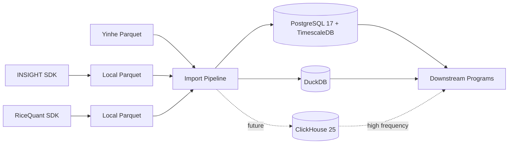

# ARCHITECTURE

更新时间：2026-06-09

本文件是项目级架构入口。INSIGHT 详细架构见 `insight_import_architecture.md`，RiceQuant 详细架构见 `ricequant_import_architecture.md`。

## 架构概览

## 存储分层

| 存储 | 用途 |
|---|---|
| PostgreSQL 17 + TimescaleDB | canonical 元数据、日线、分钟线、P1 事实表、审计和 checkpoint。 |
| Local Parquet | INSIGHT raw/staged 数据，可重载，避免重复调用 SDK。 |
| DuckDB | 临时验证、源对比、复权核对、宽表快照和本地分析。 |
| ClickHouse 25 | 后续 tick、逐笔、委托和大规模高频历史数据。 |
| Redis | 后续实时缓冲、消息和运行态缓存。 |

## 模块边界

- `adapters/`：provider 适配层，负责从上游读取原始数据；当前已实现 `yinhe`、`insight`、`ricequant`，RiceQuant 仍处于试用期验证和补充数据源阶段。
- `staging/`：Parquet 写入、hash、schema fingerprint 和 manifest。
- `transform/`：字段规范化和 canonical dataframe 生成。
- `load/`：PostgreSQL upsert、instrument attach 和目标表写入。
- `orchestration/`：pipeline、job audit、checkpoint、fetch/load/import 命令流程。
- `quality/`：重复键、OHLC、非负值、复权因子、缺交易日等质量规则。
- `services/`：symbol map、trading calendar 等共享服务。

## 关键决策

- INSIGHT 数据必须先落 Parquet，再进入数据库。
- RiceQuant 采用同样的 `SDK -> Local Parquet -> canonical DB` 路径，优先使用 `rqdatac`；凭证只能通过环境变量或本地密钥文件注入。
- 当前 INSIGHT 仍是主要行情来源；RiceQuant 处于试用期，优先验证 instruments、trading calendar/trading day 和少量行情补充样本。
- ETF 和普通 fund 分表。
- `stock_adj_factor` 按 sparse event 落表，`end_date` 暂不作为 canonical 主字段。
- 分钟线交易日优先由交易日历推导；本地日历缺失且源数据自带完整 `trading_day` 时允许兜底导入。
- 当前 market bar 表是单 canonical 行模型，主键不含 `source`；`source` 字段记录最终选中数据的来源。RiceQuant 与 INSIGHT 的同区间多源对比先放 DuckDB 或临时验证输出，经人工核对后只选一条入库。
- 当前 P1 开发阶段允许重建本地数据库；稳定后 schema 变更必须走 additive migrations。

## 后续架构任务

- 设计 ClickHouse 25 tick/逐笔/委托 schema。
- 补齐 RiceQuant canonical source policy，避免补充源自动覆盖 INSIGHT/Yinhe 已落库数据。
- 增加 DuckDB artifact manifest。
- 增加对外读取 API/SDK。
- 明确调度、失败续跑和生产 checkpoint 策略。
