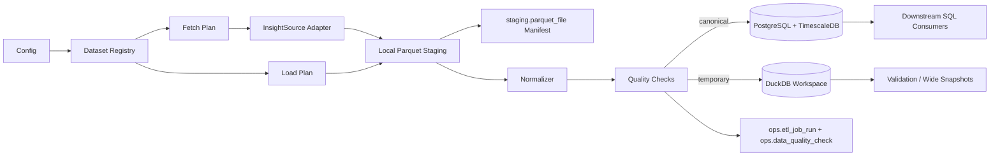
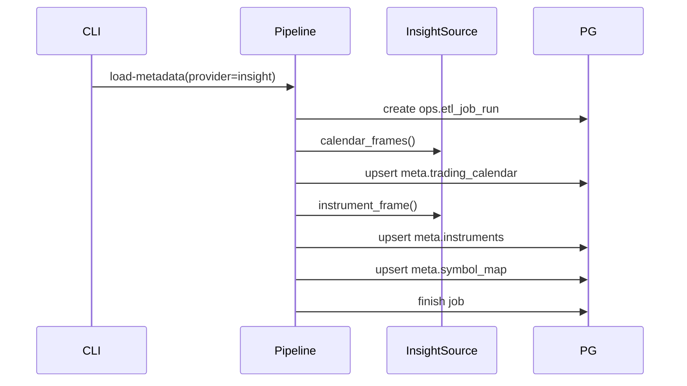
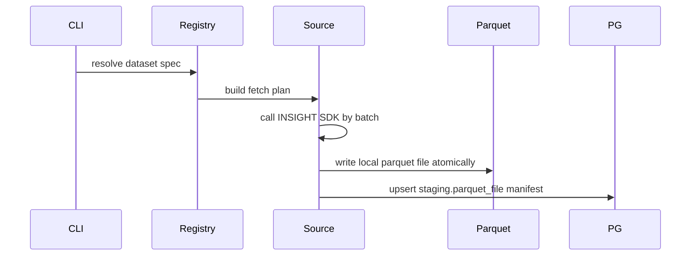
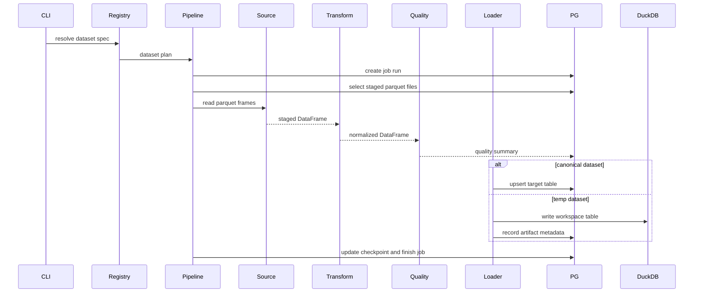

# INSIGHT Data Import Architecture

> Lead agent: architect
> Inputs:
> - `docs/insight_import_product_requirements.md`
> - `docs/华泰INSIGHT_数据封装_开发文档.md`
> - Current `getrich_data_import` provider, pipeline, SQL, and export modules
> Updated: 2026-06-08
> Status: Draft

## 0. Current Design Decisions

- Local PostgreSQL + TimescaleDB can be cleaned and rebuilt during the current P1 development phase. The backend SQL files are still treated as the rebuildable baseline schema, so changing `sql/init/backend/60_insight.sql` is acceptable before the next stable commit. Additive migrations become mandatory after the INSIGHT P1 schema is promoted beyond local development.
- ETF and ordinary fund data must be modeled separately. ETF rows returned by fund-family INSIGHT APIs should land in ETF-specific tables, while ordinary funds should use separate fund tables. Do not mix ETF and fund rows in a shared `market.fund_*` table.
- ETF instruments remain `asset='etf'`; ordinary mutual funds, LOF, and other non-ETF funds use `asset='fund'` with a subtype when needed. The current ready fund path is verified with listed non-ETF fund/LOF rows; OTC public fund NAV rows need a follow-up symbol convention decision.

## 1. Architecture Goal

Design an INSIGHT import path that first writes INSIGHT SDK results into local Parquet staging, then loads validated data into PostgreSQL + TimescaleDB as authoritative storage. DuckDB is reserved for validation, source comparison, adjustment reconciliation, and local analytical snapshots.

The design must fit the existing `getrich_data_import` implementation:

- provider registry already supports `InsightSource`;
- `ImportPipeline` already loads metadata and historical bars;
- `meta`, `market`, `realtime`, and `ops` schemas already exist;
- bar imports already use idempotent PostgreSQL upsert and quality checks;
- DuckDB support currently exists as a local parquet query helper.
- a new database-side `staging` schema records local Parquet files without storing raw file payloads in PostgreSQL.

## 2. Key Assumptions

- First implementation wave is historical data, not realtime streaming.
- INSIGHT fetch and database load are separate steps: SDK fetch writes local Parquet first, then the canonical loader reads Parquet.
- Downstream consumers can start with SQL access; Python reader APIs can be added later.
- INSIGHT SDK credentials, runtime path, rate limits, and permission tier are environment-specific and must remain configurable.
- Missing optional datasets can be skipped, but every skip must be auditable.
- Futures and options contract metadata remains incomplete inside INSIGHT and must not be fabricated.
- Adjustment-price views remain experimental until multi-source reconciliation passes.

## 3. Existing Baseline

### 3.1 Already Present

| Area | Current State |
|---|---|
| Provider layer | `HistoryDataSource` protocol with metadata, symbol map, contract, and bar methods. |
| INSIGHT adapter | `InsightSource` supports SDK path/env loading, login, `get_all_basic_info`, `get_trading_days`, and `get_kline`. |
| Pipeline | `ImportPipeline.load_metadata()` and `ImportPipeline.import_bars()` cover metadata and 1d/1m bars. |
| PostgreSQL load | `upsert_dataframe()` supports temp-table upsert with immediate temp cleanup. |
| Metadata schema | `meta.instruments`, `meta.symbol_map`, `meta.trading_calendar`, `meta.future_contracts`, `meta.option_contracts`. |
| Market schema | Per-asset 1d/1m hypertables for index, stock, ETF, future, and option bars. |
| Ops schema | `ops.etl_job_run`, `ops.data_quality_check`, `ops.schema_migrations`. |
| Export layer | Parquet export and DuckDB parquet query helper. |

### 3.2 Main Gaps

| Gap | Architecture Direction |
|---|---|
| No dataset catalog | Add explicit dataset registry in code and optional `ops.dataset_catalog` table/view. |
| No Parquet staging manifest | Add `staging.parquet_file` to track local INSIGHT files, hashes, ranges, schema fingerprints, and load state. |
| Bar-only pipeline | Generalize import planning for dataset-specific extract/transform/load specs. |
| No adjustment factor tables | Add source-specific adjustment and valuation tables before adjusted-price views. |
| No daily basic, valuation, index component, ETF/fund split tables | Add rebuild-baseline DDL during P1, then additive migrations after schema promotion. |
| Job audit lacks source range and parameters | Add structured JSON parameters, provider, date range, checkpoint fields. |
| DuckDB is only a parquet query helper | Add a controlled temporary workspace convention and manifest. |
| No source comparison/reconciliation workflow | Add validation jobs that write summaries to PostgreSQL and detail outputs to DuckDB. |

## 4. Target Architecture



### 4.1 Layer Responsibilities

| Layer | Responsibility | Implementation Direction |
|---|---|---|
| Config | Credential profile, runtime path, batch size, date range, skip policy, Parquet staging root, DuckDB path. | Extend `InsightSettings` and config TOML. |
| Dataset registry | Declare dataset name, INSIGHT API, staging path pattern, target table, key columns, transform, storage class. | `catalog/registry.py`. |
| Source adapter | Thin SDK wrapper and raw DataFrame provider. | Extend `InsightSource` with dataset-specific raw methods. |
| Fetch planner | Validate user request, split SDK batches, and write local Parquet. | New fetch plan layer. |
| Staging manifest | Record Parquet file path, content hash, row count, range, schema fingerprint, status, and run ids. | `staging.parquet_file`. |
| Load planner | Select staged files and resolve canonical target table. | Generalize current `BarsExtractionPlan`. |
| Normalizer | Convert INSIGHT fields to canonical columns and types. | Keep per-dataset transform modules. |
| Quality | Validate schema, duplicate keys, date range, OHLC, PIT fields, adjustment consistency. | Extend `quality.rules`. |
| Loader | Upsert canonical data, write job audit, write quality records. | Reuse `upsert_dataframe`; add dataset-aware load specs. |
| DuckDB workspace | Write temporary validation/detail outputs. | Add `export/duckdb_workspace.py`. |
| Access | Stable SQL tables/views, later Python reader. | Add read views after canonical tables stabilize. |

## 5. Storage Design

### 5.1 Database-Side Staging and Ops Tables

The current backend SQL did not have a database-side record of local Parquet staging. Add:

| Table | Purpose |
|---|---|
| `staging.parquet_file` | Manifest for local Parquet files fetched from INSIGHT, including path, hash, row count, range, schema fingerprint, status, and job ids. |
| `ops.dataset_catalog` | DB-visible mirror of supported datasets and storage targets. |
| `ops.import_checkpoint` | Dataset partition watermarks for resumable fetch/load. |
| `ops.duckdb_artifact` | Metadata for shared DuckDB validation and snapshot artifacts. |

`staging.parquet_file` stores metadata only. Raw rows remain in local files such as `/home/quant/data/insight/...`.

### 5.2 PostgreSQL + TimescaleDB Canonical Tables

Existing tables should remain the canonical destination for bars:

- `market.stock_bar_1d`, `market.stock_bar_1m`
- `market.index_bar_1d`, `market.index_bar_1m`
- `market.etf_bar_1d`, `market.etf_bar_1m`
- `market.future_bar_1d`, `market.future_bar_1m`
- `market.option_bar_1d`, `market.option_bar_1m`

During current local P1 development, add or adjust these tables in the rebuildable backend baseline and recreate the local database. After the P1 schema is promoted, all changes must become additive migrations. Suggested priority:

| Priority | Table | Time Key | Primary Key | Notes |
|---|---|---|---|---|
| P0 | `ops.dataset_catalog` | none | `provider, dataset_name` | DB mirror of code registry. |
| P0 | `ops.import_checkpoint` | none | `provider, dataset_name, partition_key` | Supports resumable fetch/load. |
| P0 | `staging.parquet_file` | none | surrogate + unique `provider, dataset_name, source_path` | Tracks local Parquet staging files. |
| P1 | `market.stock_adj_factor` | `begin_date` | `instrument_id, begin_date, source` | Sparse `xdy`, `b_xdy`, `f_xdy`; not adjusted prices. |
| P1 | `market.stock_daily_basic` | `trading_day` | `instrument_id, trading_day, source` | Raw daily basic fields including source adjusted close. |
| P1 | `market.stock_valuation` | `trading_day` | `instrument_id, trading_day, source` | PE/PB/PS/PC and front/back adjusted close from INSIGHT. |
| P1 | `market.index_component` | `trading_day` | `index_instrument_id, component_instrument_id, trading_day, source` | Use PIT component weights. |
| P1 | `market.etf_daily` | `trading_day` | `instrument_id, trading_day, source` | ETF daily market, NAV, discount/premium fields from fund-family APIs. |
| P1 | `market.etf_nav` | `end_date` | `instrument_id, end_date, source` | ETF NAV-derived returns, rankings, and risk metrics. |
| P1 | `market.etf_basket` | `trading_day` | `etf_instrument_id, component_instrument_id, trading_day, source` | ETF creation/redemption basket. |
| P1 | `market.etf_redemption` | `trading_day` | `instrument_id, trading_day, source` | ETF redemption list summary. |
| P1 | `market.fund_daily` | `trading_day` | `instrument_id, trading_day, source` | Ordinary fund daily market/NAV fields; only for `asset='fund'`. |
| P1 | `market.fund_nav` | `end_date` | `instrument_id, end_date, source` | Ordinary fund NAV-derived returns and risk metrics; only for `asset='fund'`. |
| P2 | `market.money_flow` | `trading_day` | `instrument_id, trading_day, source` | Stock daily money flow. |
| P2 | `market.trade_distribution` | `trading_day` | `instrument_id, trading_day, price, source` | Price-level distribution. |
| P2 | `market.chip_distribution` | `trading_day` | `instrument_id, trading_day, source` | Cost distribution fields. |
| P2 | `market.margin_summary` | `trading_day` | `instrument_id, trading_day, source` | Stock margin data. |
| P2 | `market.barra_factor` | `trading_day` | `instrument_id, trading_day, factor_name, source` | Long table for 16 CNE6 style factors. |

Financial statements and company-event PIT tables should be a separate P2/P3 migration set because they create many wide tables and need a complete numeric coercion policy.

### 5.3 DuckDB Workspace

DuckDB is not authoritative. Use it for reproducible temporary outputs:

| Workspace Type | Path Convention | Contents |
|---|---|---|
| raw response sample | `<duckdb_root>/raw/{run_id}.duckdb` | Raw SDK frames captured for debugging. |
| validation detail | `<duckdb_root>/validation/{run_id}.duckdb` | Row-level mismatch and schema drift details. |
| adjustment reconciliation | `<duckdb_root>/adjustment/{run_id}.duckdb` | Multi-source adjusted close comparisons. |
| research snapshot | `<duckdb_root>/snapshot/{dataset}/{asof}.duckdb` | Wide extracts generated from canonical tables. |

Record each durable DuckDB artifact in PostgreSQL:

- run id;
- artifact path;
- dataset name;
- date range;
- generation SQL or query spec hash;
- row count;
- creation time;
- retention policy.

This can be `ops.duckdb_artifact` in P1 if snapshots become shared across programs.

## 6. Dataset Registry Design

Introduce a dataset registry instead of hard-coding each CLI command path.

Suggested model:

```python
@dataclass(frozen=True)
class DatasetSpec:
    provider: str
    dataset_name: str
    source_method: str
    target_schema: str
    target_table: str
    storage: Literal["postgres", "timescale", "duckdb_temp"]
    primary_keys: tuple[str, ...]
    required_columns: tuple[str, ...]
    optional_columns: tuple[str, ...]
    asset: str | None = None
    freq: str | None = None
    time_column: str | None = None
    supports_incremental: bool = True
    permission_tier: str = "standard"
```

The registry should drive:

- CLI choices;
- validation before execution;
- target table selection;
- upsert keys;
- catalog output;
- downstream documentation.

Bars can be represented as registry entries too, keeping current `import-bars` behavior while enabling a generic `import-dataset` command.

## 7. Import Workflow

### 7.1 Metadata First



Rules:

- metadata must run before fact imports;
- unresolved symbols must be rejected or written to an auditable quality issue;
- futures/options contract tables remain empty unless an external contract metadata source is configured.

### 7.2 Fetch to Parquet



Rules:

- Fetch jobs should be idempotent by provider, dataset, partition, and source path.
- Manifest rows are inserted or updated before canonical load.
- Each fetch run writes provider, dataset, date range, request JSON, and final checkpoint JSON to `ops.etl_job_run`.
- Each written Parquet partition updates `ops.import_checkpoint` with `status='written'`, source path, row count, hash, and source symbols.
- Raw or lightly normalized fields remain in Parquet for replay.

### 7.3 Load from Parquet to Canonical Tables



Failure behavior:

- fetch error: fail fetch job unless dataset is optional and skip policy allows skip;
- missing staged file: fail load job with manifest context;
- transform error: fail job with source columns and dataset name;
- quality error: fail or partial based on quality policy;
- load error: fail job and keep successful previous batches.
- Successful loads mark staging files loaded and update `ops.import_checkpoint` with `status='loaded'`, load run id, file id, source path, and rows written.

## 8. CLI and API Surface

Keep existing commands:

- `scan`
- `load-metadata`
- `import-bars`
- `export-bars`

Add commands in dependency order:

| Command | Purpose | Phase |
|---|---|---|
| `list-datasets` | Show registry and DB catalog status. | P0 |
| `fetch-dataset` | Fetch INSIGHT dataset into local Parquet staging and manifest. | P0 |
| `show-job` | Inspect job run request, status, row counts, warnings, and final checkpoint. | P1 implemented |
| `list-checkpoints` | Inspect import checkpoint watermarks and per-partition state. | P1 implemented |
| `import-dataset` | Fetch and load one ready dataset through the existing two-step pipeline. | P1 implemented |
| `validate-adjustments` | Compare adjustment sources and write DuckDB detail output. | P1 |
| `export-snapshot` | Build named DuckDB or parquet snapshots from canonical data. | P1 |

Example:

```bash
getrich-import --provider insight list-datasets
getrich-import --provider insight fetch-dataset --dataset stock_bar_1d --start-date 2026-06-01 --end-date 2026-06-05
getrich-import --provider insight show-job --dataset fund_nav --limit 5
getrich-import --provider insight list-checkpoints --dataset fund_nav --partition-key 161725.SZ
getrich-import --provider insight import-dataset --dataset fund_nav --start-date 2026-06-04 --end-date 2026-06-04 --symbol 161725.SZ
getrich-import --provider insight validate-adjustments --symbol 601688.SH --start-date 2015-01-01 --end-date 2026-06-07
```

## 9. Schema Evolution Plan

Current P1 local development rule:

- Local database rebuild is allowed. Baseline backend SQL files can be edited directly, then the local `getrich` database can be recreated.
- Before sharing this schema as a stable environment, record the final baseline in a commit and stop editing previously applied SQL files.

Post-promotion rule:

Use additive migrations only:

1. Extend `ops.etl_job_run` with provider, dataset name, start/end date, request JSON, warning count, and checkpoint JSON.
2. Add `ops.dataset_catalog`.
3. Add `ops.import_checkpoint`.
4. Add `staging.parquet_file`.
5. Add `ops.duckdb_artifact`.
6. Add P1 canonical market tables.
7. Add read views after table semantics are validated.

Avoid breaking current bar tables or CLI behavior.

## 10. Downstream Read Contract

First contract is SQL-first:

- metadata: `meta.instruments`, `meta.symbol_map`, `meta.trading_calendar`;
- bars: current `market.*_bar_*` tables;
- dataset status: `ops.dataset_catalog`, `ops.etl_job_run`, `ops.data_quality_check`;
- P1 facts: new `market.stock_adj_factor`, `market.stock_daily_basic`, `market.stock_valuation`, `market.index_component`, ETF tables, and separate ordinary fund tables.

Implemented SQL read views:

| View | Purpose |
|---|---|
| `market.v_stock_daily_basic` | Symbol-enriched stock daily basic facts. |
| `market.v_stock_valuation` | Symbol-enriched stock valuation facts. |
| `market.v_index_component` | Symbol-enriched index constituent weights. |
| `market.v_etf_daily` | Symbol-enriched ETF daily trading and NAV facts. |
| `market.v_etf_nav` | Symbol-enriched ETF NAV and return metrics. |
| `market.v_fund_daily` | Symbol-enriched ordinary fund daily facts. |
| `market.v_fund_nav` | Symbol-enriched ordinary fund NAV and return metrics. |
| `market.v_etf_basket` | ETF basket rows with ETF symbol enrichment and optional component instrument mapping. |
| `ops.v_dataset_coverage` | Latest loaded staging coverage and file status by dataset. |

Planned read views after adjustment-factor reconciliation:

| View | Purpose |
|---|---|
| `market.v_stock_bar_1d_raw` | Symbol-enriched raw stock daily bars. |
| `market.v_stock_bar_1m_raw` | Symbol-enriched raw stock minute bars. |
| `market.v_stock_adj_factor_filled` | Forward-filled sparse adjustment factor by trading day. |
| `market.v_stock_bar_1d_adjusted_experimental` | Adjusted OHLC after reconciliation passes. |

## 11. Implementation WBS

### P0: Core INSIGHT Contract

| Task | Dependency | Output |
|---|---|---|
| A0.1 Confirm INSIGHT runtime and credential config fields | none | Updated config schema and example. |
| A0.2 Add dataset registry skeleton | A0.1 | Code registry for bars, metadata, Parquet staging, and planned P1 datasets. |
| A0.3 Add `list-datasets` command | A0.2 | Operator can inspect supported datasets. |
| A0.4 Add `ops.dataset_catalog`, `ops.import_checkpoint`, and `staging.parquet_file` migrations | A0.2 | DB-visible catalog and staging manifest. |
| A0.5 Add `fetch-dataset` skeleton | A0.4 | INSIGHT fetch can write Parquet before DB load. |
| A0.6 Add SQL downstream examples for current bars | existing bars | Minimal consumer examples. |

### P1: Historical Dataset Expansion

| Task | Dependency | Output |
|---|---|---|
| A1.1 Extend job audit fields | A0.2 | Implemented provider/dataset/date/request/warning/checkpoint traceability. |
| A1.2 Add checkpoint table and resume contract | A1.1 | Implemented fetch/load checkpoint writes; resumable scheduler policy pending. |
| A1.3 Add stock adjustment factor DDL and transform | A1.1 | Canonical sparse factor table. |
| A1.4 Add stock daily basic and valuation DDL/transforms | A1.1 | Source raw adjusted close fields stored separately. |
| A1.5 Add index component DDL/transform | A1.1 | PIT index membership. |
| A1.6 Add ETF DDL/transforms | A1.1 | ETF daily, ETF NAV, basket, and redemption data. |
| A1.7 Add ordinary fund DDL/transforms | A1.6 | Separate fund daily and NAV tables with `asset='fund'`; listed fund/LOF ready, OTC NAV convention pending. |
| A1.8 Add generic `import-dataset` pipeline | A0.2, A1.1 | Non-bar dataset imports. |
| A1.9 Add DuckDB workspace writer | A1.1 | Validation and snapshot artifacts. |
| A1.10 Add adjustment reconciliation job | A1.3, A1.4, A1.9 | Trusted/experimental adjustment decision support. |

### P2: Broader Data Coverage

| Task | Dependency | Output |
|---|---|---|
| A2.1 Add money flow/trade distribution/chip distribution | A1.7 | Daily derived stock datasets. |
| A2.2 Add margin data | A1.7 | Margin summary tables. |
| A2.3 Add Barra factor long table | A1.7 | Import 16 CNE6 factors as long-form rows. |
| A2.4 Design financial PIT schema | A1.1 | Separate schema plan for financial statements. |

### P3: Realtime and High-Frequency

| Task | Dependency | Output |
|---|---|---|
| A3.1 Define realtime source protocol | P1 stable | Callback-to-queue abstraction. |
| A3.2 Add realtime K-line ingest | A3.1 | Short-retention or canonical storage policy. |
| A3.3 Design tick/transaction ClickHouse schema | A3.1 | Long-term high-frequency storage plan. |

## 12. Verification Strategy

| Layer | Verification |
|---|---|
| Config | Unit tests for TOML/env merge and secret redaction. |
| Registry | Unit tests for dataset spec validation and CLI choices. |
| Source adapter | SDK-free fake API tests for each INSIGHT normalization path. |
| Transform | Golden DataFrame tests for field mapping, timezone, numeric coercion, empty frames. |
| Loader | PostgreSQL integration smoke for idempotent upsert and checkpoint updates. |
| Quality | Tests for duplicate keys, null core fields, OHLC rules, PIT date presence, adjustment mismatch. |
| DuckDB | Tests that artifacts are reproducible and metadata is recorded. |
| End-to-end | Small symbol/date import with row count, duplicate, null, and downstream read checks. |

## 13. Risks and Decisions Needed

| Risk | Impact | Mitigation |
|---|---|---|
| INSIGHT permission tier unknown | Some datasets may fail or return partial fields. | Registry records permission tier; optional datasets can skip with warnings. |
| SDK rate limits unknown | Full backfills may be unstable. | Batch-size config, retry policy, checkpointing, and progressive smoke tests. |
| Adjustment source disagreement | Incorrect adjusted prices. | Store raw/factors separately; mark adjusted views experimental until reconciliation passes. |
| INSIGHT timestamp semantics unclear | Wrong bar keys or trading-day assignment. | Preserve raw source time and normalized bar key; validate with trading calendar. |
| Futures/options metadata missing | Incomplete contract semantics. | Store market data only; keep contract tables external-source driven. |
| DuckDB artifacts become hidden dependencies | Downstream reproducibility risk. | Record artifacts in ops metadata and treat DuckDB as non-authoritative. |

## 14. Next Step

Move to `code_dev` only after confirming:

1. P0 should include dataset catalog only, or also the first P1 table migration.
2. Downstream consumers need SQL-only access first, or a Python reader API in the first implementation wave.
3. Shared DuckDB artifacts should be recorded in PostgreSQL now or deferred until validation jobs exist.
