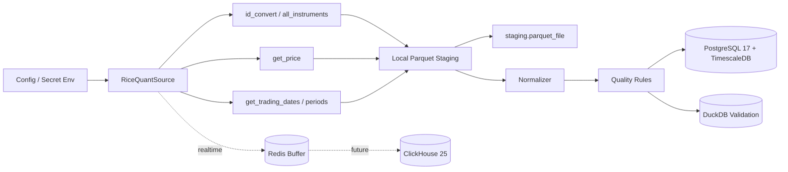
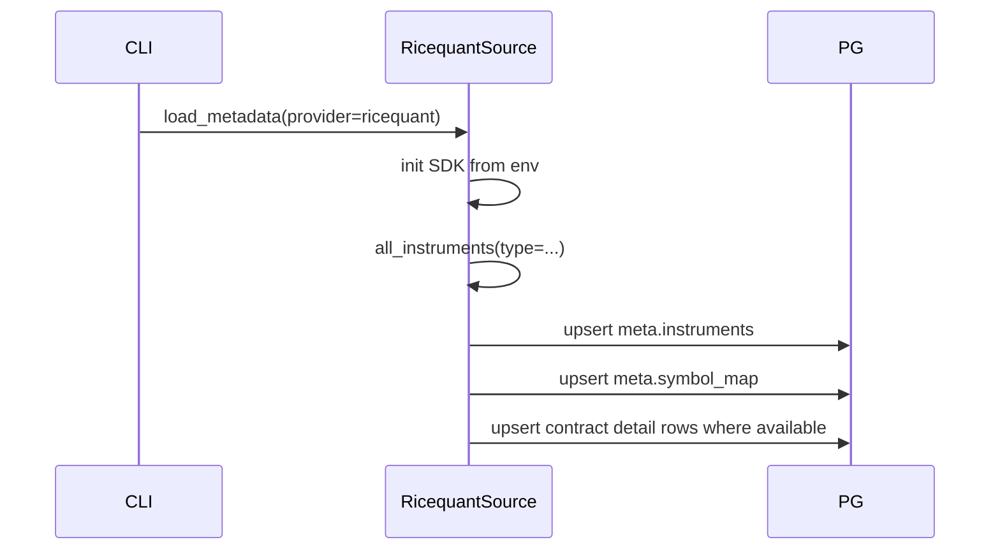
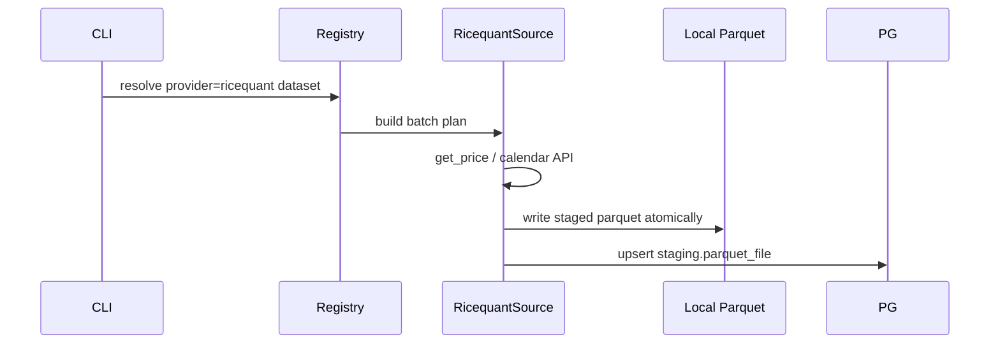
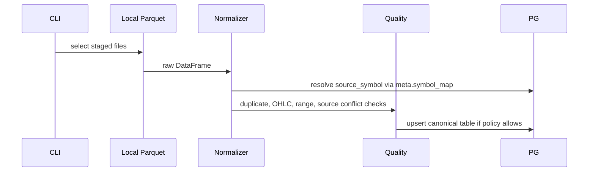

# RiceQuant Data Import Architecture

> Lead agent: architect
> Inputs:
> - `/home/quant/project/getrich-design/ricequant/config.md`
> - `/home/quant/project/getrich-design/ricequant/ricequant_generic_api.md`
> - `/home/quant/project/getrich-database/import_data/src/import_data/etl/fromrq`
> - `/home/quant/project/getrich-database/import_data/src/import_data/gateways/ricequant/client.py`
> - `docs/ARCHITECTURE.md`
> - `docs/insight_import_architecture.md`
> Updated: 2026-06-09
> Status: Draft

## 1. Goal

Add RiceQuant RQData as another upstream data provider in `getrich_data_import`, using the same import discipline already chosen for INSIGHT:

```text
RiceQuant SDK -> local Parquet staging -> validation/normalization -> PostgreSQL + TimescaleDB
```

INSIGHT remains the primary market data source for now. RiceQuant is introduced as a trial-period supplemental provider, initially for interface validation, trading calendar/trading-day related data, instrument metadata, and selected comparison samples.

DuckDB remains the workspace for temporary validation, source comparison, manual-review candidates, and wide local snapshots. ClickHouse 25 is the future target for large immutable high-frequency datasets such as historical tick, transaction, and order data.

## 2. Key Assumptions

- This phase designs the interface and storage contract only. It does not implement code, SQL, or credential setup.
- RiceQuant credentials are secrets and must be injected through environment variables or a local secret file outside version control.
- `rqdatac` is the preferred SDK. The legacy `import_data` implementation already imports `rqdatac as rq`, calls `rq.init("license", api_key)`, wraps `rq.all_instruments`, and uses `rq.id_convert` in conversion paths.
- The external RiceQuant docs mention `rqsdk` installation in one place, but implementation should try `rqdatac` first and only revisit package choice if local smoke fails.
- RiceQuant is still in a trial period. Do not assume all historical market-data APIs are licensed or stable.
- MVP focuses on China market metadata, trading calendar/trading-day data, and small market-data samples for validation. Broad market-data backfill is supplemental, not the primary plan.
- Current canonical bar tables intentionally store one row per instrument and timestamp. Multiple provider candidates must be reconciled before canonical load.

## 3. Existing Baseline Fit

| Existing Area | Reuse for RiceQuant | Required Change |
|---|---|---|
| `HistoryDataSource` protocol | Reuse for metadata, calendars, symbol map, and bar frames. | Add `RicequantSource` adapter implementation. |
| Provider registry | Already routes `yinhe` and `insight`. | Add `ricequant` provider name. |
| Dataset registry | Provider-qualified `DatasetSpec` supports multiple providers. | Add RiceQuant dataset specs. |
| Parquet staging | Manifest keys include provider and dataset. | Use `provider='ricequant'` and deterministic RiceQuant staging paths. |
| `meta.symbol_map` | Primary key `(source, source_symbol)` supports RiceQuant `order_book_id`. | Add source mappings from RiceQuant IDs to canonical instruments. |
| Market bar tables | Existing `market.{asset}_bar_{freq}` tables already have `source` provenance columns. | Keep one canonical row per `(instrument_id, dt)` and enforce source selection before load. |
| DuckDB workspace | Useful for source comparison. | Add RiceQuant-vs-INSIGHT comparison plans and manual-review candidate outputs. |
| Legacy fromrq | Existing `RQDataAPI` wrapper and `INSTRUMENT_TYPES` list show usable patterns. | Re-implement in this project style, not by importing old modules. |

## 4. Target Architecture



## 5. Provider Configuration

Add a provider-specific config block while keeping credentials out of repo files.

```toml
[ricequant]
staging_dir = "~/data/ricequant"
license_env = "RICEQUANT_LICENSE"
init_mode = "license"
market = "cn"
batch_size = 300
default_start_date = "2026-05-19"
default_end_date = "2026-05-19"
symbols = ["000001.XSHE", "000300.XSHG", "IF2406"]
```

Rules:

- `license_env` points to the full license string or the secret required by the installed SDK.
- Logs, job rows, and manifest rows must never include the license value.
- `init_mode` should default to `license` for `rqdatac.init("license", key)`. `tcp_license` can remain a future option if required by the deployed license string.
- `symbols` are RiceQuant `order_book_id` values. Inputs from other providers should be normalized through `id_convert` before fetch.

Add a source-routing config so operators can see which provider is intended for each dataset.

```toml
[source_policy]
canonical_default = "insight"
conflict_mode = "reject"  # reject | manual_review | replace_in_rebuild

[source_policy.datasets.metadata]
primary = "insight"
supplemental = ["ricequant"]
load_mode = "merge_missing"

[source_policy.datasets.trading_calendar]
primary = "ricequant"
fallback = ["insight"]
load_mode = "merge_verified"

[source_policy.datasets.stock_bar_1d]
primary = "insight"
supplemental = ["ricequant"]
load_mode = "compare_then_manual_select"
```

Rules:

- `primary` means the provider expected to populate canonical rows by default.
- `supplemental` means fetch/stage is allowed, but canonical load requires conflict checks and, if values differ, manual selection.
- `merge_missing` can insert records that do not exist in canonical storage, but must not overwrite existing records from another provider.
- `compare_then_manual_select` writes differences to DuckDB or an ops review table; only the selected row enters canonical storage.

## 6. Symbol and Exchange Mapping

RiceQuant uses `order_book_id` as the source identifier.

| RiceQuant Example | Canonical Mapping Direction |
|---|---|
| `000001.XSHE` | `asset='stock'`, `exchange='XSHE'`, `source_symbol='000001.XSHE'` |
| `600000.XSHG` | `asset='stock'`, `exchange='XSHG'`, `source_symbol='600000.XSHG'` |
| `000300.XSHG` | `asset='index'`, `exchange='XSHG'`, `source_symbol='000300.XSHG'` |
| `510300.XSHG` | `asset='etf'`, `exchange='XSHG'`, `source_symbol='510300.XSHG'` |
| `IF2406` | `asset='future'`, `exchange` from `instruments().exchange`, `source_symbol='IF2406'` |
| `10000615` | `asset='option'`, `exchange` from `instruments().exchange`, `source_symbol='10000615'` |

Design decisions:

- Store RiceQuant raw code in `meta.symbol_map.source_symbol`.
- Use `instruments()` or `all_instruments()` to populate `meta.instruments.exchange` rather than parsing futures/options exchange from code.
- Use `id_convert()` only as a conversion helper, not as a replacement for durable symbol mapping.
- Do not fabricate missing futures/options contract metadata. If `instruments()` does not return multiplier, strike, maturity, or underlying fields, leave contract-detail rows incomplete and record a quality warning.

## 7. Dataset Registry

Register RiceQuant datasets under `provider='ricequant'`. Dataset names should match current canonical target names where the target table is shared.

| Phase | Dataset | RiceQuant API | Target | Source Role | Status |
|---|---|---|---|---|---|
| P0 | `metadata` | `all_instruments`, `instruments`, `id_convert` | `meta.instruments`, `meta.symbol_map`, contract tables | supplemental / merge missing | planned |
| P0 | `trading_calendar` | `get_trading_dates`, previous/next/latest helpers | `meta.trading_calendar` | primary candidate for calendar | planned |
| P1 | `stock_bar_1d` | `get_price(frequency='1d', adjust_type='none')` | `market.stock_bar_1d` | supplemental sample | planned |
| P1 | `stock_bar_1m` | `get_price(frequency='1m', adjust_type='none')` | `market.stock_bar_1m` | supplemental sample | planned |
| P1 | `index_bar_1d` / `index_bar_1m` | `get_price` | existing index bar tables | supplemental sample | planned |
| P1 | `etf_bar_1d` / `etf_bar_1m` | `get_price(adjust_type='none')` | existing ETF bar tables | supplemental sample | planned |
| P1 | `future_bar_1d` / `future_bar_1m` | `get_price` | existing future bar tables | supplemental sample | planned |
| P1 | `option_bar_1d` / `option_bar_1m` | `get_price` | existing option bar tables | supplemental sample | planned |
| P1 | `trading_period` | `get_trading_periods` | `meta.trading_session` or DuckDB first | calendar support | planned |
| P2 | `auction_after_close` | `get_auction_info` | new `market.stock_auction_after_close` | optional | planned |
| P2 | `auction_open` | `get_open_auction_info` | new `market.open_auction_snapshot` | optional | planned |
| P2 | `yield_curve` | `get_yield_curve` | new `macro.yield_curve` or DuckDB first | optional | planned |
| P2/P3 | `tick` | `get_price(frequency='tick')` | ClickHouse 25 | permission-dependent | planned |
| P3 | `live_tick` / `live_bar_1m` | `LiveMarketDataClient` | Redis then ClickHouse 25 | permission-dependent | planned |

`get_ticks`, `get_live_ticks`, `current_minute`, `current_snapshot`, and `get_live_minute_price_change_rate` are realtime or current-day surfaces. They should not be mixed into historical backfill CLI commands.

Trial-period priority:

1. Verify `rqdatac` init, `id_convert`, `all_instruments`, and `get_trading_dates`.
2. Import/stage `metadata` and `trading_calendar` first.
3. Stage one-day samples for selected market-data datasets only after P0 succeeds.
4. Keep INSIGHT as the default canonical market-data provider unless a manual review selects a RiceQuant row.

## 8. Historical Bar Normalization

Use `get_price(..., adjust_type='none')` for canonical historical bars. This matches the existing rule that canonical OHLC is raw/unadjusted and adjustment should be handled separately.

Field mapping:

| RiceQuant Field | Canonical Field |
|---|---|
| MultiIndex `order_book_id` | `source_symbol` |
| MultiIndex `datetime` / `date` | `dt` |
| `trading_date` | `trading_day`, especially for futures night sessions |
| `open`, `high`, `low`, `close` | same |
| `prev_close` | `pre_close` |
| `total_turnover` | `amount` |
| `volume` | `volume` |
| `settlement` | `settle` |
| `prev_settlement` | `pre_settle` |
| `open_interest` | `open_interest` |
| `limit_up`, `limit_down` | same |
| `num_trades`, `iopv`, `dominant_id`, `day_session_open` | preserve in raw Parquet; add canonical columns only after schema decision |

Rules:

- Daily rows use `dt = trading_day`.
- Minute rows use timezone-aware Shanghai timestamp for `dt`.
- For futures and options minute rows, prefer RiceQuant `trading_date` for night-session attribution.
- `skip_suspended=False` should be the default for bar completeness; if `skip_suspended=True` is used, record it in job parameters and manifest metadata.
- `adjust_type='none'` is mandatory for canonical bars unless a future source-specific adjusted table is explicitly created.

## 9. Source Policy for Shared Canonical Tables

Current market bar primary keys are `(instrument_id, dt)`. Therefore:

- Canonical tables represent one authoritative row per instrument and timestamp.
- The existing `source` column should remain in canonical tables as provenance for the selected row.
- Do not add `source` to the canonical primary key. That would violate the one-row-per-instrument-time design.
- RiceQuant must not overwrite an existing INSIGHT/Yinhe canonical row automatically.
- Source comparison should write RiceQuant and INSIGHT staged Parquet to DuckDB or temporary validation outputs first.
- When provider values differ, the flow is manual review, optional third-source comparison, then loading exactly one selected row to canonical storage.
- If future requirements need multiple provider observations to coexist permanently, add source-qualified shadow tables such as `market_source.bar_observation`. Do not silently alter canonical table keys during P1.

Recommended MVP behavior:

1. Add a config-level `source_policy`.
2. Before loading a RiceQuant staged file, check target table coverage for conflicting `source`.
3. Reject conflicting loads by default.
4. Write provider differences to DuckDB for review when `conflict_mode='manual_review'`.
5. Allow `--replace-source` only in local rebuild mode or an explicit migration-backed operation.

Recommended review artifact columns:

| Column | Meaning |
|---|---|
| `dataset_name` | Dataset under comparison. |
| `instrument_id` / `source_symbol` | Canonical and provider-specific identity. |
| `dt` / `trading_day` | Compared timestamp. |
| `primary_source` / `candidate_source` | Usually `insight` and `ricequant`. |
| `field_name` | Differing field. |
| `primary_value` / `candidate_value` | Compared values. |
| `abs_diff` / `rel_diff` | Numeric difference when applicable. |
| `decision` | `pending`, `accept_primary`, `accept_candidate`, `needs_third_source`. |
| `review_note` | Manual reason if the selected row differs from default source. |

## 10. Database Schema Impact

No immediate schema change is required for RiceQuant P0/P1 metadata and bar MVP if it uses existing canonical tables, existing `source` columns, and manifest tables.

Potential future schema additions:

| Table | Reason | Phase |
|---|---|---|
| `meta.trading_session` | Durable trading periods from `get_trading_periods`, including night sessions. | P1 |
| `market.stock_auction_after_close` | Post-close fixed-price trading data. | P2 |
| `market.open_auction_snapshot` | Opening auction level1 snapshot data. | P2 |
| `macro.yield_curve` | China government yield curve from `get_yield_curve`. | P2 |
| `ops.source_review_decision` | Durable manual review decisions if DuckDB artifacts become insufficient. | P1/P2 |
| `market_source.bar_observation` or source-specific shadow tables | Permanent multi-provider comparison without overwriting canonical rows. | P2 |
| ClickHouse `tick_level1` | Historical tick and realtime tick persistence. | P2/P3 |

## 11. Import Workflows

### 11.1 Metadata



### 11.2 Fetch to Parquet



### 11.3 Load to Canonical Tables



## 12. Verification Plan

Minimum smoke sequence:

1. Confirm `rqdatac` install/import and `rq.init("license", key)` using secret env only.
2. `id_convert('000001.SZ')` returns a RiceQuant standard code.
3. `all_instruments(type='CS', date=<sample>)` returns rows and can normalize into `meta.instruments`.
4. `all_instruments(type='Future')` and `all_instruments(type='Option')` return either usable rows or a clear permission/empty result.
5. `get_trading_dates(<start>, <end>)` returns sorted dates and can load `meta.trading_calendar`.
6. `get_price('000001.XSHE', sample_day, sample_day, frequency='1d', adjust_type='none')` stages one stock daily sample if permission allows.
7. `get_price('IF2406', sample_day, sample_day, frequency='1m')` stages futures minute rows and verifies `trading_date` mapping if permission allows.
8. Attempt a RiceQuant load over an INSIGHT-loaded range and confirm source policy rejects it or routes to manual review.

## 13. Implementation Task Breakdown

1. Run local `rqdatac` smoke before changing dependencies or schema.
2. Add `RicequantSettings`, env overrides, and source policy config.
3. Add `rqdatac` dependency only after smoke confirms package/import path.
4. Implement `RicequantSource` with lazy SDK import and secret-safe initialization.
5. Add provider registry entry and provider names.
6. Add RiceQuant dataset specs for metadata, calendars, and bars.
7. Implement metadata normalization for `all_instruments` and `instruments`.
8. Implement bar fetch normalization for `get_price`.
9. Add source policy checks before canonical load.
10. Add DuckDB/manual-review comparison artifact for provider differences.
11. Add tests with fake SDK frames for metadata, bars, futures night-session `trading_date`, source policy, and trial-permission skips.
12. Run local smoke with metadata, calendar, and one-day market-data samples only.

## 14. Open Questions

- Which index/package command should be used to install `rqdatac` in the managed `uv` environment?
- Does the current license cover historical tick via `get_price(frequency='tick')`, or only realtime/current-day tick surfaces?
- Which datasets should use RiceQuant as primary source during the trial period: only trading calendar/instruments, or also selected bars after manual validation?
- Should manual source-review decisions be stored only as DuckDB artifacts initially, or promoted to `ops.source_review_decision`?
