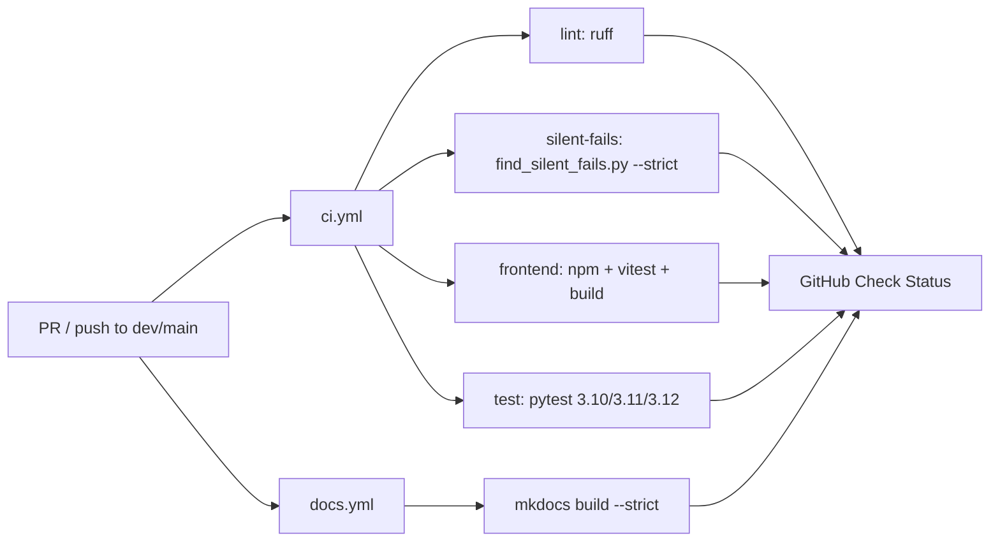

# CI 工作流

> **本节讲解 GetRich 项目的 GitHub Actions 持续集成**。`.github/workflows/ci.yml` 包含 4 个 job：lint（ruff）、silent-fails（静态扫描）、frontend（npm + vitest + build）、test（pytest 跨 Python 矩阵 + 真 PG/CH/Redis service）。还有独立的 `.github/workflows/docs.yml` 跑 mkdocs build。

---

## 1. 全景



**触发条件**（`on:`）：

```yaml
on:
  pull_request:
    branches: [dev, main]
  push:
    branches: [dev, main]
```

**并发控制**：

```yaml
concurrency:
  group: ci-${{ github.ref }}
  cancel-in-progress: true
```

> 同一 ref 的旧 run 自动取消（节省 CI 分钟数）。

---

## 2. 4 个核心 Job

### 2.1 `lint` —— ruff check + format

**作用**：Python 代码风格 / 格式静态检查

```yaml
lint:
  name: Lint (ruff)
  runs-on: ubuntu-latest
  steps:
    - uses: actions/checkout@v4
    - uses: astral-sh/setup-uv@v3
    - run: uv python install 3.12
    - uses: actions/cache@v4       # 缓存 .venv + ~/.cache/uv
    - run: uv run --frozen ruff check src tests
    - run: uv run --frozen ruff format --check src tests
```

| 步骤 | 命令 | 失败时表现 |
|---|---|---|
| ruff check | `uv run ruff check src tests` | import 顺序、未使用变量、危险语法 |
| ruff format --check | `uv run ruff format --check src tests` | 格式不一致（**不会自动修复**，CI 必须过） |

> **本地对应**：`uv run ruff check src tests && uv run ruff format --check src tests`

### 2.2 `silent-fails` —— Round #1059 静态扫描

**作用**：扫描 `try/except` 中**只 log 不 re-raise** 的危险 pattern（静默吞错）

```yaml
silent-fails:
  steps:
    - run: uv run --frozen python scripts/find_silent_fails.py --strict
```

**三类处理**：

| 分类 | 含义 | CI 行为 |
|---|---|---|
| `P0_REVIEW` | 未被审查 / 注释的吞错 | `--strict` 模式下**失败** |
| `LIKELY_OK` | handler 有副作用（写 metrics / 报警） | 允许通过 |
| `P0_SUPPRESSED` | 显式 `# silent-fail-ok: <reason>` 注释 | 允许通过 |

> 添加新的 silent-fail 容忍时**必须**加 `# silent-fail-ok:` 注释并写明 reason。

### 2.3 `frontend` —— npm + vitest + build

**作用**：TypeScript 类型检查、ESLint、单元测试、生产构建

```yaml
frontend:
  defaults:
    run:
      working-directory: frontend
  steps:
    - uses: actions/setup-node@v4
      with: { node-version: "20" }
    - uses: actions/cache@v4       # 缓存 ~/.npm
    - run: npm ci                  # 严格按 lockfile 安装
    - run: npm run lint            # ESLint
    - run: npm run test -- --run   # vitest 单次跑（避免 watch 模式 hang）
    - run: npm run build           # tsc -b + vite build
```

| 步骤 | 命令 | 失败时表现 |
|---|---|---|
| `npm ci` | 按 `package-lock.json` 严格安装 | lockfile drift → fail |
| `npm run lint` | ESLint + 自定义规则 | 规则违反（`getrich/no-unsanitized-danger` 等） |
| `npm run test -- --run` | vitest 单次跑 | 任何测试 fail |
| `npm run build` | tsc 严格模式 + vite bundle | TS 类型错 / 构建错 |

> **Node 20 LTS** —— Vite 8 支持的最老 LTS 线。`renovate` PR 不会乱跳版本（cache key 稳定）。

### 2.4 `test` —— pytest 跨 Python 矩阵

**作用**：跑全套 Python 测试（~1900 测试）

```yaml
test:
  strategy:
    fail-fast: false
    matrix:
      python-version: ["3.10", "3.11", "3.12"]
  services:
    postgres:    { image: postgres:16, ports: [5432:5432] }
    clickhouse:  { image: clickhouse/clickhouse-server:24.3, ports: [8123:8123, 9000:9000] }
    redis:       { image: redis:7, ports: [6379:6379] }
  steps:
    - uses: actions/checkout@v4
    - run: uv python install ${{ matrix.python-version }}
    - run: uv sync --frozen --extra dev
    - run: uv run python -m getrich.migrations.cli postgres
    - run: uv run python -m getrich.migrations.cli clickhouse
    - run: uv run pytest tests/getrich_backtest tests/getrich/apps -x --timeout=60
```

**Python 矩阵**（`pyproject.toml` 的 `requires-python = ">=3.10"`）：

| 版本 | 用途 |
|---|---|
| 3.10 | 最早支持（CI 保护，捕获 typing 改动） |
| 3.11 | 主流（性能提升 10-60%） |
| 3.12 | **项目主版本**（本地开发、release） |

> `fail-fast: false` —— 3 个版本都跑完，才知道哪几个挂。

**services 镜像**：

| Service | 镜像 | 端口 | 用途 |
|---|---|---|---|
| `postgres` | `postgres:16` | 5432 | 业务主库（25 个 migration 全部跑） |
| `clickhouse` | `clickhouse/clickhouse-server:24.3` | 8123 + 9000 | 时序库（2 个 migration） |
| `redis` | `redis:7` | 6379 | Celery broker（**测试时不启 worker**） |

> 每个 service 配 `health-cmd` + 5s interval —— runner 启动后会 wait health，**不会 race**。

**环境变量**（注入到 runner）：

```yaml
env:
  PG_HOST: localhost
  PG_USER: quant
  PG_PASSWORD: testpass
  PG_DB: getrich
  CLICKHOUSE_HOST: localhost
  CLICKHOUSE_PORT: "8123"
  CLICKHOUSE_DB: default
  GETRICH_WORKER_BACKEND: celery
  GETRICH_BROKER_URL: redis://localhost:6379/0
  GETRICH_RESULT_BACKEND: redis://localhost:6379/1
```

> `GETRICH_WORKER_BACKEND=celery` 让 router 测试走 Celery dispatch 路径（`test_celery_app` + `test_backtest_jobs_router`），**不实际连 broker**（test 内部 monkeypatch）。

---

## 3. 缓存策略

| Job | 缓存路径 | Key |
|---|---|---|
| `lint` / `silent-fails` | `.venv` + `~/.cache/uv` | `uv-${{ runner.os }}-${{ hashFiles('uv.lock', 'pyproject.toml') }}` |
| `test` (矩阵) | 同上 | `uv-${{ runner.os }}-py${{ matrix.python-version }}-${{ hashFiles(...) }}` |
| `frontend` | `~/.npm` | `npm-${{ runner.os }}-${{ hashFiles('frontend/package-lock.json', 'frontend/package.json') }}` |

> `key` 包含 lockfile hash；lockfile 不变就恢复缓存，省 30-60s。

---

## 3.5 Pre-commit / Dependabot / Coverage gate（Round #1159-#1161）

### 3.5.1 Pre-commit hooks

`.pre-commit-config.yaml` 配 17 个 hook，分 4 组：

| 类别 | hook 例子 | 作用 |
|---|---|---|
| 通用 hygiene | `trailing-whitespace`, `end-of-file-fixer`, `check-yaml/toml/json`, `check-added-large-files` (≤ 2 MB), `check-merge-conflict`, `detect-private-key`, `mixed-line-ending` | 提交前防低级错误 |
| Python | `ruff` (lint + `--fix --exit-non-zero-on-fix`), `ruff-format` | 镜像 CI 的 `lint` job |
| 本地扫描器 | `silent-fails-scan` (Round #1059), `pg-migrations-lint`, `clickhouse-migrations-lint` (Round #1150/#1153) | CI parity |
| 前端 | `eslint` (frontend), `tsc -b --noEmit` | 镜像 `frontend` job 的 lint + 类型检查 |
| Commit 消息 | `conventional-pre-commit` (v3.6.0) | 强制 Conventional Commits 格式 |

**安装**（一次性）：

```bash
uv tool install pre-commit        # 或 pipx install pre-commit
pre-commit install                # 装 .git/hooks/pre-commit
pre-commit install --hook-type commit-msg
```

**本地全量复现**（与 CI 完全等价）：

```bash
pre-commit run --all-files
```

**跳过**（紧急情况，不推荐）：

```bash
SKIP=ruff git commit -m "..."   # 跳过 ruff
git commit -m "..." --no-verify  # 跳过全部
```

> ⚠️ `--no-verify` 后 CI 仍会跑，**不能真正绕过**。

### 3.5.2 Dependabot（`.github/dependabot.yml`，Round #1160）

3 个 ecosystem，周一 01:00 UTC 批量开 PR（亚洲工作时间窗）：

| ecosystem | directory | 频率 | PR cap | major 隔离 |
|---|---|---|---|---|
| `pip` (uv) | `/` | weekly | 10 | 单独 group（major 独立 PR） |
| `npm` | `/frontend` | weekly | 10 | 单独 group |
| `github-actions` | `/` | weekly | 3 | 单独 group |

分组策略：

- `frontend-patch` / `python-patch`：minor + patch 合并成 1 个 PR（review 友好）
- `frontend-major` / `python-major` / `actions-major`：单独 PR（CVEs 类可快速合并）

commit prefix：`deps(pip):` / `deps(frontend):` / `ci(actions):`，可用 `git log --grep="^deps"` 一把抓出所有依赖升级。

### 3.5.3 Coverage gate（Round #1161）

`test` job 在 `pytest ... -x --timeout=60` 之后追加：

```bash
--cov=getrich \
--cov=getrich_backtest \
--cov-report=term-missing \      # PR diff 展示 missing 行
--cov-report=xml \               # codecov.io 兼容
--cov-fail-under=60              # 硬阈值
```

**阈值演进**（记录在 `pyproject.toml [tool.coverage.*]` 注释）：

| 季度 | floor | 备注 |
|---|---|---|
| 2026-Q3 | 60% | 初始（防御性） |
| 2026-Q4 | 70% | 引擎核心覆盖成熟 |
| 2027-Q1 | 80% | 终态目标 |

**本地复现**：

```bash
COVERAGE_FLOOR=60 scripts/measure_coverage.sh
COVERAGE_FLOOR=60 scripts/measure_coverage.sh html    # 写 htmlcov/
```

> 注意：CI 阈值是 60%；`measure_coverage.sh` 默认无阈值（仅报告），需 `COVERAGE_FLOOR=60` 才 exit 1。

### 3.5.4 完整门禁链

```
   pre-commit (本地)            CI (远端)
       │                          │
       ▼                          ▼
  ruff / format ──────►   ruff check + format --check
  silent-fails ────────►   silent-fails scan --strict
  pg/ch migrations ────►   同名 lint script
  eslint / tsc ─────────►   frontend job
  conventional msg ────►   (CI 不强制；仅 PR 标题给 squash 用)
                              │
                              ▼
                          coverage --cov-fail-under=60
                          pytest -x --timeout=60
```

> 即本地 pre-commit + 远端 CI 任意一方拦截都不能 merge。两层防御：本地拦截免一轮 CI 浪费时间，CI 拦截防有人跳过 pre-commit。

---

## 4. 独立 `docs.yml` —— MkDocs build

> 源：`.github/workflows/docs.yml`（Phase #1096）

```yaml
name: Docs
on:
  push:
    branches: [dev, main]
    paths:
      - 'docs/**'
      - 'mkdocs.yml'
      - 'src/getrich_backtest/**'
      - 'backtest/docs/**'
  pull_request:
    paths: [same as above]
jobs:
  build:
    runs-on: ubuntu-latest
    steps:
      - uses: actions/checkout@v4
      - uses: actions/setup-python@v5
        with: { python-version: "3.12" }
      - run: pip install -e .[docs]
      - run: mkdocs build --strict --clean
      - uses: actions/upload-artifact@v4
        with:
          name: mkdocs-site
          path: site/
```

**触发**：

- `docs/**` / `mkdocs.yml` 改动
- `src/getrich_backtest/**` 改动（mkdocstrings 跟踪源码）
- `backtest/docs/**` 改动（设计契约）

> **不部署** —— 默认只 build + upload artifact。如需 deploy 到 GitHub Pages，加 `mkdocs gh-deploy --force` step（待 Phase 3 polish）。

---

## 5. 完整本地复现

> 在 push 前**强烈建议**本地跑完整 CI（避免 CI 失败浪费 PR review 时间）：

```bash
# 后端
uv sync --frozen --extra dev
uv run ruff check src tests
uv run ruff format --check src tests
uv run python scripts/find_silent_fails.py --strict
uv run pytest tests/getrich_backtest tests/getrich/apps -x --timeout=60

# 前端
cd frontend
npm ci
npm run lint
npm run test -- --run
npm run build

# 文档
uv run mkdocs build --strict --clean
```

> **pre-commit hook**（推荐配置 `.git/hooks/pre-commit`）：

```bash
#!/bin/bash
set -e
uv run ruff check src tests
uv run ruff format --check src tests
cd frontend && npm run lint && cd ..
```

---

## 6. 故障排查

### 6.1 pytest 失败 —— DB 不可用

**症状**：

```
psycopg.OperationalError: connection to server at "localhost" (::1), port 5432 failed
```

**原因**：本地没起 PG / CH service。**CI 是 runner 起服务的，本地必须自己起**：

```bash
docker compose up -d postgres clickhouse redis
uv run python -m getrich.migrations.cli postgres
uv run python -m getrich.migrations.cli clickhouse
```

### 6.2 pytest 失败 —— migration 没跑

**症状**：

```
relation "frontend.strategies" does not exist
```

**修法**：

```bash
uv run python -m getrich.migrations.cli postgres
uv run python -m getrich.migrations.cli clickhouse
```

### 6.3 frontend 失败 —— Node 版本

**症状**：`EBADENGINE Unsupported engine` / `vite not found`

**修法**：本地 Node 必须 ≥ 20.19（CI 用 20）。`nvm install 20 && nvm use 20`。

### 6.4 silent-fails 失败

**症状**：

```
[P0_REVIEW] src/getrich/apps/foo/bar.py:42
  handler 'except ValueError' only logs, no return/raise
```

**修法**：

```python
# 1) 接受 + 加注释（显式容忍）
except ValueError:
    logger.warning("bad input: %s", exc)
    # silent-fail-ok: ValueError 在该接口等同于"无效输入"，调用方已处理空值

# 2) 拒绝 + 改代码（推荐）
except ValueError:
    logger.exception("bad input")  # 包含 stack trace
    raise                          # 重新抛出
```

### 6.5 docs build 失败

**症状**：

```
WARNING -  Doc file 'engine/x.md' contains a link 'api-reference.md#13-...'
```

**修法**：

1. **优先**：补对应的 anchor / page
2. **其次**：修链接 typo
3. **兜底**：把 link 改写成普通文字描述

> 不允许直接 `--strict` 关闭！CI 警告即失败是约定。

---

## 7. CI 性能

> 实测数据（PR #N 触发后 5 分钟内完成）：

| Job | 平均耗时 | 缓存命中后 |
|---|---|---|
| lint | 1m 20s | 30s |
| silent-fails | 45s | 20s |
| frontend | 3m 10s | 1m 50s |
| test (3 versions) | 8m 30s | 4m 50s（3 个并行） |
| docs | 1m 50s | 50s |
| **合计（最慢依赖链）** | **~12min** | **~7min** |

> 优化方向：把 `test` 拆细到分文件并行（`pytest -n auto` 加 pytest-xdist），可降到 ~3min。

---

## 8. 必填环境变量清单

> CI 自动注入。**本地**跑需要：

```bash
# .env.local（不入 git）
GETRICH_PG__HOST=localhost
GETRICH_PG__PORT=5432
GETRICH_PG__USER=quant
GETRICH_PG__PASSWORD=quant_dev_password
GETRICH_PG__DATABASE=getrich
GETRICH_CLICKHOUSE__HOST=localhost
GETRICH_CLICKHOUSE__PORT=8123
GETRICH_CLICKHOUSE__DATABASE=default
GETRICH_REDIS__URL=redis://localhost:6379/0
GETRICH_WEB__JWT_SECRET=dev-only-not-for-prod
```

详见 [环境变量参考](../reference/env-vars.md)。

---

## 9. 进一步阅读

- API：[平台架构 — 中间件栈](../platform/architecture.md#4-中间件栈)
- 设计契约：[测试策略（CLAUDE.md）](https://github.com/getrich/getrich/blob/main/CLAUDE.md)
- 源码：
    - [`.github/workflows/ci.yml`](https://github.com/getrich/getrich/blob/main/.github/workflows/ci.yml)
    - [`.github/workflows/docs.yml`](https://github.com/getrich/getrich/blob/main/.github/workflows/docs.yml)
    - [`scripts/find_silent_fails.py`](https://github.com/getrich/getrich/blob/main/scripts/find_silent_fails.py)
- 工具：
    - [uv](https://docs.astral.sh/uv/) —— Python 包管理
    - [GitHub Actions](https://docs.github.com/en/actions)
    - [MkDocs Material](https://squidfunk.github.io/mkdocs-material/)
