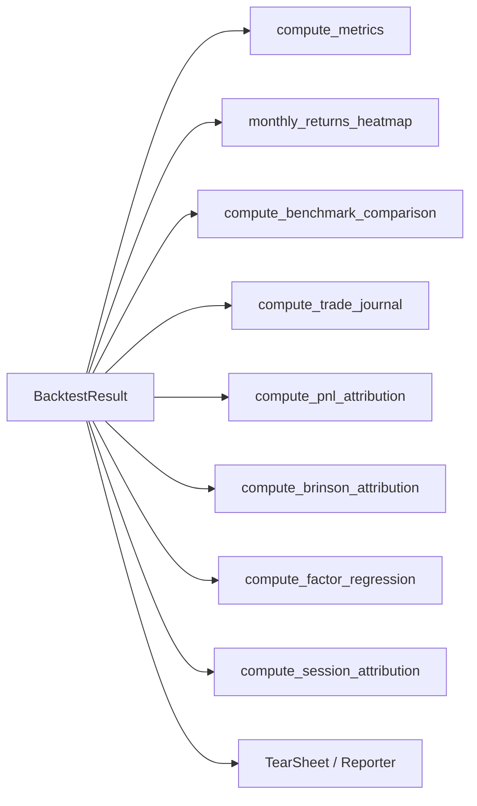

# 分析、归因与报告

> **本节讲解 backtest 跑完后的事**。`Backtest.run()` 返回 `BacktestResult`，包含权益曲线、bar 流、fills、orders。要把它变成可读的指标和归因报告，需要：`compute_metrics` → `compute_benchmark_comparison` → 4 种归因 → `TearSheet` / `Reporter`。

---

## 1. 全景：分析管道



---

## 2. `BacktestMetrics` —— 16 个指标

> 源码：`src/getrich_backtest/metrics.py`

```python
@dataclass
class BacktestMetrics:
    # 原始收益
    total_return: Decimal
    log_return: Decimal

    # 风险调整
    annualized_return: Decimal
    annualized_volatility: Decimal
    sharpe_ratio: Decimal
    sortino_ratio: Decimal
    calmar_ratio: Decimal

    # 回撤
    max_drawdown: Decimal
    max_drawdown_duration: int

    # 活动
    total_fees: Decimal
    total_turnover: Decimal
    turnover_rate: Decimal
    total_trades: int

    # 元数据
    n_bars: int
    risk_free_rate: Decimal
    trading_days_per_year: int
```

### 2.1 指标定义

| 指标 | 公式 | 单位 |
|---|---|---|
| `total_return` | `(equity_end / equity_start) - 1` | Decimal |
| `log_return` | `ln(equity_end / equity_start)` | Decimal |
| `annualized_return` | `(1 + total_return) ^ (252 / n_days) - 1` | Decimal/年 |
| `annualized_volatility` | `daily_returns.std() * sqrt(252)` | Decimal/年 |
| `sharpe_ratio` | `(annualized_return - risk_free) / annualized_volatility` | 倍 |
| `sortino_ratio` | 同上但用 downside deviation | 倍 |
| `calmar_ratio` | `annualized_return / abs(max_drawdown)` | 倍 |
| `max_drawdown` | `max(peak - trough) / peak` | Decimal |
| `max_drawdown_duration` | 从 peak 到 recovery 的 bar 数 | int |
| `total_fees` | 累计手续费 | Decimal |
| `total_turnover` | `Σ abs(qty × price)` (买卖双向) | Decimal |
| `turnover_rate` | `total_turnover / avg_equity` | Decimal/年化 |
| `total_trades` | 成交笔数 | int |

### 2.2 日频下采样（关键修复）

> Round #159：早期 `compute_metrics` 直接在原始 bar 频率上算 Sharpe。**1m bar 的 std 远大于 1d bar**，导致 Sharpe 被人为放大 ~15x（`sqrt(1440) ≈ 38`）。

`_to_daily_equity()` 把 equity curve 按 **calendar day** group_by 并取最后值（mark-to-market EOD），然后所有年化指标都基于日频：

```python
def _to_daily_equity(equity_curve: pl.DataFrame) -> pl.DataFrame:
    return (
        equity_curve
        .with_columns(pl.col("dt").dt.date().alias("_date"))
        .sort(["dt"])
        .group_by("_date", maintain_order=True)
        .agg(pl.col("equity").last())
        .drop("_date")
    )
```

> **同修复应用到 benchmark.py** —— 策略和 benchmark 都用日频下采样后算 Alpha/Beta。

### 2.3 `compute_metrics()` 用法

```python
from getrich_backtest import compute_metrics

metrics = compute_metrics(
    result,                          # BacktestResult
    risk_free_rate=Decimal("0.03"),  # 3%（默认）
    trading_days_per_year=252,       # 默认（A 股）
)
print(f"Sharpe: {metrics.sharpe_ratio:.2f}")
print(f"Max DD: {metrics.max_drawdown:.2%}")
```

`equity_curve_override` 允许传入自定义 equity（用于多策略组合）：

```python
combined_equity = pl.concat([r.equity_curve for r in sub_results]).sort("dt")
metrics = compute_metrics(result, equity_curve_override=combined_equity)
```

### 2.4 `monthly_returns_heatmap()` —— 月度收益热力图

```python
from getrich_backtest import monthly_returns_heatmap

heatmap = monthly_returns_heatmap(result.equity_curve)
# 输出 Polars DataFrame: 行=年, 列=月 (Jan..Dec), 值=月度收益 (Decimal)
```

可视化（在 TearSheet 里渲染为 seaborn heatmap）：

| Year | Jan | Feb | ... | Dec |
|---|---|---|---|---|
| 2020 | +3.2% | -1.5% | ... | +5.1% |
| 2021 | +0.8% | +4.2% | ... | -2.3% |
| ... | ... | ... | ... | ... |

> 月度收益应该是**有正有负**的。如果一整列都是负的（某年某月持续亏损），可能策略有时间窗口问题。

---

## 3. 基准对比（`compute_benchmark_comparison`）

> 源码：`src/getrich_backtest/benchmark.py`

```python
from getrich_backtest import compute_benchmark_comparison, Benchmark

benchmark = Benchmark(
    name="CSI300",
    equity_curve=load_csi300_equity_curve("2020-01-01", "2024-12-31"),
)
result_compare = compute_benchmark_comparison(
    strategy=result.equity_curve,
    benchmark=benchmark,
    risk_free_rate=Decimal("0.03"),
)
```

### 3.1 `BenchmarkCompareResult` 字段

| 字段 | 公式 | 含义 |
|---|---|---|
| `alpha` | 截距（CAPM） | 超额收益（年化） |
| `beta` | 斜率（CAPM） | 策略相对市场的波动率 |
| `tracking_error` | `(strategy - benchmark).std() * sqrt(252)` | 跟踪误差 |
| `information_ratio` | `(strategy - benchmark).mean() / std() * sqrt(252)` | IR（信息比率） |
| `up_capture` | `mean(strategy_return | benchmark > 0) / mean(benchmark | benchmark > 0)` | 上涨捕获率 |
| `down_capture` | `mean(strategy_return | benchmark < 0) / mean(benchmark | benchmark < 0)` | 下跌捕获率 |

### 3.2 如何解读

| 指标 | 含义 |
|---|---|
| `alpha > 0` | 策略有超额收益（剔除市场风险后） |
| `alpha < 0` | 跑输基准——可能因子过激或者只是杠杆不够 |
| `beta > 1` | 策略波动比市场大（更激进） |
| `beta < 0` | 策略和市场反向（对冲型） |
| `tracking_error > 10%` | 策略和市场相关性低，是"主动型" |
| `up_capture > 1, down_capture < 1` | 完美：涨时跟得上、跌时少跌 |
| `information_ratio > 0.5` | 主动管理有价值 |

---

## 4. 因子评估（`compute_ic` / `compute_rank_ic` / `factor_evaluation_report`）

> 源码：`src/getrich_backtest/analytics.py`

IC（Information Coefficient）= 因子预测值与实际收益的相关性。

```python
from getrich_backtest import compute_ic, compute_rank_ic

# Pearson 相关系数
ic_series = compute_ic(
    factor=factor_data,         # pl.DataFrame[(dt, symbol, factor_value)]
    returns=forward_returns,    # pl.DataFrame[(dt, symbol, fwd_return_1d)]
)
# 输出: pd.Series[dt -> ic_value]，每个 dt 一次截面相关系数

# Spearman 秩相关（更稳健）
ric_series = compute_rank_ic(factor=factor_data, returns=forward_returns)
```

### 4.1 IC > 0.05 视为"有用因子"

经验阈值：

| IC | 评估 |
|---|---|
| `> 0.10` | 极强因子（罕见，可能是 look-ahead） |
| `0.05 ~ 0.10` | 强因子（可作主信号） |
| `0.02 ~ 0.05` | 弱因子（需多因子融合） |
| `< 0.02` | 无效（考虑替换） |
| `< 0` | 反向因子（可作空头端） |

### 4.2 `factor_evaluation_report()`

把 IC 序列、t-stat、IC 衰减等汇总成 Markdown / HTML 报告：

```python
from getrich_backtest import factor_evaluation_report

report_md = factor_evaluation_report(
    factor=factor_data,
    returns=forward_returns,
    horizons=[1, 5, 20],  # 1d / 5d / 20d 持有期
)
# 输出含 IC 均值/标准差/IR、t-stat、IC 衰减曲线、分位数收益
```

---

## 5. 归因（5 个函数）

### 5.1 `compute_trade_journal`

每笔成交一行：

| trade_id | symbol | side | entry_dt | entry_price | exit_dt | exit_price | qty | pnl | holding_days | fee |
|---|---|---|---|---|---|---|---|---|---|---|
| t-001 | A | BUY | 2020-03-15 | 10.50 | 2020-04-02 | 11.20 | 100 | +70.00 | 18 | 5.00 |

```python
from getrich_backtest import compute_trade_journal

journal = compute_trade_journal(result.fills)
print(journal.head(5))
```

### 5.2 `compute_pnl_attribution`

把 PnL 拆为 4 个成分：

```
总 PnL = ΔShare × Avg_Cost   (持仓变化 × 加权成本)
      + Avg_Cost × ΔPrice     (成本 × 价差)
      + ΔShare × ΔPrice       (量 × 价交叉)
      + Fee                    (费用)
```

```python
from getrich_backtest import compute_pnl_attribution

attribution = compute_pnl_attribution(result.fills)
# 输出: pl.DataFrame, 每行 (fill_id, share_effect, price_effect, cross_effect, fee)
```

### 5.3 `compute_cost_attribution`

按费用类型拆分：

```python
from getrich_backtest import compute_cost_attribution

costs = compute_cost_attribution(result.fills)
# 输出: pl.DataFrame, 每行 (fill_id, commission, slippage, stamp_tax, ...)
```

### 5.4 `compute_brinson_attribution`（Brinson 模型）

把组合超额收益拆为 **配置效应（Allocation）+ 选择效应（Selection）+ 交互效应（Interaction）**：

```
Active Return = (w_p - w_b) × (r_b - r_total)        # 配置：超配/低配
              + w_b × (r_p_sector - r_b_sector)      # 选择：行业内选股
              + (w_p - w_b) × (r_p_sector - r_b_sector)  # 交互
```

```python
from getrich_backtest import compute_brinson_attribution

attribution = compute_brinson_attribution(
    portfolio_weights=portfolio_df,    # pl.DataFrame[(dt, sector, weight)]
    benchmark_weights=benchmark_df,
    portfolio_returns=returns_df,
    benchmark_returns=benchmark_returns_df,
    sector_column="sector",
)
# 输出: (allocation, selection, interaction) by sector
```

### 5.5 `compute_factor_regression`

对策略收益做多因子回归：

```python
from getrich_backtest import compute_factor_regression

result = compute_factor_regression(
    strategy_returns=strategy_daily_returns,
    factor_returns={"MKT": mkt, "SMB": smb, "HML": hml, "MOM": mom},
    risk_free_rate=Decimal("0.03"),
)
# 输出: FactorRegResult
#   .betas: {factor -> beta}
#   .t_stats: {factor -> t-stat}
#   .r_squared: float
#   .alpha: Decimal
#   .residuals: pd.Series
```

> 经典 Fama-French 三因子 + Carhart 动量因子。`beta ≈ 0.5` 表示策略有 50% 市场暴露 + 50% alpha。

### 5.6 `compute_session_attribution`

按交易时段（盘前/盘中/盘后/夜盘）拆分 PnL：

```python
from getrich_backtest import compute_session_attribution, Session, DEFAULT_ASHARE_SESSIONS

attribution = compute_session_attribution(
    fills=result.fills,
    sessions=DEFAULT_ASHARE_SESSIONS,    # A 股默认 4 个 session
    # 或自定义：sessions=(Session(time(9,30), time(11,30), "morning"), ...)
)
# 输出: SessionAttributionResult
#   .by_session: {session_name -> {pnl, n_trades, hit_rate}}
#   .total: 全 session 汇总
```

`DEFAULT_ASHARE_SESSIONS`：

- `morning_1`: 09:30 ~ 10:30
- `morning_2`: 10:30 ~ 11:30
- `afternoon_1`: 13:00 ~ 14:00
- `afternoon_2`: 14:00 ~ 15:00

> 用法：看策略 PnL 来自哪个时段。如果 80% 来自 `morning_1`，可能需要警惕"开盘抢筹"是否可持续。

---

## 6. 报告输出

### 6.1 `TearSheet` —— 单策略报告

> 源码：`src/getrich_backtest/report.py`

```python
from getrich_backtest import TearSheet

tearsheet = TearSheet(
    result=result,
    benchmark=benchmark_curve,
    attribution=attribution_results,
    output_dir="/tmp/reports/run-001",
    backend="plotly",  # 或 "matplotlib"
)
tearsheet.render()
# 产出:
#   /tmp/reports/run-001/
#     ├── equity_curve.html       (交互式)
#     ├── drawdown_curve.html
#     ├── monthly_heatmap.html
#     ├── attribution_table.html
#     ├── factor_exposures.html
#     ├── trade_journal.csv
#     └── report.html              (主页)
```

**两种后端**：

| 后端 | 优点 | 缺点 |
|---|---|---|
| `plotly`（默认） | 交互式（hover / zoom / 切换指标） | 单文件 > 1MB |
| `matplotlib` | 静态 PNG，可嵌入 PDF | 无交互 |

### 6.2 `Reporter` —— 多策略对比报告

```python
from getrich_backtest import Reporter

reporter = Reporter(
    results={"strategy_a": result_a, "strategy_b": result_b, "strategy_c": result_c},
    benchmark=benchmark_curve,
    output_dir="/tmp/reports/compare",
    backend="matplotlib",
)
reporter.render()
# 产出: 叠加的 equity curve、对比表、alpha/beta/IR 表
```

### 6.3 HTML 报告结构

```
report.html
├── 1. Header (策略名 / 运行时间 / 起始资金)
├── 2. Summary (16 个指标 + 基准对比)
├── 3. Equity Curve (interactive)
├── 4. Drawdown (interactive)
├── 5. Monthly Heatmap
├── 6. Trade Journal (top 20 trades)
├── 7. Attribution
│   ├── 7.1 Brinson (配置/选择/交互 by sector)
│   ├── 7.2 Factor Regression (betas + t-stats + R²)
│   ├── 7.3 Session (PnL by trading session)
│   └── 7.4 Cost (fee breakdown)
└── 8. Risk Metrics
    ├── 8.1 Drawdown over time
    ├── 8.2 Rolling Sharpe
    └── 8.3 Liquidation Events
```

---

## 7. 完整示例

```python
from decimal import Decimal
from getrich_backtest import (
    Backtest, DataFrameBarLoader, Strategy,
    compute_metrics, monthly_returns_heatmap,
    compute_benchmark_comparison, Benchmark,
    compute_trade_journal, compute_pnl_attribution,
    compute_brinson_attribution, compute_factor_regression,
    compute_session_attribution,
    TearSheet, Reporter, DEFAULT_ASHARE_SESSIONS,
)

# 1. 跑 backtest
bt = Backtest(strategy=strategy, bar_loader=loader, run_config=cfg)
result = bt.run()

# 2. 指标
metrics = compute_metrics(result, risk_free_rate=Decimal("0.03"))
heatmap = monthly_returns_heatmap(result.equity_curve)

# 3. 基准对比
benchmark = Benchmark(name="CSI300", equity_curve=load_csi300())
comparison = compute_benchmark_comparison(
    strategy=result.equity_curve, benchmark=benchmark,
    risk_free_rate=Decimal("0.03"),
)

# 4. 归因
journal = compute_trade_journal(result.fills)
pnl_attr = compute_pnl_attribution(result.fills)
brinson = compute_brinson_attribution(...)
factor_reg = compute_factor_regression(result.equity_curve, factor_returns_dict)
session_attr = compute_session_attribution(result.fills, DEFAULT_ASHARE_SESSIONS)

# 5. 报告
TearSheet(
    result=result,
    benchmark=benchmark.equity_curve,
    metrics=metrics,
    journal=journal,
    attribution={"brinson": brinson, "factor": factor_reg, "session": session_attr},
    output_dir="/tmp/reports/run-001",
    backend="plotly",
).render()
```

---

## 8. 常见错误

| 症状 | 原因 | 修法 |
|---|---|---|
| Sharpe 异常高（> 3） | 没做日频下采样 | 升级到有 `_to_daily_equity` 的版本 |
| 因子 IC 全是 NaN | 因子和收益没有重叠的 dt/symbol | `inner_join` 检查 |
| Brinson 配置效应负但选择效应正 | 选股能力 OK 但仓位偏离基准过大 | 检查 `Constraints` |
| 月度热力图全是红色 | 策略在某段时间集中亏损 | 配合 `walk-forward` 检查是否过拟合 |
| TearSheet 渲染慢 | 数据量太大 | 改用 `backend="matplotlib"`（10x 快） |

---

## 9. 进一步阅读

- 设计契约：
    - [40 指标](../design-contracts/40-metrics.md)
    - [41 因子评估](../design-contracts/41-factor-eval.md)
    - [42 基准与归因](../design-contracts/42-benchmark-attribution.md)
    - [52 报告与可视化](../design-contracts/52-report-visualization.md)
- API 详情：[API 参考 — 指标与归因](api-reference.md#8-指标与归因)
- 源码：
    - [`src/getrich_backtest/metrics.py`](https://github.com/getrich/getrich/blob/main/src/getrich_backtest/metrics.py)
    - [`src/getrich_backtest/benchmark.py`](https://github.com/getrich/getrich/blob/main/src/getrich_backtest/benchmark.py)
    - [`src/getrich_backtest/attribution.py`](https://github.com/getrich/getrich/blob/main/src/getrich_backtest/attribution.py)
    - [`src/getrich_backtest/report.py`](https://github.com/getrich/getrich/blob/main/src/getrich_backtest/report.py)
