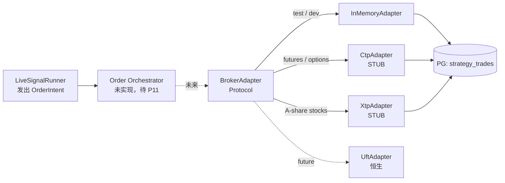

# 券商对接（CTP / XTP）

> **本节讲解 GetRich 平台的券商对接层**。`LiveSignalRunner` 发出 `OrderIntent` 后，由 `BrokerAdapter` Protocol 抽象层统一路由到 CTP（期货/期权）/ XTP（A股股票）/ 恒生UFT 等真实券商 SDK。本文档涵盖：抽象层契约、3 个内置适配器（CTP/XTP stub + InMemory dev）、幂等性约束、接入实盘券商的完整路径。
>
> 源码：`src/getrich/apps/strategy/broker.py`（Round #1163）

---

## 1. 抽象层架构



> **当前状态（Round #1163）**：`LiveSignalRunner` **不直接**调 `BrokerAdapter`；订单落 PG（`strategy_trades` 表）。`BrokerAdapter` 是 **infra-ready** 的契约层 —— 任何未来 PR 想要把 `LiveSignalRunner` 接上真实券商，只需把 `_record_to_pg()` 调用换成 `_submit_to_broker()`，**其余 live pipeline 零改动**。

---

## 2. `BrokerAdapter` Protocol

> 源码：`src/getrich/apps/strategy/broker.py::BrokerAdapter`

5 个方法 + 1 个 `kind` 类属性：

| 方法 | 签名 | 作用 | 必填实现 |
|---|---|---|---|
| `connect` | `async () -> None` | 登录 broker front（CTP `ReqUserLogin` / XTP `Init`） | ✅ |
| `disconnect` | `async () -> None` | 释放 session | ✅ |
| `submit_order` | `async (intent: OrderIntent) -> OrderAck` | 提交一笔委托 | ✅（必须幂等） |
| `cancel_order` | `async (client_order_id: str) -> OrderAck` | 撤销委托 | ✅（已成交不抛错） |
| `query_order` | `async (client_order_id: str) -> OrderAck` | 查询委托状态（对账用） | ✅ |

**实现约束**（在 Protocol docstring 中强制声明）：

1. **Async**：真实券商 ack 10-100ms，不阻塞 live loop
2. **Idempotent on `client_order_id`**：同一 ID 重提 → 返回首次 ack（**不重发**）
3. **Cancel-before-fill-safe**：已成交的 cancel 调用 → 返回原 ack with `status=FILLED`（**不抛错**）
4. **类属性 `kind: BrokerKind`**：写库时标记券商类型，便于 SRE 排查

---

## 3. 4 个枚举 + 2 个 dataclass

### 3.1 枚举

| 枚举 | 值 | 用途 |
|---|---|---|
| `OrderSide` | `BUY` / `SELL` | 买卖方向（ASCII 字符串，对齐 CTP/XTP） |
| `TimeInForce` | `DAY` / `GTC` / `IOC` / `FOK` | 4 个最常用 TIF；CTP 还有 GFD，XTP 还用 DAY 关键字 |
| `OrderStatus` | `PENDING` / `ACCEPTED` / `PARTIALLY_FILLED` / `FILLED` / `CANCELLED` / `REJECTED` / `EXPIRED` | 订单生命周期（CTP/XTP 并集） |
| `BrokerKind` | `IN_MEMORY` / `CTP` / `XTP` / `UFT` | 券商类型（`UFT` 是占位） |

> **设计取舍**：刻意不绑 CTP 专有词汇（`THOST_FTDC_OF_Open` 等），用 ASCII 字符串。CTP/XTP 各自负责在 stub 内部映射到 native 枚举。

### 3.2 `OrderIntent`（frozen dataclass）

```python
@dataclass(frozen=True)
class OrderIntent:
    symbol: str                              # "rb2410" / "600519.SH"
    side: OrderSide
    quantity: Decimal                        # 期货=手，股票=股
    price: Decimal | None = None             # None=市价单
    tif: TimeInForce = TimeInForce.DAY
    strategy_id: str = ""                    # 路由/审计
    sub_account_id: str = ""                 # 子账户路由
    client_order_id: str = field(default_factory=lambda: uuid.uuid4().hex)
```

> 与回测 `getrich_backtest.execution.OrderIntent` 是**独立的两个 dataclass**（不 type-alias）—— 实盘侧多 `strategy_id` / `sub_account_id` / `client_order_id` 三个字段。

### 3.3 `OrderAck`

```python
@dataclass(frozen=True)
class OrderAck:
    client_order_id: str
    broker_order_id: str                     # CTP OrderSysID / XTP order_xtp_id
    status: OrderStatus
    broker: BrokerKind
    accepted_at_ms: int                      # epoch ms
    filled_quantity: Decimal = Decimal(0)
    filled_price: Decimal | None = None
    message: str = ""                        # 错误信息（成功时 ""）
    raw: object = None                       # 券商原生响应（debug 用）
```

### 3.4 `BrokerError`

```python
@dataclass
class BrokerError(Exception):
    broker: BrokerKind
    code: str                                # 券商错误码 / "NOT_CONNECTED" 等
    message: str
    retryable: bool = False                  # 网络抖动 = True；账户异常 = False
```

`retryable` 标志区分**瞬时错误**（网络抖动 → 上层重试）和**终止错误**（账户冻结 → 上层告警 + 跳过）。

---

## 4. 3 个内置 Adapter

### 4.1 `CtpAdapter`（期货/期权，STUB）

> CTP（Comprehensive Transaction Platform）是上期信息技术主导的期货/期权交易前端。Python 绑定 `ctpapi` 在 pip 上有，但 wheel 是 platform-specific，**本仓库不打包**。

**CTP 关键概念**：

| 概念 | 字段 | 用途 |
|---|---|---|
| `BrokerID` | `self._broker_id` | 期货公司代码（如 `9999`） |
| `InvestorID` | `self._user_id` | 投资者账号 |
| `OrderRef` | `intent.client_order_id` | 客户端订单引用（**幂等键**） |
| `OrderSysID` | `broker_order_id` | 交易所系统 ID |
| `Direction` | `"0"`=买, `"1"`=卖 | CTP 编码 |
| `CombOffsetFlag` | `"0"`=开仓 | 组合开平标志 |
| `TimeCondition` | `"3"`=IOC, `"0"`=GFD | CTP 编码 |

**调用映射**（stub 已注释好真实 SDK 调用）：

```python
# 真实 SDK（Round #1163 stub 注释里）
self._api.ReqOrderInsert({
    "BrokerID": self._broker_id,
    "InvestorID": self._user_id,
    "InstrumentID": intent.symbol,           # "rb2410"
    "OrderRef": intent.client_order_id,      # 幂等键
    "Direction": "0" if intent.side == OrderSide.BUY else "1",
    "CombOffsetFlag": "0",                   # open
    "LimitPrice": float(intent.price or 0),
    "VolumeTotalOriginal": int(intent.quantity),
    "TimeCondition": "3" if intent.tif == TimeInForce.IOC else "0",
})
# Ack 通过 OnRtnOrder 回调回来
```

### 4.2 `XtpAdapter`（A 股股票，STUB）

> XTP（X-Trade Platform）是中信证券的股票交易前端。Python 绑定在 `xtp` 包。

**XTP 关键差异**（与 CTP 对比）：

| 差异 | CTP | XTP |
|---|---|---|
| Broker order ID | `OrderSysID` (str) | `order_xtp_id` (int) |
| 报单/撤单 | `ReqOrderInsert` + `ReqOrderAction` | 单一 `InsertOrder` + `CancelOrder` |
| 账号类型 | 无 | `CREDIT` / `NORMAL` / `DERIVATIVES` |
| 标的代码 | `rb2410` (期货) | `600519` (带市场后缀 `.SH` / `.SZ`) |

**stub 模型**：用单调递增 int 作为 `broker_order_id`（`1, 2, 3, ...`），便于测试断言。

### 4.3 `InMemoryAdapter`（test / dev）

> 真实可用的实现，**CI 和本地开发**都走这个。

**关键特性**：

- **Autofill 默认开启**：提交即成交（`status=FILLED`），便于测试整链路
- **可关 Autofill**：构造时 `InMemoryAdapter(autofill=False)` 保持 `PENDING`，模拟"未成交需对账"
- **完整 Protocol 实现**：`connect` / `disconnect` / `submit` / `cancel` / `query` 全可调
- **测试辅助**：`all_orders() -> list[OrderAck]` 返回所有 ack 快照

```python
# CI smoke test 用法
adapter = InMemoryAdapter()
await adapter.connect()
ack = await adapter.submit_order(OrderIntent(
    symbol="600519.SH",
    side=OrderSide.BUY,
    quantity=Decimal(100),
    price=Decimal(1800.00),
))
assert ack.status == OrderStatus.FILLED
assert ack.broker == BrokerKind.IN_MEMORY
```

---

## 5. 幂等性契约（**核心**）

> 任何实现 `BrokerAdapter` 的类**必须**遵守：

### 5.1 `submit_order` 幂等

```python
intent = OrderIntent(symbol="600519.SH", side=OrderSide.BUY, quantity=Decimal(100))
ack1 = await adapter.submit_order(intent)
ack2 = await adapter.submit_order(intent)  # 网络重试
assert ack1.client_order_id == ack2.client_order_id  # 同一 ID
assert ack1.broker_order_id == ack2.broker_order_id  # 返回首次 ack
```

**实现**：`client_order_id` 作为本地 dict key 去重。

**真实 SDK 映射**：

- **CTP**：`OrderRef` 字段就是幂等键，CTP front server 自动 dedup
- **XTP**：客户端必须先 `QueryOrder(client_order_id)` 再决定是否 `InsertOrder`（SDK 不原生去重）

### 5.2 `cancel_order` 已成交不抛错

```python
ack_filled = await adapter.submit_order(intent)
ack_cancel = await adapter.cancel_order(intent.client_order_id)
# 如果中间 fill 完成：
assert ack_cancel.status == OrderStatus.FILLED  # 返回原状态，不抛错
```

**实现**：cancel 路径先查本地 dict，**有则返回**，无则按 broker 实际状态处理。

### 5.3 `BrokerError.retryable` 标志

| 场景 | retryable | 上层动作 |
|---|---|---|
| 网络断 | True | 指数 backoff 重试 |
| CTP 前置未就绪 | True | 等待 + 重试 |
| 账户被冻结 | False | 立即告警 + 跳过 |
| 资金不足 | False | 立即告警 + 跳过 |
| 委托价格超限 | False | 跳过 + 记录原因 |

---

## 6. 接入实盘券商的完整路径

### 6.1 准备工作

1. **获取 vendor SDK wheel**（不在本仓库内）
   - CTP：`pip install ctpapi==6.7.7`（pip 有，但 platform-specific）
   - XTP：向中证技术申请 SDK + 客户号
2. **开 broker 账户**（沙箱/SIM 账户先跑通）
3. **配置 `front_address` / `client_key` 等**（在 `Settings` 加 `BROKER_*` 配置）

### 6.2 PR 模板（给未来的自己）

```python
# src/getrich/apps/strategy/broker.py 增加

class RealCtpAdapter(CtpAdapter):
    """Round #NNNN — wire the real CTP Python binding.

    Differences from the stub:
    - The OnRspUserLogin callback comes from the SDK's own
      thread; we await a future the callback completes.
    - The OnRtnOrder / OnRtnTrade callbacks need to update
      our local _acks dict from the SDK's thread.
    - Reconnect logic on dropped sessions.
    """
    def __init__(self, broker_id, user_id, password, front_address):
        super().__init__(broker_id, user_id, password, front_address)
        import ctpapi  # platform-specific
        self._api = None
        # ... rest of the wiring
```

### 6.3 切换路径

> 当 `RealCtpAdapter` 写完并测试通过后：

```python
# 1. 在 LiveSignalRunner 的 close loop 末尾增加
async def _send_to_broker(self, intent: OrderIntent) -> OrderAck:
    if self._broker is None:
        # No broker wired yet — keep current behavior:
        # write to PG strategy_trades and stop.
        return await self._record_to_pg(intent)
    return await self._broker.submit_order(intent)

# 2. 在 lifespan 里增加
async def lifespan(app: FastAPI):
    # ... existing setup
    broker = RealCtpAdapter(
        broker_id=settings.broker.ctp_broker_id,
        user_id=settings.broker.ctp_user_id,
        password=settings.broker.ctp_password,
        front_address=settings.broker.ctp_front_address,
    )
    await broker.connect()
    app.state.broker = broker
    yield
    await broker.disconnect()
```

### 6.4 测试矩阵

| 阶段 | 工具 | 范围 |
|---|---|---|
| 单元 | `pytest` + `InMemoryAdapter` | Protocol 契约、幂等性、错误码 |
| 集成 | `pytest` + SIM 账户 | Round-trip 提交/撤单/查询 |
| UAT | 沙箱账户 + 真实撮合 | 撮合行为、风控拒单、回报完整性 |
| 上线 | 真实账户（小资金） | 灰度 → 放量 |

> **禁止**跳过 UAT 直接上真实资金。

---

## 7. 错误码与重试

### 7.1 通用错误码

| code | 含义 | retryable |
|---|---|---|
| `NOT_CONNECTED` | `submit_order` 在 `connect()` 之前调用 | False |
| `UNKNOWN_ORDER` | `cancel` / `query` 一个不存在的 `client_order_id` | False |
| `SDK_TIMEOUT` | SDK 调用超时（券商前置没回包） | True |
| `SDK_DISCONNECTED` | 网络断 | True |
| `ACCOUNT_FROZEN` | 账户冻结 | False |
| `INSUFFICIENT_FUNDS` | 资金不足 | False |
| `PRICE_LIMIT` | 价格超限（涨跌停） | False |

### 7.2 重试策略

```python
async def submit_with_retry(adapter, intent, max_attempts=3):
    for attempt in range(1, max_attempts + 1):
        try:
            return await adapter.submit_order(intent)
        except BrokerError as e:
            if not e.retryable or attempt == max_attempts:
                raise
            await asyncio.sleep(0.1 * 2 ** attempt + random.uniform(0, 0.05))
```

> **不重试**的 5 类错误立即进入 L4 告警通道（[监控 - L4 告警通道](../operations/monitoring.md#5)）。

---

## 8. 与回测的差异

> 关键防混淆点：

| 维度 | 回测 | 实盘 |
|---|---|---|
| 模块 | `getrich_backtest.execution` | `apps.strategy.broker` |
| OrderIntent | 引擎内部 dataclass | 独立 dataclass（多 3 字段） |
| 撮合 | `NextBarMatchingModel`（事件驱动） | 真实交易所 |
| 延迟 | 0（同步） | 10-100ms（网络） |
| 幂等性 | 不需要 | **必须**（`client_order_id`） |
| 撤单 | 不支持 | 支持 |
| 拒单 | 自定义（风险模块） | 真实风控（保证金/限购/合规） |
| 手续费 | `FeeModel` 计算 | 真实扣收 + 报表对账 |

---

## 9. 测试

### 9.1 单元测试

`tests/getrich/apps/strategy/test_broker.py`（Round #1163 编写）覆盖：

- Protocol 子类化校验（`@runtime_checkable`）
- `InMemoryAdapter` 幂等性（同 ID 重复提交）
- `InMemoryAdapter` cancel-before-fill-safe
- `CtpAdapter` / `XtpAdapter` stub 路径
- `BrokerError` 的 `retryable` 标志

### 9.2 集成测试

```bash
# 1. 启动 dev server + worker
uv run uvicorn getrich.apps.web.main:app --port 8000 &
uv run python -m getrich.apps.worker.cli worker --concurrency=1 &

# 2. 跑 live signal smoke test
uv run pytest tests/getrich/apps/strategy/test_live_signals_integration.py -v
```

### 9.3 真实 broker 测试（待 SDK 接入后）

```bash
# SIM 账户
BROKER_CTP_FRONT_ADDRESS=tcp://sim.ctp.example.com:10100 \
BROKER_CTP_BROKER_ID=9999 \
BROKER_CTP_USER_ID=sim_user \
BROKER_CTP_PASSWORD=sim_pass \
uv run pytest tests/integration/test_ctp_real.py -v
```

---

## 10. 进一步阅读

- 监控：[监控与告警](../operations/monitoring.md#5)（告警通道配置）
- 引擎：[实盘信号](live-signals.md)（订单流转）
- 故障处理：[Runbook §11 — Broker SDK 异常](../operations/runbook.md)
- 源码：
    - [`src/getrich/apps/strategy/broker.py`](https://github.com/getrich/getrich/blob/main/src/getrich/apps/strategy/broker.py)
    - [`src/getrich/apps/strategy/live_runner.py`](https://github.com/getrich/getrich/blob/main/src/getrich/apps/strategy/live_runner.py)
- 厂商文档：
    - [CTP API 文档（综合交易平台）](http://www.sfit.com.cn/5_2_DocumentDown_1.shtml)
    - [XTP API 文档（中信证券）](https://github.com/ztsec/xtp_api)
