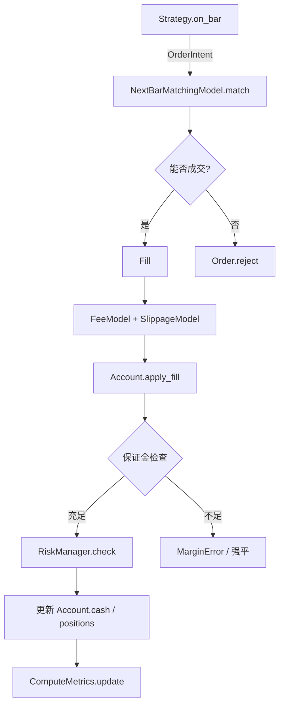
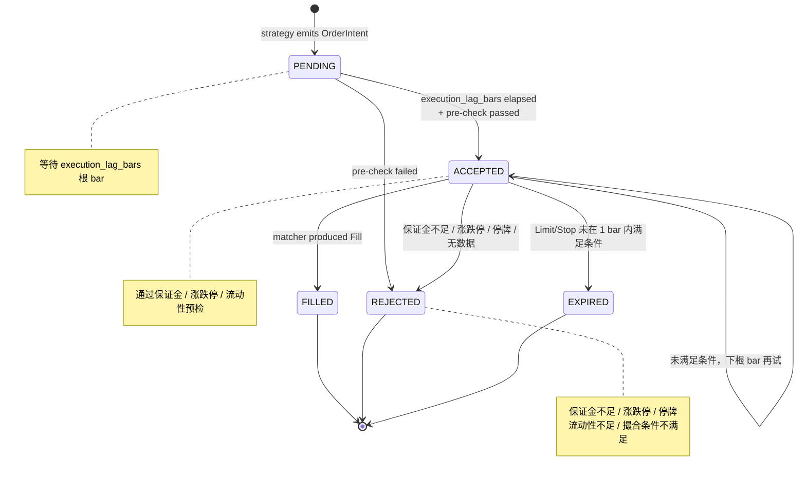

# 执行、账户与风控

> **本节讲解回测"心跳"内部**：策略产出 `OrderIntent` 后，引擎如何撮合成 `Fill`、更新 `Account` 状态、计算保证金、触发风控、最终落到 `BacktestResult`。
>
> 默认撮合模型是 `NextBarMatchingModel`（下一根 bar 的 OHLC 决定成交价）；账户是 `Account`（含子账户、保证金、short 头寸）；风控是 `RiskManager`。

---

## 1. 全景：每根 bar 的 6 步执行循环



源码：`src/getrich_backtest/api.py::Backtest._run_single` 的 bar loop 段。

---

## 2. `Order` 与 `OrderIntent`

`OrderIntent` 是**策略的意图**（"我想买 100 股 AAPL @ market"）：

```python
from decimal import Decimal
from getrich_backtest import OrderIntent, Side

intent = OrderIntent(
    symbol="AAPL",
    side=Side.BUY,
    qty=Decimal("100"),         # 或 weight=Decimal("0.05")
    order_type=OrderType.MARKET,  # 或 LIMIT / STOP / STOP_LIMIT
    limit_price=Decimal("150.00"),
    stop_price=Decimal("148.00"),
    time_in_force=TimeInForce.GTC,
)
```

`Order` 是**撮合中的内部对象**（`OrderIntent` 被撮合引擎接受后实例化）：

```python
class Order:
    order_id: str          # 自动生成
    intent: OrderIntent
    symbol: str
    side: Side
    qty: Decimal
    filled_qty: Decimal     # 累计成交
    avg_fill_price: Decimal | None
    status: OrderStatus     # PENDING → ACCEPTED → FILLED / REJECTED / EXPIRED
    created_at: datetime
    filled_at: datetime | None
```

### 2.1 订单状态机



### 2.2 `OrderStatus` enum

| 状态 | 含义 |
|---|---|
| `PENDING` | 等待 `execution_lag_bars` 根 bar |
| `ACCEPTED` | 通过预检，等待当前 bar 撮合 |
| `FILLED` | 全部成交 |
| `REJECTED` | 被拒绝（不会再次尝试） |
| `EXPIRED` | 超过有效时间 / 撮合窗口未满足 |

---

## 3. `NextBarMatchingModel` —— 默认撮合模型

> 源码：`src/getrich_backtest/execution.py`

```python
from getrich_backtest import NextBarMatchingModel, ZeroFee, ZeroSlippage

matcher = NextBarMatchingModel(
    execution_lag_bars=1,    # 默认：策略 in bar N，下单；撮合在 bar N+1
    fee_model=ZeroFee(),     # 替换为真实费率模型
    slippage_model=ZeroSlippage(),
)
```

### 3.1 撮合规则

撮合引擎用 **OHLC** 决定单根 bar 内能否成交：

| 订单类型 | 撮合条件 | 成交价 |
|---|---|---|
| `MARKET` | bar 存在 + 未停牌 | `open` (后续应用 slippage) |
| `LIMIT BUY` | `low <= limit_price` | `min(limit_price, open)` |
| `LIMIT SELL` | `high >= limit_price` | `max(limit_price, open)` |
| `STOP BUY` | `high >= stop_price` | `max(stop_price, open)` |
| `STOP SELL` | `low <= stop_price` | `min(stop_price, open)` |
| `STOP_LIMIT` | 先触发 stop，再用 limit | 复合 |

未满足 → order 留在 `ACCEPTED` 状态，下根 bar 再试。

### 3.2 `execution_lag_bars`

```python
matcher = NextBarMatchingModel(execution_lag_bars=2)
```

| lag | 行为 |
|---|---|
| `1`（默认） | 策略在 bar N 决策，bar N+1 的 open 撮合 |
| `2` | 策略在 bar N 决策，bar N+2 撮合（更保守，避免 look-ahead） |
| `>=3` | 接近真实"下单-到-到账"的 T+N 延迟 |

> 现实是 `1`，因为策略的 `on_bar` 已经"看到"了当前 bar 的 close，理论上不应再看到下一根的 open。`execution_lag_bars >= 2` 用于复现真实交易滑点场景。

### 3.3 预检（`_rejection_reason`）

撮合前会拒绝以下情况：

- 现金不足（`InsufficientCashError`）
- 触及涨跌停（`LimitHitError`）
- 标的停牌（`is_suspended` 标志）
- bar 内未找到该 symbol
- 保证金不足（`MarginError`，期货）

被拒绝的 order 不会再次尝试。

---

## 4. 费用与滑点（FeeModel + SlippageModel）

### 4.1 5 种 `FeeModel`

源码：`src/getrich_backtest/cost.py`

| 类 | 计费方式 | 适用 |
|---|---|---|
| `ZeroFee` | 0 | 单元测试 / 教学 |
| `FixedFee` | 每笔固定金额 | 模拟定额佣金 |
| `PercentageFee` | 交易额的 % | A 股双边 0.025% |
| `PerShareFee` | 每股固定金额 | 美股 $0.005/股 |
| `CompositeFee` | 多种组合 | 真实券商（监管费 + 佣金 + 印花税） |

```python
from getrich_backtest import CompositeFee, FixedFee, PercentageFee

realistic = CompositeFee([
    FixedFee(Decimal("5.00")),            # 最低 5 元
    PercentageFee(Decimal("0.0003")),     # 万 3
])
```

### 4.2 3 种 `SlippageModel`

| 类 | 滑点方式 | 适用 |
|---|---|---|
| `ZeroSlippage` | 0 | 同上 |
| `FixedSlippage` | 每笔固定金额 | 大盘股 |
| `BpsSlippage` | bps（万分之） | 默认推荐 |

```python
from getrich_backtest import BpsSlippage

slip = BpsSlippage(bps=Decimal("1.5"))  # 万 1.5
```

### 4.3 成交价 = `base_price ± slippage`

| side | 应用方向 |
|---|---|
| BUY | 成交价 = `base_price + slippage`（买贵了） |
| SELL | 成交价 = `base_price - slippage`（卖便宜了） |

---

## 5. `Account` 与 `Position`

> 源码：`src/getrich_backtest/account.py`

```python
@dataclass
class Account:
    cash: Decimal
    frozen_cash: Decimal = Decimal("0")     # 委托冻结（pre-check 通过但未成交）
    positions: dict[str, Position] = field(default_factory=dict)
    sub_accounts: dict[str, SubAccount] = field(default_factory=dict)
    initial_cash: Decimal | None = None       # 用于回测期收益率计算
    currency: str = "CNY"
```

### 5.1 `Position`

```python
@dataclass
class Position:
    symbol: str
    qty: Decimal                        # 正数=多，负数=空
    avg_cost: Decimal                   # 加权平均成本（不含费用）
    realized_pnl: Decimal = Decimal("0")
    margin_held: Decimal = Decimal("0")  # 期货占用的保证金
    maintenance_margin: Decimal = ...    # 维持保证金
    last_price: Decimal | None
```

### 5.2 `SubAccount`（子账户）

每个 sub-account 有独立现金、持仓、保证金。**多策略/多 sub-account 路由**见 [组合与权重 — sub-account 路由](../platform/architecture.md#sub-account-路由)。

```python
@dataclass
class SubAccount:
    sub_account_id: str
    cash: Decimal
    positions: dict[str, Position]
    margin_held: Decimal = Decimal("0")
    maintenance_margin: Decimal = Decimal("0")
    realized_pnl: Decimal = Decimal("0")
    snapshot: SubAccountSnapshot | None   # 每日结算后的快照
```

### 5.3 `apply_fill` —— 成交如何改写账户

`Account.apply_fill(fill)` 做的事：

```
1. 计算 notional = qty × price
2. 计算 commission = fee_model.compute(notional, fill)
3. 现金变化：
   - BUY:  cash -= (notional + commission)
   - SELL: cash += (notional - commission)
4. 持仓变化：
   - BUY:  position.qty += qty, recompute avg_cost
   - SELL: position.qty -= qty, realized_pnl += (price - avg_cost) × qty
5. 维护保证金：期货时增加 / 释放 margin_held
6. 写回 Account
```

`Account.equity()` = `cash + Σposition.qty × last_price`（未实现 PnL）。

### 5.4 `apply_corporate_action`

公司行为（分红、送股、拆股）独立于交易，用 `apply_corporate_action(corp_action)` 应用：

```python
@dataclass
class CorporateAction:
    symbol: str
    action_type: Literal["dividend", "split", "merge", "spinoff"]
    ex_date: datetime
    cash_per_share: Decimal | None     # for dividend
    ratio: Decimal | None              # for split (2.0 = 1-to-2)
```

`Account.apply_corporate_action(action)`:

- **dividend**：`cash += position.qty × cash_per_share`
- **split**：`position.qty *= ratio`，`position.avg_cost /= ratio`

> 引擎的 bar loop 在每根 bar 前调 `apply_corporate_action`（基于 ex_date），所以分红/拆股会自动反映在后续 bar 的 equity 计算里。

---

## 6. 保证金（`MarginCalculator`）

> 源码：`src/getrich_backtest/margin.py`

```python
from getrich_backtest import MarginCalculator

calc = MarginCalculator(
    initial_margin_rate=Decimal("0.15"),    # 初始保证金 15%
    maintenance_margin_rate=Decimal("0.10"),  # 维持保证金 10%
    margin_call_rate=Decimal("0.08"),        # 强平线 8%
)
```

### 6.1 三档线

| 阶段 | 阈值 | 触发 |
|---|---|---|
| 初始保证金 | `initial_margin_rate × notional` | 开仓需要 |
| 维持保证金 | `maintenance_margin_rate × notional` | 触发追保（margin call） |
| 强平线 | `margin_call_rate × notional` | 触发强平事件 |

### 6.2 保证金检查流程

`Account.check_margin_call()` 触发 `MarginError`：

```python
def check_margin_call(self) -> None:
    for pos in self.positions.values():
        required = calc.required_maintenance_margin(pos)
        if pos.margin_held < required:
            raise MarginError(...)
```

引擎在每根 bar 撮合**后**调一次，捕获 `MarginError` 后：

- 默认行为：标记该 position 为 `force_closed`，创建 `LiquidationEvent`
- `RiskManager` 可自定义（部分平仓 / 拒绝新单 / 报警）

---

## 7. 风险控制（`RiskManager`）

> 源码：`src/getrich_backtest/risk.py`

```python
from getrich_backtest import RiskManager, RiskConfig

config = RiskConfig(
    max_position_concentration=Decimal("0.30"),  # 任何单一资产 ≤ 30%
    max_leverage=Decimal("1.5"),                  # 杠杆 ≤ 1.5
    max_drawdown=Decimal("0.20"),                 # 触发 20% 回撤时停策略
    max_daily_loss=Decimal("0.05"),               # 日损 5% 停止当日交易
    stop_on_margin_call=True,                     # 保证金追保时强制平仓
)
risk = RiskManager(config)
```

### 7.1 `RiskConfig`

| 字段 | 默认 | 含义 |
|---|---|---|
| `max_position_concentration` | 1.0 | 单资产最大权重 |
| `max_leverage` | 1.0 | 杠杆上限（期货才有意义） |
| `max_drawdown` | ∞ | 最大回撤（超过则停） |
| `max_daily_loss` | ∞ | 单日最大亏损 |
| `stop_on_margin_call` | False | 追保时是否自动平仓 |

### 7.2 `RiskManager.check` —— 每根 bar 调用

```python
def check(self, account: Account, ctx: BarContext) -> None:
    if self.config.max_position_concentration is not None:
        for sym, pos in account.positions.items():
            weight = (pos.qty * pos.last_price) / account.equity()
            if weight > self.config.max_position_concentration:
                raise RiskError(f"position {sym} exceeds {self.config.max_position_concentration}")
    if self.config.max_drawdown is not None:
        current_dd = compute_drawdown(account.equity_curve)
        if current_dd > self.config.max_drawdown:
            raise RiskError(f"drawdown {current_dd} exceeds {self.config.max_drawdown}")
```

`RiskError` 被 runner 捕获，标记 `failed`（不重试），避免爆仓型策略继续跑。

### 7.3 `LiquidationEvent`

被强平的 position 会在 TearSheet 里以事件形式展示（按时间倒序），包含：

- 触发时间、强平价格、强平数量
- 当时账户 equity、未实现 PnL
- 触发原因（margin call / max drawdown / manual）

---

## 8. 每日结算（`daily_settle`）

> 源码：`src/getrich_backtest/account.py::daily_settle`

每个交易日结束（最后一根 bar 之后）调用 `daily_settle`，做的事：

1. 计算当日 `mark-to-market` PnL（用 `close` 价格重新估值）
2. 把 `unrealized_pnl` 转为 `realized_pnl`（如果是 close 后的强制平仓）
3. 更新 `SubAccountSnapshot`（用于审计 + 报告）
4. 重置 `frozen_cash`（已成交的冻结解除）

```python
from getrich_backtest import daily_settle

settled = daily_settle(
    account=account,
    settlement_prices={"A": Decimal("152.00"), "B": Decimal("48.50")},
    dt=current_dt,
)
# settled.sub_account_snapshots[sub_id].equity == mark-to-market equity
```

`get_settlement_prices(bars, dt)` 工具函数：从最后根 bar 的 close 提取每 symbol 的结算价。

---

## 9. Look-ahead 防御清单

回测中**最致命的 bug**就是 look-ahead bias——用未来的数据决策。引擎在以下环节做了防御：

| 环节 | 防御 |
|---|---|
| `on_bar` 可见数据 | 只看到当前 bar（`ctx.bar`）和历史（`ctx.history`），**不看到未来** |
| 撮合价格 | `execution_lag_bars >= 1`，bar N 决策在 bar N+1 撮合 |
| 因子 / 财务数据 | 必须有 `effective_at` 字段，引擎检查 `bar.dt >= factor.effective_at` |
| 公司行为 | 用 `ex_date`，bar loop 触发 |
| `next_rebalance_dt` 决策 | `ctx.now` 返回当前 bar 的 dt，不是 wall clock |

### 9.1 自检

如果你看到 backtest 表现异常好（年化 > 50%，Sharpe > 3），先检查：

1. `execution_lag_bars` 是否为 0？（绝不允许！）
2. `fee_model` / `slippage_model` 是否为 `ZeroFee` / `ZeroSlippage`？（实盘肯定不是）
3. `bar` 里的 `dt` 是 timezone-aware 吗？（`require_shanghai_aware` 校验）
4. `RunConfig.start` / `end` 是否合理？
5. `walk-forward` 的 OOS 表现是否远低于 IS？

---

## 10. 完整示例：含费用、滑点、保证金、风险控制

```python
from decimal import Decimal
from getrich_backtest import (
    Backtest, DataFrameBarLoader, Strategy, BarContext,
    OrderIntent, Side,
    NextBarMatchingModel, BpsSlippage, CompositeFee, FixedFee, PercentageFee,
    MarginCalculator, RiskManager, RiskConfig,
)

matcher = NextBarMatchingModel(
    execution_lag_bars=1,
    fee_model=CompositeFee([
        FixedFee(Decimal("5.00")),            # 最低 5 元
        PercentageFee(Decimal("0.0003")),     # 万 3
    ]),
    slippage_model=BpsSlippage(bps=Decimal("1.5")),
)
margin = MarginCalculator(
    initial_margin_rate=Decimal("0.15"),
    maintenance_margin_rate=Decimal("0.10"),
    margin_call_rate=Decimal("0.08"),
)
risk = RiskManager(RiskConfig(
    max_position_concentration=Decimal("0.30"),
    max_drawdown=Decimal("0.25"),
    stop_on_margin_call=True,
))

bt = Backtest(
    strategy=MyStrategy(),
    bar_loader=DataFrameBarLoader(bars),
    matcher=matcher,
    margin_calculator=margin,
    risk_manager=risk,
    initial_cash=Decimal("1000000"),
)
result = bt.run()
```

---

## 11. 进一步阅读

- 设计契约：
    - [30 执行引擎](../design-contracts/30-execution-engine.md)
    - [31 账户与保证金](../design-contracts/31-account-margin.md)
    - [32 风险控制](../design-contracts/32-risk-control.md)
- API 详情：[API 参考 — 执行撮合 / 账户 / 风险](api-reference.md#4-执行撮合)
- 撮合源码：[`src/getrich_backtest/execution.py`](https://github.com/getrich/getrich/blob/main/src/getrich_backtest/execution.py)
- 账户源码：[`src/getrich_backtest/account.py`](https://github.com/getrich/getrich/blob/main/src/getrich_backtest/account.py)
- 保证金源码：[`src/getrich_backtest/margin.py`](https://github.com/getrich/getrich/blob/main/src/getrich_backtest/margin.py)
- 风控源码：[`src/getrich_backtest/risk.py`](https://github.com/getrich/getrich/blob/main/src/getrich_backtest/risk.py)
