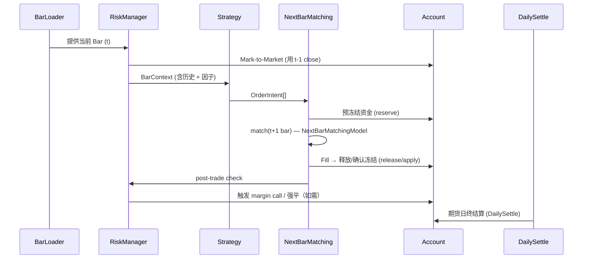

# 引擎总览

> **GetRich 量化回测引擎**（`getrich_backtest` Python 包）

`getrich_backtest` 是一个**事件驱动的事件循环回测框架**。它不模拟撮合交易所、不做行情回放、不接券商；它消费标准化的 K 线 + 因子 + 公司行为，驱动用户编写的 `Strategy`，按既定规则产出订单与成交，最终输出指标与归因。

---

## 是什么 / 不是什么

| ✅ GetRich 引擎做 | ❌ GetRich 引擎不做 |
|---|---|
| 标准化 OHLCV 加载（PG / DuckDB / DataFrame） | 行情回放（请用专门的 replay 工具） |
| 跨品种、跨频率、多策略并行 | 实盘下单（请用专门的 broker API） |
| 完整的事件循环（开仓 → 撮合 → 账户 → 风险） | 实时行情订阅（请用专门的 market data 服务） |
| 6 种权重分配器、4 类归因 | 复杂衍生品定价（仅支持基础期权/期货线性损益） |
| 参数扫描 + Walk-Forward 优化 | 机器学习模型训练（用专门的 ML 平台） |
| HTML / Parquet 报告输出 | 实时风控告警（用 `live/` 子包） |

---

## 5 层架构

```text
┌────────────────────────────────────────────────────────────┐
│ 60. Backtest (Backtest class — public entry point)         │
├────────────────────────────────────────────────────────────┤
│ 50. Research: sweep · walk_forward · report · config       │
├────────────────────────────────────────────────────────────┤
│ 40. Analytics: metrics · benchmark · attribution · factor  │
├────────────────────────────────────────────────────────────┤
│ 30. Execution: order → match → fill → fee/slip → account   │
├────────────────────────────────────────────────────────────┤
│ 20. Strategy: strategy → portfolio → allocator → intent    │
├────────────────────────────────────────────────────────────┤
│ 10. Data: PgSQL / DuckDB / DataFrame BarLoader (Polars)    │
└────────────────────────────────────────────────────────────┘
```

每层只依赖**下一层**，上层不感知下层实现细节。

---

## 核心执行循环

每根 K 线触发一次完整的事件序列：



> **关键设计**：估值用 `t-1` close（防 look-ahead bias），撮合在 `t+1` 开盘（`execution_lag_bars=1`，可调为 0 表示同日撮合）。详见 [执行与账户](execution-accounting.md)。

---

## 目录映射

| 引擎模块 | 文档 |
|---|---|
| `api.py`（`Backtest` 顶层类） | [API 参考](api-reference.md) |
| `account.py` | [执行与账户](execution-accounting.md) |
| `execution.py`（订单撮合） | [执行与账户](execution-accounting.md) |
| `margin.py`、`risk.py` | [执行与账户](execution-accounting.md) |
| `cost.py`（费用/滑点模型） | [执行与账户](execution-accounting.md) |
| `strategy/base.py`、`signal.py`、`target_position.py` | [策略开发](strategies.md) |
| `strategy/portfolio.py`、`alloc_weight.py`、`preprocessor.py` | [组合与权重](portfolio-allocation.md) |
| `strategy/context.py` | [核心概念](concepts.md) |
| `strategy/allocator.py`（`FixedAllocator`） | [组合与权重](portfolio-allocation.md) |
| `data/loader.py`、`pg_loader.py`、`duckdb_loader.py` | [数据加载器](data-loaders.md) |
| `data/resample.py` | [多频率](multi-frequency.md) |
| `indicators.py` | [策略开发](strategies.md) |
| `calendar.py` | [多频率](multi-frequency.md) |
| `metrics.py`、`benchmark.py`、`attribution.py` | [分析与报告](analysis-reporting.md) |
| `report.py`（TearSheet + Reporter） | [分析与报告](analysis-reporting.md) |
| `sweep.py`、`walk_forward.py` | [参数优化](parameter-optimization.md) |
| `persistence.py`、`job_persistence.py` | [结果持久化](persistence.md) |
| `live/signal.py`、`producer.py`、`writer.py` | [实盘信号](live-signals.md) |
| `runconfig.py` | [核心概念](concepts.md) |
| `types.py`、`time.py` | [核心概念](concepts.md) |
| `exceptions.py` | [核心概念](concepts.md) |

---

## 10 条设计原则

1. **决策/意图/执行分离**：`Strategy` 产出 `OrderIntent`，由 `execution` 层撮合为 `Order → Fill`。`Strategy` 不直接修改账户。
2. **t-1 估值**：账户权益用前一 bar 的 close 标记，撮合用后一 bar 的 open。**严禁**用 `t` 的 close 估值又用 `t` 的 close 撮合（look-ahead bias）。
3. **Decimal vs Float**：财务金额、PnL、保证金、订阅价格一律 `Decimal`；价格、收益率、IC 等标量用 `Float64`（Polars dtype）。
4. **Asia/Shanghai aware**：所有 `dt` 必须 `Asia/Shanghai (UTC+8)` 时区感知；naive datetime 直接抛 `TimezoneError`。
5. **Polars 长表**：所有时序数据用 Polars DataFrame；列名严格遵循 `open, high, low, close, volume, vwap, oi, symbol, dt`。
6. **BarLoader 协议中立**：`DataFrameBarLoader` / `PgBarLoader` / `DuckDBBarLoader` 实现同一 6 方法协议；`Strategy` 不感知。
7. **可复现四元组**：`(run_id, strategy_name, runconfig_hash, source_version)` 决定一次回测的全部输出，便于审计与复现。
8. **事件循环的 idempotency**：同一 `(run_id, source_version)` 多次运行产生一致结果（除非显式传 `random_seed`）。
9. **无 hidden state**：`Strategy` 不允许持有跨 `run` 的状态；每次 `setup()` 都从空状态开始。
10. **Error 层级清晰**：`BacktestError`（根）→ `DataLoadError` / `StrategyError` / `ExecutionError` / `MarginError` / `TimezoneError` 等具体类型；不混用 `Exception`。

---

## 运行时类型枚举

### 资产类型（`AssetClass`）

| 值 | 含义 |
|---|---|
| `EQUITY_A` | A 股 |
| `STOCK_FUTURE` | 股指期货 |
| `COMMODITY_FUTURE` | 商品期货 |
| `INDEX_FUTURE` | 指数期货 |
| `OPTION` | 期权 |
| `BOND` | 债券 |
| `FUND` | 基金 |

### 频率（`Frequency`）

| 值 | 用途 |
|---|---|
| `1m` | 1 分钟线 |
| `5m` | 5 分钟线 |
| `15m` | 15 分钟线 |
| `30m` | 30 分钟线 |
| `1h` | 1 小时线 |
| `1d` | 日线 |

`Frequency` 提供 `.all_values()`、`.is_valid(v)`、`.minutes` 等方法。`FREQ_TO_MINUTES: dict[str, int]` 提供字符串到分钟数的映射。

### 订单类型（`OrderType`）

| 值 | 说明 |
|---|---|
| `MARKET` | 市价单（默认 `t+1 open` 撮合） |
| `LIMIT` | 限价单（`low ≤ limit` 时撮合 `min(limit, open)`） |
| `STOP` | 止损单（`high ≥ stop` 时触发市价） |
| `STOP_LIMIT` | 止损限价单 |

### 订单方向（`Side`）

| 值 | 说明 |
|---|---|
| `BUY` | 买入（多开） |
| `SELL` | 卖出（多平） |
| `OPEN_LONG` | 显式开多 |
| `OPEN_SHORT` | 开空 |
| `CLOSE_LONG` | 平多 |
| `CLOSE_SHORT` | 平空 |

### TimeInForce

| 值 | 说明 |
|---|---|
| `DAY` | 当日有效（默认） |
| `GTC` | 撤销前有效 |
| `IOC` | 立即成交否则撤销 |
| `FOK` | 全部成交否则撤销 |
| `AUCTION` | 集合竞价 |

---

## 下一步

- 5 分钟跑通：[5 分钟上手](getting-started.md)
- 理解核心抽象：[核心概念](concepts.md)
- 写第一个策略：[策略开发](strategies.md)
- 完整 API 索引：[API 参考](api-reference.md)
