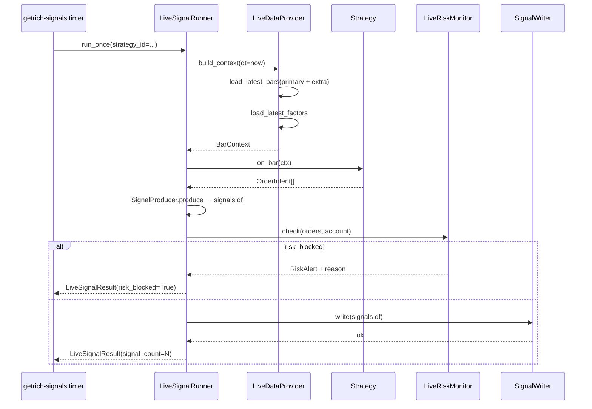

# 实盘信号生成

> **本节讲解"从回测到实盘"**。`Backtest.run()` 给出"假设在历史数据上交易"的 equity curve；**实盘信号**则是"现在这个 bar，给我交易建议"。两者共享同一个 `Strategy`，但实盘多了一层包装（`SignalProducer`）、一个实时的数据提供器（`LiveDataProvider`）、一个风控拦截器（`LiveRiskMonitor`）。

---

## 1. 从回测到实盘的鸿沟

| 维度 | 回测 | 实盘信号 |
|---|---|---|
| 数据源 | 离线 Parquet / PG | ClickHouse 最新窗口 |
| 时机 | 一次跑完 10 年 | 每分钟/每日定时触发 |
| 输出 | `BacktestResult` | 1 个/多个 `Signal` |
| 落库 | `backtest_runs` 表 | `signals` 表 |
| 风险 | 回填到 TearSheet | 拦截 + AlertChannel（Log/Webhook/Email） |
| 路由 | 单一 sub_account | 按 `strategy_id` → 用户的 sub_account 路由 |

实盘模式的核心是 **回测代码零修改** —— 同一个 `Strategy.on_bar` 既能跑回测，也能跑实盘。

---

## 2. 全景：实盘信号管道

```mermaid
flowchart LR
    A[getrich-signals.timer<br/>cron] --> B[LiveSignalRunner.run_once]
    B --> C[LiveDataProvider.load_latest_bars]
    C --> D[CH: latest bars]
    B --> E[LiveDataProvider.load_latest_factors]
    E --> F[CH: factor values]
    B --> G[LiveDataProvider.build_context]
    G --> H[BarContext<br/>(含 bars + factors + extra_freqs)]
    H --> I[Strategy.on_bar]
    I --> J[OrderIntent list]
    J --> K[SignalProducer.produce]
    K --> L[signal DataFrame]
    L --> M[SignalWriter.write]
    M --> N[PG: signals 表]
    B --> O[LiveRiskMonitor.check]
    O --> P[RiskAlert]
    P --> Q[AlertChannel.send<br/>Log/Webhook/Email]
```

源码：
- `src/getrich_backtest/live/` —— Signal / SignalProducer / SignalWriter
- `src/getrich/apps/strategy/live_data_provider.py` —— LiveDataProvider
- `src/getrich/apps/strategy/live_runner.py` —— LiveSignalRunner
- `src/getrich/apps/strategy/live_risk.py` —— LiveRiskMonitor + AlertChannel

---

## 3. `Signal` —— 信号数据模型

> 源码：`src/getrich_backtest/live/signal.py`

```python
@dataclass(frozen=True)
class Signal:
    symbol: str
    action: str                      # "buy" | "sell" | "hold" | "close"
    signal_type: str = "entry"       # "entry" / "exit" / "rebalance"
    direction: str | None = None     # "long" | "short"
    symbol_name: str | None = None
    exchange: str | None = None
    trigger_price: Decimal | None = None
    target_price: Decimal | None = None
    stop_loss_price: Decimal | None = None
    suggested_quantity: int | None = None
    position_pct: Decimal | None = None
    confidence: Decimal | None = None
    urgency: str = "normal"          # "low" | "normal" | "high" | "critical"
    reason: str | None = None
    trigger_time: datetime | None = None
    status: str = "active"           # "active" | "expired" | "cancelled"
```

映射到 PG `signals` 表（015 migration）—— **1 个 Signal 写入 1 行**。可选字段允许 `None`，让策略只填它有的。

### 3.1 `action` 枚举

| `action` | 含义 |
|---|---|
| `"buy"` | 买入建仓 / 加仓 |
| `"sell"` | 卖出减仓 / 平仓 |
| `"hold"` | 不操作（用于通知） |
| `"close"` | 强制平仓（风控触发） |

> Round #1081：信号 `reason` 字段在写入前用 bleach sanitize（防止 XSS / SQL 注入）；上限长度 500 字符。

---

## 4. `SignalProducer` —— 把 `OrderIntent` 转 `Signal`

> 源码：`src/getrich_backtest/live/producer.py`

```python
from getrich_backtest import SignalProducer, Strategy, SignalStrategy

producer = SignalProducer(strategy=Strategy(...))  # 或 SignalStrategy
signals_df = producer.produce(ctx)                  # pl.DataFrame
signals_list = producer.to_signals(signals_df)      # list[Signal]
```

### 4.1 两种策略的 produce 路径

| 策略类型 | produce 实现 |
|---|---|
| `Strategy`（写 `OrderIntent`） | `_produce_from_intents` —— 把每个 `OrderIntent` 映射成 1 行 signal |
| `SignalStrategy`（写评分） | `_produce_from_scores` —— 把截面评分 → 标准化 → top-k → signal |

> `SignalProducer` 根据 strategy 类型自动分支（鸭子类型），用户无感。

### 4.2 OrderIntent → Signal 映射

```python
def _side_to_action(side: Side) -> str:
    if side == Side.BUY:   return "buy"
    if side == Side.SELL:  return "sell"
    return "hold"

def _side_to_direction(side: Side) -> str | None:
    if side == Side.BUY:   return "long"
    if side == Side.SELL:  return "short"   # 或 None（仅平仓）
    return None
```

`reason` 自动生成：

```
"BUY 100 AAPL @ 152.30 (target_pct=10%)"
```

---

## 5. `SignalWriter` 协议

> 源码：`src/getrich_backtest/live/writer.py`

```python
class SignalWriter(Protocol):
    def write(self, signals: pl.DataFrame) -> None: ...
```

### 5.1 `EvalSignalWriter` —— 内存实现（测试/教学）

```python
from getrich_backtest import EvalSignalWriter

writer = EvalSignalWriter()
writer.write(signals_df)
print(writer.to_dataframe())  # pl.DataFrame
print(len(writer.to_dataframe()))  # N rows
```

无副作用，存在 RAM 里。`clear()` 清空。

### 5.2 生产实现：`PgSignalWriter`（平台层）

平台层用 `PgSignalWriter`（`apps/strategy/signal_writer.py`）写 PG `signals` 表：

```python
# 平台层注入（LiveSignalRunner 内部）
async with pg_pool.connection() as conn:
    await pg_signal_writer.write_batch(conn, signals, strategy_id=strategy_id)
```

每个 `Signal` 1 行，附带 `id`（UUID）、`created_at`、`user_id`（从 sub_account 路由查得）、`run_id`（可为 None）。

---

## 6. `LiveDataProvider` —— 实时数据装配

> 源码：`src/getrich/apps/strategy/live_data_provider.py`

`LiveDataProvider` 在每根 bar 之前为 `Strategy.on_bar` 准备 `BarContext`：

```python
class LiveDataProvider:
    def __init__(
        self,
        *,
        ch_pool: ChPool,                  # ClickHouse 池
        strategy_id: str,                  # 用于 PG 配置查询
        symbols: Sequence[str],            # Universe
        primary_freq: str,                 # "1m" / "5m" / "1d"
        extra_freqs: Sequence[str] = (),   # 自动从 strategy_meta 查
        factor_names: Sequence[str] = (),  # 自动从 strategy_meta 查
        lookback_bars: int = 200,
    ): ...
```

### 6.1 `load_latest_bars` —— 拉最新 bar

```python
def load_latest_bars(self, freq: str) -> pl.DataFrame:
    """从 CH 的 bars 表拉最近 lookback_bars 根 bar."""
```

`freq ∈ {primary_freq} ∪ extra_freqs`。

### 6.2 `load_latest_factors` —— 拉最新因子

```python
def load_latest_factors(self) -> pl.DataFrame:
    """从 CH 的 factor_values 表拉指定 factor_names 的最新值."""
```

> `factor_names` 缺省时**自动从 `strategy_meta` 表查**（基于 `strategy_id`）。Round #176 实现了自动发现机制。

### 6.3 `build_context` —— 装配 `BarContext`

```python
async def build_context(self, dt: datetime) -> BarContext:
    """构造一个 BarContext，注入 bars / factors / extra_freqs."""
```

> 内部调 `_normalize_datetime` 把 CH 输出的 `dt` 强转为 `Asia/Shanghai` aware datetime，**防 look-ahead**。

### 6.4 Round #182-#185 多频率注入

`LiveDataProvider` 自动为每个 `extra_freq` 拉 bar，注入到 `BarContext` 的 `extra_history` 槽位 —— 策略可 `ctx.history("1d")` 访问。

---

## 7. `LiveSignalRunner.run_once`

> 源码：`src/getrich/apps/strategy/live_runner.py`

```python
class LiveSignalRunner:
    def __init__(
        self,
        *,
        provider: LiveDataProvider,
        strategy: Strategy,
        writer: SignalWriter,                # EvalSignalWriter 或 PgSignalWriter
        risk_monitor: LiveRiskMonitor,        # 可选
        account_loader: AccountStateLoader,    # 加载当前 sub_account 状态
    ): ...

    async def run_once(self, *, strategy_id: str) -> LiveSignalResult: ...
```

### 7.1 `run_once` 流程



### 7.2 `LiveSignalResult`

```python
@dataclass
class LiveSignalResult:
    strategy_id: str
    run_dt: datetime
    signal_count: int           # 写入的 signal 数
    risk_blocked: bool          # 是否被风控拦截
    risk_alert: RiskAlert | None
    error: str | None
    duration_ms: int            # 跑完用时
```

### 7.3 错误处理

| 异常 | 处理 |
|---|---|
| `LiveDataError`（CH 拉取失败） | 写 `error="..."`，`signal_count=0`，不调用 strategy |
| `SignalProductionError`（producer 失败） | 同上 |
| `RiskAlert` 触发 | 标记 `risk_blocked=True`，**仍可选写 hold signal**（通知用户） |
| 任何其他 `Exception` | 包装成 `error=...`，不抛出（runner 自我保护） |

---

## 8. `LiveRiskMonitor` —— 实时风控拦截

> 源码：`src/getrich/apps/strategy/live_risk.py`

```python
class LiveRiskMonitor:
    def __init__(
        self,
        config: RiskConfig,                  # 复用回测的 RiskConfig
        channels: Sequence[AlertChannel],     # 1+ 报警通道
    ): ...

    async def check(
        self,
        orders: list[OrderIntent],
        account_state: AccountState,
        ctx: BarContext,
    ) -> RiskAlert | None: ...
```

返回 `None` 表示通过；返回 `RiskAlert` 表示**阻止下单**。

### 8.1 `RiskAlert`

```python
@dataclass
class RiskAlert:
    strategy_id: str
    severity: str             # "warning" | "critical"
    rule_name: str            # "max_position_concentration" / "max_leverage" / ...
    message: str              # 可读消息
    details: dict[str, object]  # 触发的具体值（symbol, weight, ...）
    triggered_at: datetime
```

### 8.2 `AlertChannel` 协议

```python
class AlertChannel(Protocol):
    async def send(self, alert: RiskAlert) -> None: ...
```

3 个内置实现：

| 类 | 行为 |
|---|---|
| `LoggingAlertChannel` | 写 `logger.warning(...)` |
| `WebhookAlertChannel` | POST JSON 到指定 URL（飞书/Slack/DingTalk webhook 通用） |
| `EmailAlertChannel` | SMTP 发送邮件（用 `aiosmtplib`） |

```python
from getrich.apps.strategy.live_risk import (
    LiveRiskMonitor, LoggingAlertChannel, WebhookAlertChannel, EmailAlertChannel,
)

monitor = LiveRiskMonitor(
    config=RiskConfig(max_position_concentration=Decimal("0.30"), max_leverage=Decimal("1.5")),
    channels=[
        LoggingAlertChannel(),
        WebhookAlertChannel(url="https://oapi.dingtalk.com/robot/send?access_token=..."),
        EmailAlertChannel(smtp_host="smtp.gmail.com", ...),
    ],
)
```

### 8.3 默认检查项

| 规则 | 来源 | 触发 |
|---|---|---|
| `max_position_concentration` | `RiskConfig` | `|w_i| > 0.30` |
| `max_leverage` | `RiskConfig` | `gross_exposure / equity > 1.5` |
| `max_drawdown` | `RiskConfig` | running drawdown > 0.20 |
| `max_daily_loss` | `RiskConfig` | 当日 PnL < -0.05 |
| `margin_call` | `AccountState.maintenance_margin` | 保证金不足 |
| `risk_blocked_in_backtest` | `Account.risk_blocked` | 上次回测已阻止 |

> 复用回测的 `RiskConfig`，行为一致。

---

## 9. Sub-account 路由

> Round #191-#195：实盘信号需要落到**对应用户的子账户**。

```python
# AccountStateLoader.load_for_strategy(strategy_id) -> AccountState
{
    "user_id": 42,
    "sub_account_id": "user-42-main",
    "cash": Decimal("500000"),
    "positions": [...],
    "maintenance_margin": Decimal("12000"),
}
```

> 平台层用 `strategy_id` JOIN `user_strategy_subscriptions` 查到 `user_id` 和 `sub_account_id`，再用 `AccountStateLoader.load(sub_account_id)` 拉最新状态。

---

## 10. CLI 入口 + systemd timer

### 10.1 `getrich-signals`

```bash
# 单次跑（开发/CI）
getrich-signals run-once --strategy-id str-001

# 列出所有 strategy 的状态
getrich-signals list

# 手动触发 dry-run（不写 DB）
getrich-signals run-once --strategy-id str-001 --dry-run
```

源码：`src/getrich/apps/strategy/cli.py::signals_app`

### 10.2 systemd timer

`getrich-signals.timer`（每 5 分钟触发）：

```ini
[Unit]
Description=GetRich Live Signal Generator (every 5 min)

[Timer]
OnBootSec=2min
OnUnitActiveSec=5min
AccuracySec=10s
Persistent=true

[Install]
WantedBy=timers.target
```

`getrich-signals.service`：

```ini
[Service]
Type=oneshot
ExecStart=/usr/local/bin/getrich-signals run-all
User=getrich
Group=getrich
Environment=GETRICH_ENV=production
```

> 多 strategy 共享一个 5min 周期，runner 内部按 `strategy_id` 循环调 `run_once`。

---

## 11. 完整示例

```python
import asyncio
from decimal import Decimal
from getrich.libs.clickhouse.pool import ch_pool
from getrich.libs.postgres.pool import pg_pool
from getrich_backtest import Strategy, BarContext, OrderIntent, Side
from getrich_backtest.live import SignalProducer, EvalSignalWriter
from getrich.apps.strategy.live_data_provider import LiveDataProvider
from getrich.apps.strategy.live_runner import LiveSignalRunner
from getrich.apps.strategy.live_risk import (
    LiveRiskMonitor, RiskConfig, LoggingAlertChannel, WebhookAlertChannel,
)
from getrich.apps.strategy.account_loader import AccountStateLoader

class FastReversal(Strategy):
    def on_bar(self, ctx: BarContext) -> list[OrderIntent]:
        bars = ctx.history()
        if bars.is_empty():
            return []
        # ... 信号逻辑
        return [OrderIntent(symbol="AAPL", side=Side.BUY, qty=Decimal("100"))]


async def main():
    strategy = FastReversal()
    provider = LiveDataProvider(
        ch_pool=ch_pool,
        strategy_id="str-001",
        symbols=("AAPL", "MSFT"),
        primary_freq="1m",
        extra_freqs=("1d",),
        lookback_bars=200,
    )
    writer = EvalSignalWriter()  # 或 PgSignalWriter(pg_pool)
    risk = LiveRiskMonitor(
        config=RiskConfig(max_position_concentration=Decimal("0.30")),
        channels=[LoggingAlertChannel(), WebhookAlertChannel(url="https://...")],
    )
    account_loader = AccountStateLoader(pg_pool=pg_pool)

    runner = LiveSignalRunner(
        provider=provider,
        strategy=strategy,
        writer=writer,
        risk_monitor=risk,
        account_loader=account_loader,
    )

    result = await runner.run_once(strategy_id="str-001")
    print(f"Signals: {result.signal_count}, blocked: {result.risk_blocked}")

asyncio.run(main())
```

---

## 12. 常见错误

| 症状 | 原因 | 修法 |
|---|---|---|
| `LiveDataError: symbol X not in universe` | strategy 用了未配置的 symbol | 把 symbol 加到 `LiveDataProvider.symbols` |
| `BarContext` 是空数据 | CH 缺数据 / 索引未建 | `SELECT count(*) FROM getrich.bar_1m WHERE symbol='AAPL'` 验证 |
| `factor_name "momentum_20" not found` | 因子未预计算 | 跑 `factor_compute` job，或从 `strategy_meta` 删除该因子 |
| RiskAlert 一直触发 | 阈值设太严 | 调 `RiskConfig`，先 `LoggingAlertChannel` 调试 |
| `trigger_time` 是 UTC | CH 时区没设 | Round #182 修复：`LiveDataProvider._normalize_datetime` |
| Signal 落库但前端看不到 | 缺 `user_id` / `sub_account_id` 关联 | 015 migration 加了 FK，确认 `user_strategy_subscriptions` 有行 |
| 同一 bar 重复 signal | 多个 worker 并发 | systemd timer + `flock` 串行化，或加 `(strategy_id, dt)` 唯一索引 |

---

## 13. 进一步阅读

- 设计契约：[60 客户端 API](../design-contracts/60-client-api.md)
- API 详情：[API 参考 — 实盘信号](api-reference.md#15-实盘信号)
- 平台层：[Web API 参考 — Signal](../platform/api-reference.md)
- 源码：
    - [`src/getrich_backtest/live/signal.py`](https://github.com/getrich/getrich/blob/main/src/getrich_backtest/live/signal.py)
    - [`src/getrich_backtest/live/producer.py`](https://github.com/getrich/getrich/blob/main/src/getrich_backtest/live/producer.py)
    - [`src/getrich_backtest/live/writer.py`](https://github.com/getrich/getrich/blob/main/src/getrich_backtest/live/writer.py)
    - [`src/getrich/apps/strategy/live_data_provider.py`](https://github.com/getrich/getrich/blob/main/src/getrich/apps/strategy/live_data_provider.py)
    - [`src/getrich/apps/strategy/live_runner.py`](https://github.com/getrich/getrich/blob/main/src/getrich/apps/strategy/live_runner.py)
    - [`src/getrich/apps/strategy/live_risk.py`](https://github.com/getrich/getrich/blob/main/src/getrich/apps/strategy/live_risk.py)
- systemd 单元：[`getrich-signals.service`](https://github.com/getrich/getrich/blob/main/getrich-signals.service)、[`getrich-signals.timer`](https://github.com/getrich/getrich/blob/main/getrich-signals.timer)
