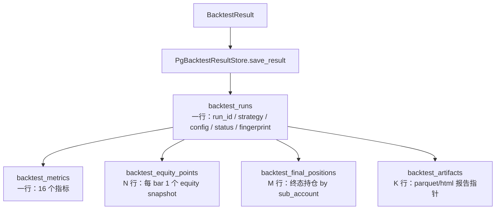

# 持久化（PostgreSQL + Artifact）

> **本节讲解"跑完的 backtest 怎么存到数据库、怎么取出来"**。`PgBacktestResultStore` 是引擎与 PostgreSQL 之间的桥梁，存的是 `BacktestResult` 全文（metadata + 指标 + equity curve + 终态持仓 + artifact 清单），不是 Parquet 重新加载。

---

## 1. 全景：保存的 5 类数据



源码：`src/getrich_backtest/persistence.py`

---

## 2. `RunConfig.fingerprint()` —— 幂等键

> `src/getrich_backtest/runconfig.py::RunConfig.fingerprint`

```python
from getrich_backtest import RunConfig

cfg = RunConfig(
    strategy_name="MACross",
    symbols=("A", "B"),
    start=..., end=...,
    initial_cash=Decimal("1000000"),
    freq="1d",
    extra_freqs=("1h",),
    execution_lag_bars=1,
    strategy_params={"fast": 10, "slow": 50},
    risk_config={...},
)
cfg.fingerprint()  # → "a3b2c1..." (SHA-256, 64 hex)
```

`fingerprint` 是 **SHA-256 哈希**，覆盖所有**逻辑字段**（除 `run_id` 和 `created_at`）：

| 字段 | 包含 |
|---|---|
| `strategy_name` | ✅ |
| `strategy_names` | ✅（多策略） |
| `strategy_freqs` | ✅ |
| `symbols` | ✅ |
| `start`, `end` | ✅ |
| `initial_cash` | ✅ |
| `freq`, `extra_freqs` | ✅ |
| `execution_lag_bars` | ✅ |
| `strategy_params` | ✅（JSON-encoded） |
| `risk_config` | ✅（JSON-encoded） |
| `run_id` | ❌（不参与指纹） |
| `created_at` | ❌（不参与指纹） |

> **幂等性**：逻辑相同 → 指纹相同。`save_result(run_id="abc", cfg)` 和 `save_result(run_id="xyz", cfg)` 在 cfg 相同的情况下覆盖同一行（`backtest_runs` 上的 `UPSERT`）。

### 2.1 用 fingerprint 去重

```sql
-- 023 migration
CREATE UNIQUE INDEX idx_backtest_runs_fingerprint_user
    ON frontend.backtest_runs(user_id, config_fingerprint)
    WHERE status IN ('running', 'completed');
```

平台层 `BacktestJobService.create_job` 在创建 job 前先查 `WHERE config_fingerprint = ?`：

- **有 completed/running 行** → 返回已有 `run_id`，不创建新 job
- **无** → 新建 job

> Round #967 + 023 migration 实现了这个机制。

---

## 3. `PgBacktestResultStore`

> 源码：`src/getrich_backtest/persistence.py`

```python
from getrich.libs.postgres.pool import pg_pool
from getrich_backtest import PgBacktestResultStore

store = PgBacktestResultStore(pool=pg_pool)  # 默认用全局 pool
```

### 3.1 `save_result` —— 保存一次回测结果

```python
async def save_result(
    self,
    result: BacktestResult,                       # 必填
    *,
    metrics: BacktestMetrics | None = None,       # 16 个指标
    strategy_id: str | None = None,                # 平台层 strategy.id
    artifacts: Sequence[BacktestArtifact] = (),   # 报告文件清单
    status: str = "completed",                     # "running" / "completed" / "failed"
    conn: AsyncConnection | None = None,
) -> None: ...
```

**幂等语义**：

- 给定 `run_id`，**先 DELETE 子表再 INSERT 新行**（同一事务）
- `backtest_runs` 用 `UPSERT`（`ON CONFLICT (run_id) DO UPDATE`）
- 多次 `save_result` 同一 `run_id` = 最新一次为准

```python
# 平台层 SweepRunner 完成 N 个 trial 后：
for trial in trials:
    store.save_result(
        result=trial.result,
        metrics=trial.metrics,
        strategy_id=strategy_id,
        artifacts=artifacts_from_report_dir(trial.report_dir),
        status="completed",
    )
```

**字段映射**（`backtest_runs`）：

| 列 | 来源 |
|---|---|
| `run_id` | `result.run_id` |
| `strategy_id` | 参数 |
| `strategy_name` | `result.strategy_name` |
| `config` | `RunConfig` 的 JSON 序列化 |
| `config_fingerprint` | `config.fingerprint()` |
| `status` | `"running"` / `"completed"` / `"failed"` |
| `created_at` | `RunConfig.created_at` |
| `final_equity` | `result.equity[-1].equity` |
| `benchmark_final_equity` | `result.benchmark_equity_curve[-1]`（如有） |
| `n_bars` | `len(result.equity_curve)` |
| `n_fills` | `len(result.fills)` |
| `n_orders` | `len(result.orders)` |
| `error_message` | `mark_failed` 时填 |

### 3.2 `mark_running` / `mark_failed` —— 状态机

```python
# worker 启动回测时
await store.mark_running(cfg, strategy_id=...)

# 跑完后（成功）
await store.save_result(result, metrics=..., status="completed")

# 跑完后（失败）
await store.mark_failed(cfg, error_message=str(exc), strategy_id=...)
```

> 这 3 个方法是 `BacktestJobRunner`（`src/getrich/apps/strategy/backtest_job_runner.py`）调用的入口。

### 3.3 `get_run` / `list_runs` —— 查询

```python
# 单个 run
run = await store.get_run(run_id="...")        # dict 或 None

# 按 strategy 列出（分页）
runs, total = await store.list_runs(
    strategy_id="...",
    status="completed",
    limit=50, offset=0,
)
# runs = list[dict], total = int (命中总数)
```

`list_runs` 支持 `status` / `strategy_id` 过滤，按 `created_at DESC` 排序，返回带 `_total` 的窗口函数结果。

### 3.4 `get_equity_curve`

```python
equity = await store.get_equity_curve(
    run_id="...",
    strategy_name="MACross",  # 可选：多策略时按 strategy 拆
)
# equity = list[dict]，按 dt 升序，每 dict 含 (dt, equity, cash, ...)
```

> `backtest_equity_points` 表有 `(run_id, dt)` 索引，查询 50 万点 1d curve < 100ms。

---

## 4. `BacktestArtifact` —— 报告文件清单

```python
@dataclass(frozen=True)
class BacktestArtifact:
    artifact_type: str          # "manifest" / "equity_parquet" / "html" / ...
    uri: str                    # 文件路径或 S3 URI
    checksum: str | None = None # SHA-256
    meta: dict[str, object] | None = None
```

### 4.1 5 种 artifact_type

| `artifact_type` | 文件名约定 |
|---|---|
| `manifest` | `manifest.json` |
| `equity_parquet` | `equity.parquet` |
| `fills_parquet` | `fills.parquet` |
| `orders_parquet` | `orders.parquet` |
| `html` | `tear_sheet.html` 或 `report.html` |

### 4.2 `artifacts_from_report_dir`

```python
from getrich_backtest import artifacts_from_report_dir
from pathlib import Path

artifacts = artifacts_from_report_dir(Path("/tmp/reports/run-001"))
# 自动扫描 _ARTIFACT_FILES 中的 6 个文件名，存在则加入清单
```

注册的文件名（`_ARTIFACT_FILES`）：

```python
_ARTIFACT_FILES = {
    "manifest.json": "manifest",
    "equity.parquet": "equity_parquet",
    "fills.parquet": "fills_parquet",
    "orders.parquet": "orders_parquet",
    "tear_sheet.html": "html",
    "report.html": "html",
}
```

### 4.3 平台层存储（`BacktestStorageConfig`）

平台层把 artifact 存到 **minio/S3** 或**本地磁盘**：

```python
# apps/web/config/settings.py
class BacktestStorageConfig(BaseSettings):
    base_path: Path = Path("/var/lib/getrich/artifacts")
    public_base_url: str = "https://getrich.example.com/content"
```

`/content` 端点（SSE/walk_forward 之外的 read API）：

```python
GET /content/{run_id}/{filename}
# → 文件流（minio 签名 URL 或 nginx X-Accel-Redirect）
```

详见 [Web API 参考 — 内容下载](../platform/api-reference.md)。

---

## 5. 4 张 PG 表

> 005 migration 创建；后续 011/023 加了 `user_id` / `config_fingerprint` 索引。

```sql
-- 5.1 backtest_runs (metadata)
CREATE TABLE frontend.backtest_runs (
    run_id           TEXT PRIMARY KEY,
    strategy_id      TEXT,
    strategy_name    TEXT NOT NULL,
    config           JSONB NOT NULL,
    config_fingerprint TEXT NOT NULL,
    status           TEXT NOT NULL CHECK (status IN ('running', 'completed', 'failed')),
    created_at       TIMESTAMPTZ NOT NULL,
    final_equity     NUMERIC(20, 4),
    benchmark_final_equity NUMERIC(20, 4),
    n_bars           INTEGER,
    n_fills          INTEGER,
    n_orders         INTEGER,
    error_message    TEXT,
    user_id          INTEGER  -- 011 migration
);

-- 5.2 backtest_metrics (16 个指标，1:1 with run)
CREATE TABLE frontend.backtest_metrics (
    run_id              TEXT PRIMARY KEY REFERENCES backtest_runs(run_id),
    total_return        NUMERIC(20, 8),
    sharpe_ratio        NUMERIC(20, 8),
    sortino_ratio       NUMERIC(20, 8),
    calmar_ratio        NUMERIC(20, 8),
    max_drawdown        NUMERIC(20, 8),
    annualized_return   NUMERIC(20, 8),
    annualized_volatility NUMERIC(20, 8),
    max_drawdown_duration INTEGER,
    total_fees          NUMERIC(20, 4),
    total_turnover      NUMERIC(20, 4),
    turnover_rate       NUMERIC(20, 8),
    total_trades        INTEGER,
    n_bars              INTEGER,
    risk_free_rate      NUMERIC(20, 8),
    trading_days_per_year INTEGER,
    log_return          NUMERIC(20, 8)
);

-- 5.3 backtest_equity_points (每 bar 1 行)
CREATE TABLE frontend.backtest_equity_points (
    run_id         TEXT NOT NULL,
    strategy_name  TEXT NOT NULL,
    dt             TIMESTAMPTZ NOT NULL,
    cash           NUMERIC(20, 4),
    equity         NUMERIC(20, 4),
    trading_pnl    NUMERIC(20, 4),
    mtm_pnl        NUMERIC(20, 4),
    total_fees     NUMERIC(20, 4),
    gross_exposure NUMERIC(20, 4),
    row_json       JSONB  -- 完整 row（forward compat）
);
CREATE INDEX idx_backtest_equity_points_run_dt
    ON frontend.backtest_equity_points(run_id, dt);

-- 5.4 backtest_final_positions (终态持仓 by sub_account)
CREATE TABLE frontend.backtest_final_positions (
    run_id         TEXT NOT NULL,
    sub_account_id TEXT NOT NULL,
    symbol         TEXT NOT NULL,
    qty            NUMERIC(20, 4),
    avg_cost       NUMERIC(20, 4),
    realized_pnl   NUMERIC(20, 4),
    margin_held    NUMERIC(20, 4),
    maintenance_margin NUMERIC(20, 4)
);

-- 5.5 backtest_artifacts (artifact 指针)
CREATE TABLE frontend.backtest_artifacts (
    run_id        TEXT NOT NULL,
    artifact_type TEXT NOT NULL,
    uri           TEXT NOT NULL,
    checksum      TEXT,
    meta          JSONB,
    created_at    TIMESTAMPTZ NOT NULL DEFAULT NOW()
);
```

### 5.1 ClickHouse 端

`backtest_equity_points` 是 PG 端；但 **大规模策略扫描**的因子输出走 ClickHouse（不在 `backtest_runs` 链路里）：

- `factor_values`（CH）—— 因子计算结果时序
- `strategy_signals`（CH）—— 实时信号历史

详见 [数据库拓扑](../operations/database-topology.md)。

---

## 6. 流式写 vs 一次性写

> Round #248-#252：早期版本用 `executemany` 一次性塞 50 万行 equity points。**PG 报 `MemoryError` + 锁等待 30s+**。

修复：`save_result` 内部已用 `executemany` 但**分批 commit**：

```python
# 简化版示意（真实实现见 persistence.py）
for chunk in chunked(equity_rows, 5000):
    await cur.executemany(_INSERT_EQUITY_SQL, chunk)
    # 中间不 commit；整个 save_result 在同一事务
```

> 长 backtest（10 年 1m bar = 220 万点）现在 5-10s 写完，不再 OOM。

---

## 7. 完整示例：跑完回测 + 存到 PG

```python
import asyncio
from decimal import Decimal
from getrich.libs.postgres.pool import pg_pool
from getrich_backtest import (
    Backtest, DataFrameBarLoader, RunConfig,
    PgBacktestResultStore, artifacts_from_report_dir,
    compute_metrics,
)
from pathlib import Path

async def main():
    # 1. 跑 backtest
    cfg = RunConfig(
        strategy_name="MACross",
        symbols=("A", "B"),
        start=..., end=...,
        initial_cash=Decimal("1000000"),
        freq="1d",
    )
    bt = Backtest(strategy=..., bar_loader=DataFrameBarLoader(bars), run_config=cfg)
    result = bt.run()
    metrics = compute_metrics(result)

    # 2. 渲染 TearSheet（落到磁盘）
    report_dir = Path(f"/var/lib/getrich/artifacts/{result.run_id}")
    report_dir.mkdir(parents=True, exist_ok=True)
    TearSheet(result=result, output_dir=report_dir, backend="plotly").render()
    # → /var/lib/getrich/artifacts/<run_id>/{equity.parquet, fills.parquet, tear_sheet.html, manifest.json}

    # 3. 存到 PG
    store = PgBacktestResultStore()
    async with pg_pool.connection() as conn:
        await store.save_result(
            result,
            metrics=metrics,
            strategy_id="strat-001",
            artifacts=artifacts_from_report_dir(report_dir),
            status="completed",
            conn=conn,
        )

asyncio.run(main())
```

---

## 8. 读回数据：构建 TearSheet

```python
async def load_tearsheet(run_id: str) -> None:
    store = PgBacktestResultStore()
    run = await store.get_run(run_id=run_id)
    metrics_rows = await store.get_metrics(run_id=run_id)  # 16 个指标
    equity = await store.get_equity_curve(run_id=run_id)
    # 重建 pl.DataFrame
    equity_df = pl.DataFrame(equity)
    # ... 喂给 TearSheet
```

平台层封装见 `apps/web/services/backtest_run.py::get_backtest_report`（已包含 metadata + metrics + 终态持仓 + artifact 链接）。

---

## 9. 常见错误

| 症状 | 原因 | 修法 |
|---|---|---|
| `ON CONFLICT` 冲突 | `run_id` 重复 + 旧数据有子表行未删 | `save_result` 内部已 DELETE 子表，幂等 |
| `MemoryError` 写 equity | 单笔 > 50 万行 | 已分批 commit；如还 OOM 检查是不是流式关闭了 |
| `ValueError: status must be ...` | 传了 `"success"` / `"ok"` 等 | 只接受 `running` / `completed` / `failed` |
| `fingerprint` 漂移 | `strategy_params` 用了 `datetime` / `set` 等不可哈希类型 | 用 `dict[str, JSON-serializable]` |
| 跨用户看到别人 run | 漏 `WHERE user_id` 过滤 | 011 migration 后必须用 `list_runs(strategy_id, user_id=...)` 形式 |

---

## 10. 进一步阅读

- 设计契约：[10 数据层](../design-contracts/10-data-layer.md)
- API 详情：[API 参考 — 持久化](api-reference.md#13-持久化)
- 平台层：[Web API 参考 — Backtest Run](../platform/api-reference.md)
- 迁移文件：
    - [`migrations/005_backtest_results.sql`](https://github.com/getrich/getrich/blob/main/migrations/005_backtest_results.sql)
    - [`migrations/011_backtest_user_id.sql`](https://github.com/getrich/getrich/blob/main/migrations/011_backtest_user_id.sql)
    - [`migrations/023_*.sql`](https://github.com/getrich/getrich/blob/main/migrations/023_*.sql) — request_hash 幂等
- 源码：[`src/getrich_backtest/persistence.py`](https://github.com/getrich/getrich/blob/main/src/getrich_backtest/persistence.py)
