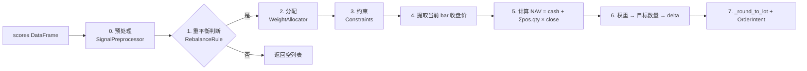

# 组合与权重分配

> **本节讲解"从信号到订单"的全链路。** 当一个 `SignalStrategy` 在 `on_bar` 里产生截面（cross-section）评分时，引擎会调用 `Portfolio.build_orders()` 把它转成 `OrderIntent` 列表。`Portfolio` 把 4 个可替换的环节串起来：预处理 → 重平衡判断 → 权重分配 → 约束 → 整数化（lot 化）。

---

## 1. 全景：build_orders 的 7 步流水线



源码：`src/getrich_backtest/strategy/portfolio.py::Portfolio.build_orders()`

---

## 2. 信号预处理（`SignalPreprocessor`）

截面评分在用作权重之前通常需要清洗。`SignalPreprocessor` 是一个**可链接的 4 步管道**，每一步都接受上一个的输出：

| 步骤 | 类 | 输入 | 输出 | 用途 |
|---|---|---|---|---|
| 1. 缺失值填补 | `MissingValue` | 含 NaN 的评分 | 干净评分 | 填补或丢弃 |
| 2. 缩尾 | `Winsorize` | 干净评分 | 同长度，去极值 | 抗噪声 |
| 3. 标准化 | `Standardize` | 同长度 | 零均值/单位方差 | 跨截面可比 |
| 4. 中性化 | `Neutralize` | 标准化评分 | 行业/规模中性 | 风险因子正交 |

每步都可以独立使用。`SignalPreprocessor` 类本身是一个容器，串起所有 4 步。

### 2.1 缺失值（`MissingValue`）

```python
from getrich_backtest import MissingValue, MissingValueMethod

# 缺失填补为 0
mv = MissingValue(method=MissingValueMethod.ZERO)
cleaned = mv.transform(scores, ctx)

# 缺失填补为截面均值
mv = MissingValue(method=MissingValueMethod.MEAN)
cleaned = mv.transform(scores, ctx)

# 直接丢弃缺失行
mv = MissingValue(method=MissingValueMethod.DROP)
cleaned = mv.transform(scores, ctx)
```

### 2.2 缩尾（`Winsorize`）

把极端值（> 99% 分位数 或 < 1% 分位数）压回分位数边界。两种模式：

```python
from getrich_backtest import Winsorize, WinsorizeMethod

# 按分位数
w = Winsorize(method=WinsorizeMethod.QUANTILE, lower=0.01, upper=0.99)
cleaned = w.transform(scores, ctx)

# 按标准差
w = Winsorize(method=WinsorizeMethod.STD, n_std=3.0)
cleaned = w.transform(scores, ctx)
```

### 2.3 标准化（`Standardize`）

```python
from getrich_backtest import Standardize, StandardizeMethod

# z-score (零均值单位方差)
s = Standardize(method=StandardizeMethod.ZSCORE)
cleaned = s.transform(scores, ctx)

# rank 化（不假设分布）
s = Standardize(method=StandardizeMethod.RANK)
cleaned = s.transform(scores, ctx)
```

### 2.4 中性化（`Neutralize`）

对每行评分做线性回归，扣除某列（通常是行业/规模因子）的影响：

```python
from getrich_backtest import Neutralize

# 按 industry 列中性化
n = Neutralize(by="industry")
cleaned = n.transform(scores, ctx)
```

> 输入必须含 `by` 列（行业、规模等），否则 `PreprocessingError`。

### 2.5 链式调用

```python
from getrich_backtest import SignalPreprocessor, MissingValue, Winsorize, Standardize, Neutralize

pipe = SignalPreprocessor(
    missing_value=MissingValue(),
    winsorize=Winsorize(),
    standardize=Standardize(),
    neutralize=Neutralize(by="industry"),
)
scores_clean = pipe.transform(scores, ctx)
```

Pipeline 是**有顺序的**：MissingValue → Winsorize → Standardize → Neutralize。每步的输出是下步的输入。

---

## 3. 重平衡判断（`RebalanceRule`）

不是每根 bar 都需要调仓。`RebalanceRule` 是 `Protocol`，判断"这根 bar 调不调"。

### 3.1 `PeriodicRebalance`

最简单的实现：每 N bar 调一次（默认 N=1，每根都调）。

```python
from getrich_backtest import PeriodicRebalance

rule = PeriodicRebalance(every_n_bars=5)  # 每 5 根 bar 调一次
if rule.should_rebalance(ctx, last_rebalance_dt):
    orders = portfolio.build_orders(scores, ctx)
```

> 月度调仓：传入 `freq="1d"` 的 bar 流 + `every_n_bars=21`（≈ 21 个交易日）。

### 3.2 自定义规则

```python
from getrich_backtest import RebalanceRule

class WeeklyRebalance:
    def should_rebalance(self, ctx, last_dt):
        # 每周一调一次
        return ctx.bar["dt"][0].weekday() == 0 and last_dt is None
```

---

## 4. 权重分配器（6 个内置 + Protocol）

`WeightAllocator` 是**核心抽象**：接收 `(scores, ctx)` 返回 `weights: pl.DataFrame[("symbol", "weight")]`。

### 4.1 `EqualWeight`（默认）

评分排序后，**头部 K 个做多、尾部 K 个做空**（可关 short）：

```python
from getrich_backtest import EqualWeight, Portfolio

alloc = EqualWeight(top_k=10, bottom_k=10, long_only=False)
# 评分前 10 + 评分后 10，等权分配
```

### 4.2 `ScoreWeight`（简单按比例）

直接把评分归一化到 [-1, 1] 后用作权重。适合评分本身在合理量级的场景。

```python
from getrich_backtest import ScoreWeight

alloc = ScoreWeight(scale="linear")  # 或 "softmax" / "tanh"
```

### 4.3 `InverseVol`（波动率倒数加权）

用 `ctx.history(symbol).vol(...)` 估算波动率，按 `1/σ` 加权。波动低的资产权重大，组合隐含波动率更稳定。

```python
from getrich_backtest import InverseVol

alloc = InverseVol(lookback=20, vol_method="std")
```

### 4.4 `RiskParity`（风险平价）

每个资产对组合波动率贡献相等。**不要求预期收益输入**。比 `InverseVol` 更稳健（考虑相关性而非仅单资产波动）。

```python
from getrich_backtest import RiskParity

alloc = RiskParity(
    lookback=60,                # 用最近 60 根 bar 估算协方差
    max_iter=100,               # Newton 迭代上限
    tol=1e-6,                   # 收敛容差
)
```

### 4.5 `MeanVariance`（均值-方差最优化）

Markowitz 最优化。**需要预期收益输入**（来自评分作为 alpha 信号），求解：

```
max   αᵀw - (λ/2) wᵀΣw
s.t.  Constraints.apply(w)
```

```python
from getrich_backtest import MeanVariance

alloc = MeanVariance(
    risk_aversion=1.0,           # λ
    lookback=252,                # 协方差估计窗口
    expected_returns="scores",  # alpha 来源
    long_only=True,
)
```

> 需要评分有可解释的"alpha"含义（值越大越值得买）。如果评分是 ranking，可以先 `Standardize.method=RANK` 再喂进来。

### 4.6 `BlackLitterman`（贝叶先验 + 视图）

先用一个市场均衡收益 `Π`（隐含自市值或自定义），再叠加用户的 **view**（"我看好 X，预期收益 Y"）：

```python
from getrich_backtest import BlackLitterman

alloc = BlackLitterman(
    market_caps={"A": 1e9, "B": 5e8, "C": 2e9},  # 隐含 Π
    views=[
        {"symbol": "A", "expected_return": 0.15, "confidence": 0.8},
        {"symbol": "C", "expected_return": 0.05, "confidence": 0.6},
    ],
    tau=0.05,                  # 先验方差缩放
    risk_aversion=1.0,
    lookback=252,
)
```

> 协方差估计：滚动 `lookback` 根 bar 的 `returns` DataFrame。

---

## 5. 约束（`Constraints`）

约束在分配后、NAV 计算前应用。三个独立可调参数：

```python
from decimal import Decimal
from getrich_backtest import Constraints

c = Constraints(
    max_single_weight=Decimal("0.10"),  # 任何单一资产 ≤ 10%
    gross_exposure=Decimal("1.0"),     # 总杠杆 ≤ 1.0（不允许杠杆）
    long_only=True,                    # 禁止做空
)
```

应用顺序（`Constraints.apply`）：
1. **long_only**：负权重 → 0
2. **clip 单资产权重**：`|w_i| ≤ max_single_weight`
3. **缩放总敞口**：若 `Σ|w_i| > gross_exposure`，按比例缩放

> 约束是**后验的** —— 它假设 allocator 的输出是合理的目标，再用约束做最后修正。如果你经常触发 `max_single_weight` 截断，allocator 的输出就过于集中在少数资产。

---

## 6. 整数化与 `OrderIntent` 生成

`Portfolio.build_orders` 的最后一步：

```python
# 6. Convert weights → target quantities → intents
for row in weights.iter_rows(named=True):
    target_notional = weight * nav
    target_qty = int(target_notional // price)        # floor
    current_qty = ctx.account.position(symbol).qty
    raw_delta = target_qty - current_qty
    delta = _round_to_lot(raw_delta, lot_size)        # A 股 100，期货 1
    if delta > 0:  append(BUY intent)
    if delta < 0:  append(SELL intent, qty=|delta|)
```

`_round_to_lot` 是 `portfolio.py::round_to_lot`：A 股 100（默认 `lot_size=100`），期货 1（`lot_size=1`），ETF 100。

---

## 7. 完整示例：评分 → 订单

```python
from decimal import Decimal
from datetime import datetime
import polars as pl
from getrich_backtest import (
    Backtest, DataFrameBarLoader, Strategy, BarContext,
    OrderIntent, Side, Frequency,
    Portfolio, EqualWeight, Constraints, PeriodicRebalance,
    SignalPreprocessor, MissingValue, Winsorize, Standardize, Neutralize,
)


class CrossSectional(Strategy):
    """每个 bar 计算截面 z-score，调入 top-5。"""

    def on_bar(self, ctx: BarContext) -> list[OrderIntent]:
        # 计算截面 momentum
        scores = ctx.history("1d").returns(20).select(
            pl.col("symbol"),
            pl.col("returns").alias("score"),
        )
        if scores.is_empty():
            return []

        return self.portfolio.build_orders(scores, ctx)


# 1. 构造预处理器
preprocessor = SignalPreprocessor(
    missing_value=MissingValue(),
    winsorize=Winsorize(lower=0.01, upper=0.99),
    standardize=Standardize(),
    neutralize=Neutralize(by="industry"),
)

# 2. 构造 Portfolio
portfolio = Portfolio(
    allocator=EqualWeight(top_k=5, long_only=True),
    constraints=Constraints(max_single_weight=Decimal("0.30")),
    rebalance=PeriodicRebalance(every_n_bars=21),  # 月度
    preprocessor=preprocessor,
    lot_size=100,  # A 股
)

# 3. 注入到策略
strategy = CrossSectional()
strategy.portfolio = portfolio

# 4. 跑
bt = Backtest(strategy=strategy, bar_loader=DataFrameBarLoader(bars), ...)
result = bt.run()
```

---

## 8. 常见错误

| 症状 | 原因 | 修法 |
|---|---|---|
| `build_orders` 总是返回 `[]` | `RebalanceRule.should_rebalance` 一直 False | 检查 `last_rebalance_dt` 是否真的更新；或者用 `PeriodicRebalance(every_n_bars=1)` 调试 |
| 输出权重全是 0 | `EqualWeight.top_k=0` 或 `Winsorize` 压平了 | 调整 `top_k` 或检查评分分布 |
| 触发了 `max_single_weight` 截断 | 评分集中在少数股票 | 用 `EqualWeight(top_k=10)` 分散；或放宽约束 |
| `InsufficientCash` 错误 | `weight * nav` 超过账户现金 | 减 `max_single_weight` 或加 `gross_exposure` 限制 |
| `MissingValue` 没填补 | 输入没有 NaN | 正常，无害 |
| `Neutralize` 报错 | 输入不含 `by` 列 | `scores = scores.with_columns(pl.col("industry"))` |

---

## 9. 设计原则（回顾）

1. **可插拔** —— 4 个独立环节（preprocessor / rebalance / allocator / constraints），每环节可以独立替换
2. **不可变数据** —— Polars DataFrame 透传，allocator 之间不修改 state
3. **Decimal 精度** —— 所有金额/数量用 `Decimal`，避免 float 累积误差
4. **后验约束** —— 约束是 allocator 的"安全网"，不是优化目标的一部分
5. **Lot 化** —— A 股默认 100，期货默认 1；用户可以覆盖

---

## 10. 进一步阅读

- 设计契约：[21 组合构建](../design-contracts/21-portfolio-construction.md)
- API 详情：[API 参考 — 策略 / 组合](api-reference.md#getrich_backtest.strategy.portfolio.Portfolio)
- 策略基类：[策略开发](strategies.md)
- `Portfolio.build_orders` 源码：[`src/getrich_backtest/strategy/portfolio.py`](https://github.com/getrich/getrich/blob/main/src/getrich_backtest/strategy/portfolio.py)
- `WeightAllocator` 各实现：[`src/getrich_backtest/strategy/alloc_weight.py`](https://github.com/getrich/getrich/blob/main/src/getrich_backtest/strategy/alloc_weight.py)
- `SignalPreprocessor`：[`src/getrich_backtest/strategy/preprocessor.py`](https://github.com/getrich/getrich/blob/main/src/getrich_backtest/strategy/preprocessor.py)
