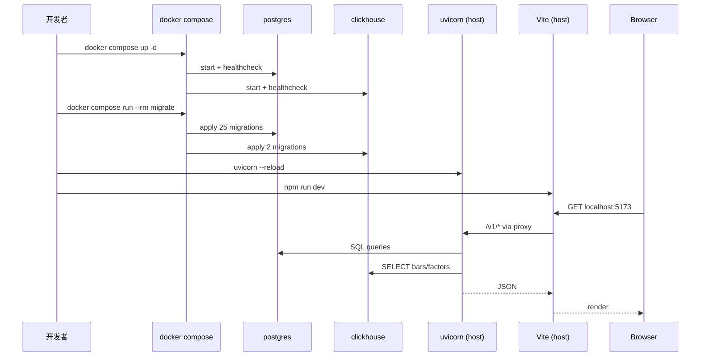

# Docker 快速启动

> **本节讲解用 `docker compose` 一键起 GetRich 完整开发栈**（PostgreSQL + ClickHouse + Redis + migration）。无需手动装任何 DB，5 分钟跑通。

---

## 1. 30 秒启动

```bash
# 1. 克隆仓库
git clone https://github.com/getrich/getrich.git
cd getrich

# 2. 复制环境变量模板
cp .env.example .env.local

# 3. 起开发栈
docker compose up -d

# 4. 等所有服务 healthy
docker compose ps
# NAME                   STATUS
# getrich-postgres       Up (healthy)
# getrich-clickhouse     Up (healthy)
# getrich-redis          Up (healthy)

# 5. 跑 migration（一次性）
docker compose run --rm migrate

# 6. 启动 API（本地，不用容器）
uv run uvicorn getrich.apps.web.main:app --reload
```

打开 <http://localhost:8000/docs> 看 OpenAPI Swagger UI。

---

## 2. 服务清单

| 服务 | 镜像 | 端口 | 用途 |
|---|---|---|---|
| `postgres` | `postgres:16` | 5432 | 业务主库（25 个 migration） |
| `clickhouse` | `clickhouse/clickhouse-server:24.3` | 8123 + 9000 | 时序 / 因子 |
| `redis` | `redis:7` | 6379 | Celery broker + result backend |
| `migrate` | `Dockerfile` (本仓库) | — | 一次性跑 migration（用 `--profile migrate` 启动） |

> 完整 `docker-compose.yml` 见仓库根目录。

---

## 3. 常用命令

### 3.1 服务管理

```bash
docker compose up -d           # 后台起
docker compose down            # 停 + 删容器（保留 volumes）
docker compose down -v         # 停 + 删容器 + 清数据
docker compose restart postgres # 重启单个
docker compose ps              # 状态
docker compose logs -f ch      # tail ClickHouse 日志
docker compose logs --tail=100 redis
```

### 3.2 进入容器

```bash
# PostgreSQL
docker compose exec postgres psql -U quant -d getrich

# ClickHouse
docker compose exec clickhouse clickhouse-client

# Redis
docker compose exec redis redis-cli
```

### 3.3 跑 migration

```bash
# 一次性
docker compose run --rm migrate

# 查看状态（不应用）
docker compose run --rm -T migrate uv run python -m getrich.migrations.cli status
# 或本地
uv run python -m getrich.migrations.cli postgres
```

### 3.4 跑测试

```bash
# 一次性起 services + 跑 pytest
docker compose up -d
uv run pytest tests/getrich_backtest tests/getrich/apps -x --timeout=60
```

---

## 4. 数据持久化

| Volume | 用途 | 清理 |
|---|---|---|
| `postgres-data` | PG 数据 | `docker compose down -v` |
| `clickhouse-data` | CH 数据（含 5 年 TTL 前的 bar） | 同上 |
| `redis-data` | broker state（重启可丢） | 同上 |

> **生产部署用命名 volume + 备份**，不要用本地的 bind-mount。详见 [运维 — 数据库迁移](../operations/migration-runner.md)。

---

## 5. 端口冲突

如果本机已有 PG/CH/Redis：

| 端口 | 解决方案 |
|---|---|
| 5432（PG） | 改 `docker-compose.yml` 的 `ports: "55432:5432"`（主机 55432 → 容器 5432），同步改 `.env.local` 的 `GETRICH_PG__PORT=55432` |
| 8123（CH） | 同上 |
| 6379（Redis） | 同上 |

> 推荐用 host port mapping 而不是改容器内部端口 —— migration 脚本读 `.env.local` 不感知容器。

---

## 6. 数据初始化

### 6.1 跑 migration

```bash
# 应用全部
docker compose run --rm migrate

# 只 PG
docker compose run --rm migrate uv run python -m getrich.migrations.cli postgres

# 只 CH
docker compose run --rm migrate uv run python -m getrich.migrations.cli clickhouse

# 试跑（不应用）
docker compose run --rm migrate uv run python -m getrich.migrations.cli postgres --dry-run
```

### 6.2 灌测试数据（可选）

```bash
# 插入 1 个测试用户（仅开发）
docker compose exec postgres psql -U quant -d getrich -c "
INSERT INTO users (email, display_name) VALUES ('dev@getrich.local', 'Dev User');
"

# 灌示例 bar 数据（用本地脚本）
uv run python scripts/etl/load_sample_bars.py
```

---

## 7. 接入前端

```bash
# 1. 启 API（本机，不在容器里）
uv run uvicorn getrich.apps.web.main:app --reload

# 2. 启 Vite dev server
cd frontend
npm run dev
# → http://localhost:5173
```

`.env.local` 给前端：

```bash
# frontend/.env.local
VITE_API_BASE=http://localhost:8000
```

---

## 8. 完整开发工作流



---

## 9. 故障排查

### 9.1 容器起不来

```bash
docker compose logs postgres | tail -30
# 常见：端口被占、磁盘满、ulimit 不够
```

### 9.2 migration 失败

```bash
# 1. 看 PG 日志
docker compose logs postgres | tail -50

# 2. 看 migration 状态
uv run python -m getrich.migrations.cli status

# 3. 跑一半？回滚 + 重跑
uv run python -m getrich.migrations.cli status
# → 显示 "applied: 015, pending: 016-025"
# → 检查 015 SQL 有没有 bug
```

### 9.3 连接拒

```bash
# 容器内能连，host 连不上
docker compose exec postgres pg_isready -U quant
# 看到 "accepting connections" → 容器健康

# 检查 host 端口
netstat -an | grep 5432  # Windows 用 Get-NetTCPConnection
# 应该看到 0.0.0.0:5432 LISTEN
```

### 9.4 性能问题

| 症状 | 修法 |
|---|---|
| PG 慢 | `EXPLAIN ANALYZE` 查 SQL；调大 `shared_buffers` |
| CH 慢 | 看 `system.query_log` 找大查询 |
| 容器内存爆 | 改 `docker-compose.yml` 加 `mem_limit: 4g` |
| 容器 OOM Killed | 加 `mem_limit` 或扩主机 RAM |

### 9.5 完全重置

```bash
# 清所有数据
docker compose down -v
rm -rf .venv frontend/node_modules
# 重新来
docker compose up -d
uv sync --frozen --extra dev
cd frontend && npm ci
```

---

## 10. 与 CI 的一致性

本地 docker compose 的 services 与 GitHub Actions 的 services **完全对齐**：

| Service | Docker compose | CI (`ci.yml`) |
|---|---|---|
| PG | `postgres:16` | `postgres:16` |
| CH | `clickhouse/clickhouse-server:24.3` | `clickhouse/clickhouse-server:24.3` |
| Redis | `redis:7` | `redis:7` |

> 这意味着：**本地能跑的测试 = CI 能跑的测试**。改 docker-compose.yml 时记得同步 CI 配置。

---

## 11. 进一步阅读

- 数据库：[数据库拓扑](../operations/database-topology.md)
- 配置：[配置](configuration.md)
- 迁移工具：[migration-runner](../operations/migration-runner.md)
- 部署（生产）：[systemd 部署](../operations/systemd.md)
- 工具：
    - [docker compose 文档](https://docs.docker.com/compose/)
    - [PostgreSQL Docker 镜像](https://hub.docker.com/_/postgres)
    - [ClickHouse Docker 镜像](https://hub.docker.com/r/clickhouse/clickhouse-server)
