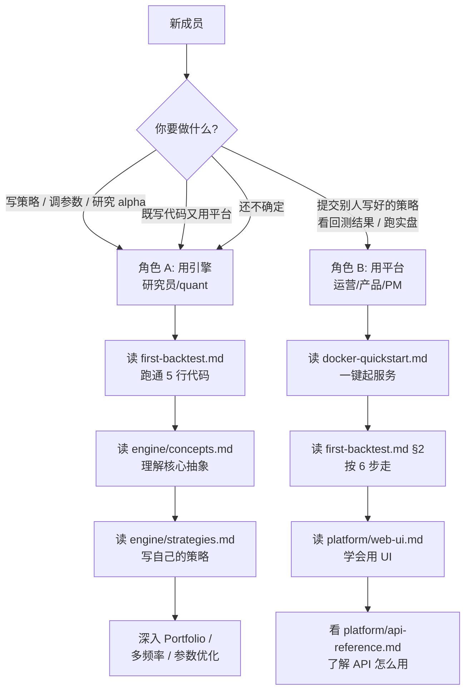

# GetRich 回测功能快速上手

> **本指南专为新成员准备**。在 5 分钟内判断你要走哪条路、读哪些文档，从"零基础"到"能跑通自己的第一个回测"。如果你已经熟悉项目，请直接跳到 [§5 完整文档索引](#5-完整文档索引)。

---

## 1. 两种角色，2 条路

GetRich 平台同时提供"**写代码做回测**"和"**点鼠标做回测**"两种入口。**先判断你是哪一种**：



> **拿不准？默认走角色 A**。用引擎能覆盖所有平台能做的事，而且你能更深入理解回测结果。

---

## 2. 角色 A：用回测引擎（写 Python 代码的研究员）

> 目标：自己写策略、回测、调参、看归因。

### 2.1 30 分钟路线

| # | 文档 | 看完你能做什么 |
|---|---|---|
| 1 | [installation.md](installation.md) | 装好 `uv` + Python 3.12 |
| 2 | [**first-backtest.md**](first-backtest.md) | **5 行代码跑通第一个回测 + 生成 Tear Sheet**（最重要的入口页）|
| 3 | [configuration.md](configuration.md) | 配 `.env`（PG / CH / Redis 连接） |

### 2.2 半天路线（30 min 之后）

| # | 文档 | 看完你能做什么 |
|---|---|---|
| 4 | [engine/concepts.md](../engine/concepts.md) | 理解 `Strategy` / `BarContext` / `OrderIntent` / `Account` 的契约 |
| 5 | [engine/data-loaders.md](../engine/data-loaders.md) | 用 `DataFrameBarLoader` / `PgBarLoader` / `DuckDBBarLoader` 装数据 |
| 6 | [engine/strategies.md](../engine/strategies.md) | **写自己的策略**（事件型 / 信号型 / 目标仓位型 3 种范式 + 内置 MACross / Bollinger）|

### 2.3 1 天路线

| # | 文档 | 看完你能做什么 |
|---|---|---|
| 7 | [engine/execution-accounting.md](../engine/execution-accounting.md) | 配手续费 / 滑点 / 撮合模型 / 保证金 / 风险 |
| 8 | [engine/portfolio-allocation.md](../engine/portfolio-allocation.md) | 多策略组合（`EqualWeight` / `ScoreWeight` / `RiskParity` / `MeanVariance` / `BlackLitterman`）|
| 9 | [engine/multi-frequency.md](../engine/multi-frequency.md) | 多频率数据 + 夜盘 + session-aware 重采样 |
| 10 | [engine/analysis-reporting.md](../engine/analysis-reporting.md) | Brinson 归因 / 因子回归 / PnL 拆解 / Tear Sheet |

### 2.4 1 周路线（深入）

| # | 文档 | 看完你能做什么 |
|---|---|---|
| 11 | [engine/parameter-optimization.md](../engine/parameter-optimization.md) | Grid Search / Sweep / Walk-Forward + 取消 / 重试 / 幂等 |
| 12 | [engine/persistence.md](../engine/persistence.md) | `RunConfig.fingerprint()` + `PgBacktestResultStore` + artifact |
| 13 | [engine/live-signals.md](../engine/live-signals.md) | 从回测到实盘：`SignalProducer` / `LiveSignalRunner` / `RiskMonitor` |
| 14 | [engine/broker-integration.md](../engine/broker-integration.md) | `BrokerAdapter` Protocol + CTP / XTP 接入路径 |
| 15 | [engine/api-reference.md](../engine/api-reference.md) | 公开 API 自动渲染（随时查）|

### 2.5 角色 A 的"必读前 3 篇"

如果时间只够读 3 篇，按这个顺序：

1. **[first-backtest.md](first-backtest.md)** —— 跑通第一个回测
2. **[engine/concepts.md](../engine/concepts.md)** —— 理解所有 API 的"地图"
3. **[engine/strategies.md](../engine/strategies.md)** —— 开始写自己的策略

---

## 3. 角色 B：用回测平台（点鼠标的运营/产品）

> 目标：提交回测、查看结果、订阅信号。

### 3.1 30 分钟路线

| # | 文档 | 看完你能做什么 |
|---|---|---|
| 1 | [docker-quickstart.md](docker-quickstart.md) | 1 键起 PG / CH / Redis / API / Worker |
| 2 | [**first-backtest.md §2 完整示例**](first-backtest.md#2-完整示例含真实数据源) | **6 步走完注册 → 登录 → 提交回测 → 看 SSE 实时进度 → 看 Tear Sheet** |
| 3 | [repository-tour.md](repository-tour.md) | 知道前后端代码在哪里 |

### 3.2 半天路线

| # | 文档 | 看完你能做什么 |
|---|---|---|
| 4 | [platform/web-ui.md](../platform/web-ui.md) | 路由树 / `AuthContext` / react-query / SSE 实时进度的使用方式 |
| 5 | [platform/architecture.md](../platform/architecture.md) | 理解 API 角色、Celery worker、`pg_notify` 事件流 |
| 6 | [configuration.md](configuration.md) | 看懂 `.env`（登录、JWT、broker 配在哪）|

### 3.3 1 天路线

| # | 文档 | 看完你能做什么 |
|---|---|---|
| 7 | [platform/api-reference.md](../platform/api-reference.md) | OpenAPI 反射的完整 API 文档（Redoc），可手写 curl / Postman |
| 8 | [platform/live-signal-pipeline.md](../platform/live-signal-pipeline.md) | 理解实盘信号 5 分钟一次的流水线 |
| 9 | [engine/live-signals.md](../engine/live-signals.md) | 深入：信号如何产生 / 落库 / 推送 |

### 3.4 角色 B 的"必读前 3 篇"

如果时间只够读 3 篇，按这个顺序：

1. **[docker-quickstart.md](docker-quickstart.md)** —— 把服务起起来
2. **[first-backtest.md §2](first-backtest.md#2-完整示例含真实数据源)** —— 按 6 步走完整个流程
3. **[platform/web-ui.md](../platform/web-ui.md)** —— 学会用每个页面

---

## 4. 共同必读（不管哪个角色都要看）

| 文档 | 用途 | 时长 |
|---|---|---|
| [configuration.md](configuration.md) | `.env` + `settings.py` 全字段 | 15 min |
| [repository-tour.md](repository-tour.md) | 仓库树讲解 | 10 min |
| [development/coding-standards.md](../development/coding-standards.md) | **铁律：时区 / Decimal / 列名 / 3-DB 职责**（不读会反复踩坑）| 20 min |

---

## 5. 完整文档索引

### 5.1 入门（getting-started/）

| 文档 | 内容 |
|---|---|
| [index.md](index.md) | 快速开始首页 |
| [installation.md](installation.md) | Python / uv / PG / CH / Redis 安装 |
| [first-backtest.md](first-backtest.md) | 5 行代码跑通第一个回测（**最重要**）|
| [configuration.md](configuration.md) | `.env` + `settings.py` 配置 |
| [docker-quickstart.md](docker-quickstart.md) | docker-compose 一键启动 |
| [repository-tour.md](repository-tour.md) | 仓库结构导览 |
| [getrich-backtest-quickstart.md](getrich-backtest-quickstart.md) | **本文件**：新成员按角色导航 |

### 5.2 引擎（engine/，最详尽）

| 文档 | 内容 |
|---|---|
| [engine/index.md](../engine/index.md) | 引擎总览（5 层架构）|
| [engine/getting-started.md](../engine/getting-started.md) | 引擎 5 分钟上手 |
| [engine/concepts.md](../engine/concepts.md) | 核心概念（**地图**）|
| [engine/data-loaders.md](../engine/data-loaders.md) | 3 种 BarLoader + schema |
| [engine/strategies.md](../engine/strategies.md) | 策略开发（事件型/信号型/目标仓位型）|
| [engine/portfolio-allocation.md](../engine/portfolio-allocation.md) | Portfolio + 6 种 WeightAllocator |
| [engine/execution-accounting.md](../engine/execution-accounting.md) | 撮合 + 账户 + 保证金 + 风险 |
| [engine/multi-frequency.md](../engine/multi-frequency.md) | 多频率 + session-aware 重采样 |
| [engine/analysis-reporting.md](../engine/analysis-reporting.md) | 指标 + 归因 + Tear Sheet |
| [engine/parameter-optimization.md](../engine/parameter-optimization.md) | GridSearch / Sweep / Walk-Forward |
| [engine/persistence.md](../engine/persistence.md) | RunConfig fingerprint + PG 持久化 + artifact |
| [engine/live-signals.md](../engine/live-signals.md) | 从回测到实盘 |
| [engine/broker-integration.md](../engine/broker-integration.md) | CTP / XTP / InMemory 券商对接 |
| [engine/api-reference.md](../engine/api-reference.md) | mkdocstrings 公开 API 自动渲染 |

### 5.3 平台（platform/）

| 文档 | 内容 |
|---|---|
| [platform/architecture.md](../platform/architecture.md) | FastAPI lifespan + 中间件栈 + 路由分组 |
| [platform/api-reference.md](../platform/api-reference.md) | Redoc 嵌入 OpenAPI |
| [platform/web-ui.md](../platform/web-ui.md) | 前端路由 + AuthContext + react-query + SSE |
| [platform/live-signal-pipeline.md](../platform/live-signal-pipeline.md) | 实盘信号端到端流水线 |

### 5.4 运维（operations/）

| 文档 | 内容 |
|---|---|
| [operations/systemd.md](../operations/systemd.md) | systemd 部署 + 备份 timer |
| [operations/monitoring.md](../operations/monitoring.md) | 4 层观测栈 + Prometheus `/metrics` |
| [operations/migration-runner.md](../operations/migration-runner.md) | DB migration CLI |
| [operations/database-topology.md](../operations/database-topology.md) | PG / CH / DuckDB 职责铁律 |
| [operations/load-testing.md](../operations/load-testing.md) | k6 负载测试（4 脚本）|
| [operations/runbook.md](../operations/runbook.md) | 故障 Runbook |

### 5.5 开发（development/）

| 文档 | 内容 |
|---|---|
| [development/coding-standards.md](../development/coding-standards.md) | 编码规范 + 铁律 |
| [development/testing.md](../development/testing.md) | pytest + vitest + silent-fail 扫描 |
| [development/ci-workflow.md](../development/ci-workflow.md) | GitHub Actions 4 job + pre-commit + Dependabot + coverage gate |
| [development/mobile-responsive.md](../development/mobile-responsive.md) | 移动端响应式审计 |

### 5.6 参考（reference/）

| 文档 | 内容 |
|---|---|
| [reference/env-vars.md](../reference/env-vars.md) | `GETRICH_*` 全量环境变量 |
| [reference/error-codes.md](../reference/error-codes.md) | 异常类层级 + HTTP 映射 |
| [reference/database-schema.md](../reference/database-schema.md) | 25 PG + 2 CH 表 |

### 5.7 设计契约（design-contracts/）

> 19 篇原始 backtest 设计契约，新成员**先不要读**。当你需要理解某个引擎决策的"为什么"时再来翻。

---

## 6. 常见问题

### Q1：我跑 `first-backtest.md` 的代码报 `TimezoneError: All datetimes must be Asia/Shanghai-aware.`

**答**：所有 `dt` 字段必须带 `Asia/Shanghai` 时区。修法：

```python
from getrich_backtest import get_shanghai_tz
dt = datetime(2024, 1, 1, 9, 30, tzinfo=get_shanghai_tz())
```

> 这是 [CLAUDE.md §3.1 铁律](https://github.com/getrich/getrich/blob/main/CLAUDE.md)，破例必报错。

### Q2：报 `TypeError: Money field must be Decimal, not float.`

**答**：财务金额、PnL、可用资金一律用 `Decimal`：

```python
from decimal import Decimal
price = Decimal("100.50")  # ❌ 100.50 是 float
```

### Q3：报 `ImportError: cannot import name 'DataFrameBarLoader'`

**答**：`DataFrameBarLoader` 在子模块：

```python
from getrich_backtest.data import DataFrameBarLoader
```

### Q4：前端起不来 / 报 `vite not found`

**答**：Node 必须 ≥ 20.19（Vite 8 floor）。`nvm install 20 && nvm use 20`。

### Q5：跑测试时 PG 报 `relation "frontend.strategies" does not exist`

**答**：migration 没跑：

```bash
uv run python -m getrich.migrations.cli postgres
uv run python -m getrich.migrations.cli clickhouse
```

### Q6：报 `psycopg.OperationalError: connection to server at "localhost" ... failed`

**答**：本地没起 PG / CH service。CI 是 runner 起服务的，本地必须自己起：

```bash
docker compose up -d postgres clickhouse redis
```

更多问题看 [first-backtest.md §5 常见错误](first-backtest.md#5-常见错误) 和 [operations/runbook.md](../operations/runbook.md)。

---

## 7. 获取帮助

- **站内搜索**：右上角搜索框（支持中文分词）
- **GitHub issue**：在仓库提交 issue
- **AI 协作**：项目提供 [CLAUDE.md](https://github.com/getrich/getrich/blob/main/CLAUDE.md) / AGENTS.md / GEMINI.md 三套 AI 指令，可与 Claude / Codex / Gemini 协作
- **Onboarding 群**：问组内老成员

---

## 8. 下一步

按角色跳转：

- 角色 A（写代码）→ [first-backtest.md](first-backtest.md) → [engine/concepts.md](../engine/concepts.md)
- 角色 B（用平台）→ [docker-quickstart.md](docker-quickstart.md) → [first-backtest.md §2](first-backtest.md#2-完整示例含真实数据源)
