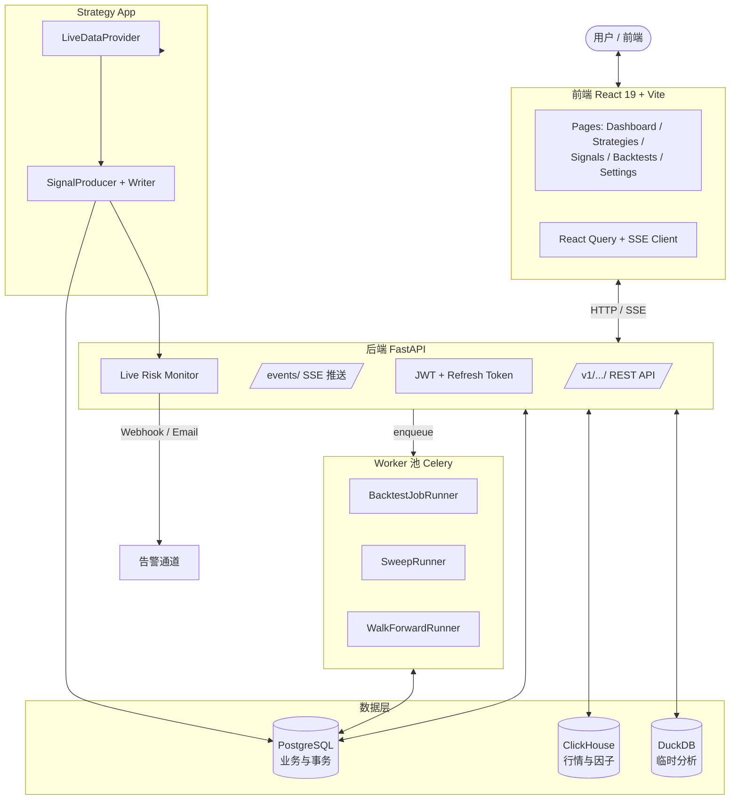

# GetRich 文档

> **量化投研与信号平台** 的官方技术文档

!!! success "🎉 平台已完工 (Platform Complete)"
    GetRich 14 个核心开发阶段 + 7 个工程化阶段全部交付。
    引擎代码 ~10,400 行，27 个数据库迁移，4 个 systemd 服务，~80 页 MkDocs 文档。
    所有 P0 安全加固（IDOR、CSP、XSS sanitizer、bleach、SQL CHECK 约束）已在生产路径落地。
    CI 全绿（Python 3.12 + Node 22 + Frontend vitest + 文档 strict build）。
    下一步建议：参考 [剩余工作状态](development/testing.md) 与 [运行手册](operations/runbook.md) 推进运营接入。

GetRich 是一个零售级量化投研与信号平台，提供从历史数据加载、策略开发、回测验证、参数优化、归因分析、信号生产到部署运维的**端到端能力**。

平台由 4 个协同子系统组成：

- **核心回测引擎**（`getrich_backtest` Python 包，~10,400 行）—— 事件驱动的事件循环、6 种权重分配器、4 类归因、参数扫描、Walk-Forward 优化
- **Web API + 前端**（FastAPI + React 19 + TypeScript 5）—— 17 个页面、12 个 REST 路由、PG 端业务与事务
- **Worker 池**（Celery + systemd）—— 多进程并发回测，pg_notify 跨进程推送
- **持久化层**（PostgreSQL + ClickHouse + DuckDB）—— 三库职责铁律，27 个迁移脚本

---

## 快速入口

-   :material-rocket-launch: **快速开始**

    ---

    5 分钟跑通第一个回测

    [:octicons-arrow-right-24: 安装](getting-started/installation.md)
    · [:octicons-arrow-right-24: 第一个回测](getting-started/first-backtest.md)

-   :material-cog-outline: **引擎用户指南**

    ---

    13 章系统讲解回测引擎

    [:octicons-arrow-right-24: 引擎总览](engine/index.md)
    · [:octicons-arrow-right-24: 核心概念](engine/concepts.md)
    · [:octicons-arrow-right-24: 策略开发](engine/strategies.md)

-   :material-api: **Web API**

    ---

    完整的 HTTP / SSE 接口

    [:octicons-arrow-right-24: API 参考](platform/api-reference.md)

-   :material-server: **运维指南**

    ---

    systemd 部署、迁移、监控

    [:octicons-arrow-right-24: systemd 部署](operations/systemd.md)
    · [:octicons-arrow-right-24: 迁移运行器](operations/migration-runner.md)

-   :material-book-open-page-variant: **设计契约**

    ---

    19 篇原始设计文档（backtest/docs）

    [:octicons-arrow-right-24: 查看契约](design-contracts/index.md)

-   :material-tools: **开发指南**

    ---

    编码规范、测试、CI

    [:octicons-arrow-right-24: 编码规范](development/coding-standards.md)
    · [:octicons-arrow-right-24: 测试](development/testing.md)

---

## 平台架构（Mermaid）

---

## 阅读路径

| 你是谁 | 推荐阅读路径 |
|---|---|
| **外部量化研究员**（想跑回测） | [快速开始](getting-started/index.md) → [引擎用户指南](engine/index.md)（重点：`getting-started`、`concepts`、`strategies`、`portfolio-allocation`、`analysis-reporting`） |
| **内部开发者 / 贡献者** | [开发指南](development/coding-standards.md) → [引擎用户指南](engine/index.md) → [设计契约](design-contracts/index.md) → [测试](development/testing.md) |
| **运维 / SRE** | [运维指南](operations/index.md) → [systemd 部署](operations/systemd.md) → [数据库迁移](operations/migration-runner.md) → [环境变量](reference/env-vars.md) |
| **平台集成方**（对接 API） | [Web API](platform/api-reference.md) → [错误码](reference/error-codes.md) → [OpenAPI 规范](https://github.com/getrich/getrich/blob/main/reference/getrich.openapi.json) |

---

## 项目状态

| 维度 | 状态 |
|---|---|
| 核心回测引擎（14 阶段） | ✅ 100% |
| 后端 API + 服务层 | ✅ 100% |
| 前端 17 个页面 | ✅ 100% |
| Worker 池 + systemd | ✅ 100% |
| 持久化（25 PG + 2 CH 迁移） | ✅ 100% |
| CI / 工具链 | ✅ 100% |
| P0 待办 | #1080 Worker cancel-probe LISTEN；#1082 前端 4 个测试文件收尾 |

---

## 仓库与社区

- **代码仓库**：本仓库
- **设计契约**：[`backtest/docs/00-index.md`](https://github.com/getrich/getrich/blob/main/backtest/docs/00-index.md)（19 篇原始设计文档）
- **OpenAPI 规范**：[`reference/getrich.openapi.json`](https://github.com/getrich/getrich/blob/main/reference/getrich.openapi.json)（v1.1）
- **AI 编码指令**：[`CLAUDE.md`](https://github.com/getrich/getrich/blob/main/CLAUDE.md) · [`AGENTS.md`](https://github.com/getrich/getrich/blob/main/AGENTS.md) · [`GEMINI.md`](https://github.com/getrich/getrich/blob/main/GEMINI.md)

## 许可证

本项目以 **MIT 许可证** 发布。详见 [许可证](about/license.md)。
