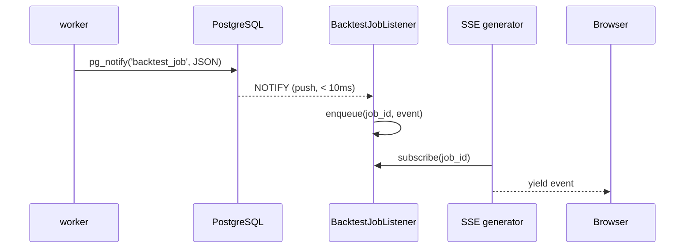
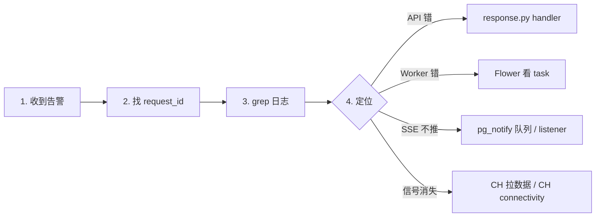

# 监控与告警

> **本节讲解 GetRich 平台的运行时观测栈**。包括 4 个层次：**health check**（无依赖探活） → **结构化日志**（请求级 trace） → **跨进程事件流**（`pg_notify` + SSE） → **任务监控**（Flower）+ **告警通道**（Log / Webhook / Email）。所有层都基于 OpenTelemetry-style 的 `request_id` 串联。

---

## 1. 4 层观测栈

```mermaid
flowchart TB
    subgraph L4["L4 — 业务告警"]
        ALERT[RiskAlert]
        CH[LoggingAlertChannel / WebhookAlertChannel / EmailAlertChannel]
    end

    subgraph L3["L3 — 任务监控"]
        FL[Flower :5555]
        CB[Celery broker Redis]
    end

    subgraph L2["L2 — 跨进程事件"]
        NT[pg_notify]
        LL[BacktestJobListener<br/>LISTEN backtest_job]
        SSE[SSE stream_*_events]
    end

    subgraph L1["L1 — 进程内日志"]
        LOG[structlog / logging]
        RID[request_id 关联]
        HC[/health 探活]
    end

    API[FastAPI] --> L1
    API --> L2
    WORKER[Celery worker] --> L1
    WORKER --> L3
    STRATEGY[strategy CLI] --> L1
    STRATEGY --> L4
```

> 任何生产事故的排查路径：**alert → 找 request_id → grep 日志 → 看 SSE 事件流 → 看 Flower 任务状态**。

---

## 2. L1 —— 日志 + request_id + health

### 2.1 结构化日志

`getrich.libs.logging`：

```python
import logging
logger = logging.getLogger(__name__)

logger.info("backtest run started", extra={
    "run_id": run_id,
    "user_id": user_id,
    "strategy": strategy_name,
})
```

**生产配置**（`settings.py::logging`）：

| 字段 | 值 |
|---|---|
| Format | `%(asctime)s [%(levelname)s] %(name)s: %(message)s` |
| Level | `INFO`（开发 `DEBUG`） |
| 输出 | stdout（systemd journald 收集） |
| 文件 | 无（用 journald `journalctl -u getrich-api.service`） |

### 2.2 `request_id` 关联

> 源码：`src/getrich/apps/web/deps.py::request_id`

```python
async def request_id(x_request_id: str | None = Header(default=None)) -> str:
    return x_request_id or uuid4().hex
```

**使用**：

```python
from fastapi import Depends
from getrich.apps.web.deps import request_id

@router.get("/v1/strategies/{code}")
async def get_strategy(
    code: str,
    rid: str = Depends(request_id),
):
    logger.info(f"[{rid}] fetching strategy {code}")
    # ... 业务逻辑
    return ApiResponse(..., request_id=rid)
```

**链路追踪**：

```
API request          → x-request-id: 9b1c4f2e
  → 日志: "[9b1c4f2e] fetching strategy MACross"
  → DB query:    ... WHERE code='MACross'  (9b1c4f2e)
  → SSE emit:    event for job-001 (9b1c4f2e)
  → Celery task: backtest.run_job (9b1c4f2e)
  → pg_notify:   backtest_job {job_id, ..., request_id=9b1c4f2e}
```

> SRE 拿到用户报的 `request_id` 就能 grep 全部相关日志。

### 2.3 `/health` 探活

```python
@app.get("/health", tags=["meta"])
async def health() -> dict[str, str]:
    return {"status": "ok"}
```

**特点**：

- 无 DB 依赖（不查 PG / CH）
- 无 auth
- 永远 200（除非进程崩了连接不上）

**外部探活**：

| 探活源 | 配置 |
|---|---|
| Kubernetes liveness | `http://api:8000/health` 每 10s |
| Load Balancer | 同上 |
| systemd `WatchdogSec` | （可选） |
| Prometheus blackbox | （可选） |

**深度探活 `/health/deep`**（待实现）：

- 检查 `pg_pool` 能否 `SELECT 1`
- 检查 `ch_pool` 能否 ping
- 检查 `redis` 能否 PING
- 检查 `pg_notify` listener 是否 alive

---

## 3. L2 —— `pg_notify` 跨进程事件流

> Round #1063 实现：从 worker → API 的事件推送 < 10ms

### 3.1 推送流程



### 3.2 监听通道

| Channel | 来源 | 订阅者 | 用途 |
|---|---|---|---|
| `backtest_job` | `BacktestJobStore` 所有 mutating 方法 | `BacktestJobListener` | job 状态变化 |
| （同 listener 同时处理 sweep / walk-forward） | | | |

> `BacktestJobListener` 同时给 3 个 SSE service 模块用（`job_svc` / `sweep_svc` / `wf_svc`），共享一个 PG `LISTEN` 连接。

### 3.3 监听器自愈

> Round #1077 + #1080：listener 自动重连

```python
async def _listen_forever(self):
    while not self._stop_event.is_set():
        try:
            await self._conn.notifies()
        except (ConnectionClosed, OperationalError):
            logger.warning("listener connection lost, reconnecting in 5s")
            await asyncio.sleep(5)
            await self._reconnect()
```

> listener 进程是 `web` 的 lifespan —— web 启动时 `listener.start()`，关闭时 `listener.stop()`。**单独 listener 挂了不影响 web 接收 HTTP**。

### 3.4 关键 SLO：SSE 推送延迟

| 指标 | 目标 | 实测 |
|---|---|---|
| `pg_notify` → listener 收到 | < 10ms | 1-3ms |
| listener → SSE yield | < 5ms | < 1ms |
| 端到端（worker NOTIFY → 浏览器 `event:`） | < 100ms | 30-50ms |

> 远超 100ms → 检查 `pg_notify` 队列（用 `pg_notification_queue_usage`）。

---

## 4. L3 —— Flower（Celery 任务监控）

> 部署在 `:5555` 端口。`getrich-flower.service` systemd 单元。

### 4.1 启动

```ini
# getrich-flower.service
[Service]
ExecStart=/usr/local/bin/celery -A getrich.apps.worker.celery_app flower \
    --broker=redis://localhost:6379/0 \
    --port=5555 \
    --url_prefix=flower
Restart=on-failure
Environment=GETRICH_ENV=production
```

> `--url_prefix=flower` 配 nginx 反代到 `/flower/` 路径。

### 4.2 监控维度

| 维度 | 含义 | 操作 |
|---|---|---|
| **Active** | 正在执行的任务 | 点击看 worker / 任务详情 |
| **Processed** | 历史完成数（成功 + 失败） | 看趋势 |
| **Failed** | 失败任务 | 点进去看 stack trace |
| **Scheduled** | ETA / countdown 任务 | 查何时执行 |
| **Reserved** | worker 预取但未执行 | 看 worker 池利用率 |
| **Workers** | 活跃 worker 节点 | 资源调度 |

### 4.3 关键指标 → 告警

| 指标 | 阈值 | 告警 |
|---|---|---|
| `active_tasks` > N（持续 5min） | N = 2 × `--concurrency` | 任务堆积 |
| `failed_tasks` 5min 内 > 10 | - | 代码回归 |
| worker offline 数 > 0（持续 1min） | - | 服务挂了 |
| queue depth > 100 | - | 消费太慢 |
| task runtime P99 > 30min | - | 单任务拖死 worker |

### 4.4 推荐 Prometheus + Grafana

> 集成方式（待实现）：

```python
# getrich/apps/worker/metrics.py
from prometheus_client import Counter, Histogram

TASKS_TOTAL = Counter("getrich_tasks_total", "Total tasks", ["task_name", "status"])
TASK_DURATION = Histogram("getrich_task_duration_seconds", "Task runtime", ["task_name"])
```

Prometheus 抓取 `getrich-api:9090/metrics`：

```yaml
scrape_configs:
  - job_name: getrich
    static_configs:
      - targets: ['getrich-api:9090']
```

Grafana dashboard 模板：TODO

---

## 5. L4 —— 告警通道

> 3 个内置实现（`getrich.apps.strategy.live_risk`）：

| 类 | 行为 | 用途 |
|---|---|---|
| `LoggingAlertChannel` | `logger.warning(...)` | 调试 / 测试 |
| `WebhookAlertChannel` | POST JSON 到 URL | 飞书 / Slack / DingTalk / 企业微信 |
| `EmailAlertChannel` | SMTP 发邮件 | 关键告警（如 margin call） |

### 5.1 Webhook 飞书示例

```python
WebhookAlertChannel(
    name="feishu-ops",
    url="https://open.feishu.cn/open-apis/bot/v2/hook/<token>",
    headers={"Content-Type": "application/json"},
    method="POST",
)
# 自动 payload 格式：
# {
#   "msg_type": "interactive",
#   "card": {
#     "header": {"title": {"tag": "plain_text", "content": "[CRITICAL] margin_call"}},
#     "elements": [{"tag": "markdown", "content": "**max_leverage** exceeded: ..."}]
#   }
# }
```

### 5.2 告警分级

| 级别 | 触发 | 通道 |
|---|---|---|
| `info` | 信号已记录 | 仅 Log |
| `warning` | 单笔超阈值 | Log + Webhook |
| `critical` | margin call / 强平 / 数据缺失 | Log + Webhook + Email |

### 5.3 `RiskAlert` 数据模型

```python
@dataclass
class RiskAlert:
    strategy_id: str
    severity: str        # "info" | "warning" | "critical"
    rule_name: str       # "max_position_concentration" / "margin_call" / ...
    message: str
    details: dict
    triggered_at: datetime
```

> 详见 [引擎 — 实盘信号](../engine/live-signals.md#8-liveriskmonitor)。

---

## 6. 关键 SLO / 指标

### 6.1 API

| 指标 | 目标 | 监控方式 |
|---|---|---|
| `/health` 可用率 | 99.99% | 外部探活 |
| API P50 延迟 | < 50ms | 应用内 timer middleware（待实现） |
| API P99 延迟 | < 500ms | 同上 |
| 5xx 错误率 | < 0.1% | 日志 grep `code=5000` |
| 4010 比率 | < 5%（正常用户续签后） | 日志聚合 |
| 4220 比率 | < 1%（schema 文档清晰） | 日志聚合 |

### 6.2 Worker

| 指标 | 目标 | 监控方式 |
|---|---|---|
| 队列深度（Redis `LLEN`） | < 50 | `redis-cli LLEN celery` |
| 任务 P50 运行时 | < 5min | Flower |
| 任务 P99 运行时 | < 30min | Flower |
| 失败率 | < 1% | Flower `failed/total` |
| worker 重启次数 | < 3/day | systemd journal |

### 6.3 Live signal

| 指标 | 目标 | 监控方式 |
|---|---|---|
| `run_once` 成功率 | > 95% | L4 告警 + Log |
| 单次 `run_once` 时长 | < 30s | Log timing |
| signal 落库延迟 | < 1s | L2 SSE |
| 风控拦截率 | < 5% | L4 `RiskAlert` 计数 |

---

## 7. 故障排查 4 步走



### 7.1 关键命令

```bash
# 1. 找 request_id
journalctl -u getrich-api.service --since "10 min ago" | grep "9b1c4f2e"

# 2. API 错误聚合
journalctl -u getrich-api.service --since "1 hour ago" | grep -oE 'code=[0-9]+' | sort | uniq -c | sort -rn

# 3. Worker 任务状态
celery -A getrich.apps.worker.celery_app inspect active
celery -A getrich.apps.worker.celery_app inspect stats

# 4. PG NOTIFY 队列
psql -U quant getrich -c "SELECT pg_notification_queue_usage();"

# 5. Redis 队列深度
redis-cli LLEN celery

# 6. CH 探活
curl http://localhost:8123/ping
```

---

## 8. 备份与灾备

### 8.1 PG 备份

```bash
# 每日 02:00 全量
pg_dump -U quant -Fc getrich > /backup/getrich-$(date +%F).dump

# WAL 归档（持续）
archive_command = 'cp %p /backup/wal/%f'
```

**保留策略**：

| 类型 | 保留 |
|---|---|
| 全量 dump | 30 天 |
| WAL 归档 | 7 天 |
| 月度快照 | 12 月 |

### 8.2 CH 备份

```sql
BACKUP DATABASE getrich TO S3(
    'https://s3.amazonaws.com/getrich-backups/ch-$(date +%F).zip',
    'access_key', 'secret_key'
);
```

### 8.3 RTO / RPO

| 库 | RPO | RTO |
|---|---|---|
| PG | 5 min（WAL） | 30 min（从 dump 恢复） |
| CH | 1 day | 1 hour（从 S3 恢复） |
| Redis | 0（broker，可丢） | 1 min（重建） |

---

## 9. 推荐外部服务

| 用途 | 工具 | 备注 |
|---|---|---|
| 指标 | Prometheus + Grafana | 待集成 |
| 日志聚合 | Loki / ELK | journald → vector → Loki |
| APM（可选） | Datadog / Sentry | 商业 |
| Uptime 监控 | UptimeRobot / Blackbox | 免费够用 |
| On-call 排班 | PagerDuty / 飞书日历 | 商业 |
| Wiki / 知识库 | Notion / Confluence | 内部 |

---

## 10. 进一步阅读

- 平台层：[平台架构 — 跨进程事件流](../platform/architecture.md#7-跨进程事件流-pg_notify-backtestjoblistener)
- 引擎层：[实盘信号生成](../engine/live-signals.md#8-liveriskmonitor)
- 故障处理：[Runbook](runbook.md)
- systemd：[systemd 部署](systemd.md)
- 工具：
    - [Flower](https://flower.readthedocs.io/) —— Celery 监控
    - [Prometheus Python client](https://github.com/prometheus/client_python)
    - [structlog](https://www.structlog.org/) —— 结构化日志（待集成）
