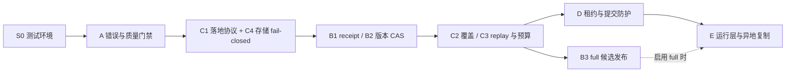

# gr-data 可靠采集实施计划

> **状态：待用户审核，未开工。** 本文批准前不开始实现；本次仅记录方案。  
> **读者 / 用途**：维护者审核范围、顺序与验收；后续实现者按任务推进。  
> **日期 / 证据版本**：2026-10-06；本机代码 HEAD `b4fe01e87f0708e94145da0e9e004720a5ceb07c`，审计时 `packages/gr-data` 无未提交改动。  
> **修订**：2026-10-06 按计划审查意见调整阶段顺序与优先级口径、A0 状态模型、C1 manifest 字段、测试环境前置、遗漏项与故障场景；仍未开工。  
> **依据**：[实现审计](../../../getrich-design/data-platform/gr-data-implementation-audit-2026-10-06.md)、[可靠采集架构](../../../getrich-design/data-platform/dataapi-reliable-pipeline-design.md)、本仓 [AGENTS.md](../../AGENTS.md)。相邻仓库链接用于本地双仓布局，不是已发布远端链接。  
> **验证边界**：静态调用链审计＋7 项未改函数体的隔离 stub 局部复现；未运行原 pytest 或真实 PG / 供应商验收，未证明生产可用。

## 1. 目标与保留能力

让采集、文件落地和数据库导入具有可证明的完整性与恢复能力，再接无人值守调度。**成功标准是目标范围的数据质量、覆盖和提交水位正确，不是进程退出码为 0。** 首期围绕 RiceQuant / Tushare，不扩展 tick、策略计算、零售产品或商业计划书。

| 保留 | 边界 |
|---|---|
| Tushare raw / ingest 分层、按日分页和限流 | ingest 只读 raw，无 SDK 兜底；补齐完整 manifest 门禁，不重造客户端 |
| RiceQuant supplement planner / store 和风险 bundle 恢复 | 保留已实现观察、hash、分片、配额暂停和逐日事务；不把此保证误套 legacy 日线 |
| PostgreSQL / TimescaleDB 行情主存、COPY / UPSERT、ownership | DuckDB 只辅助查文件；DDL 仍只在 gr-db；增加 receipt / 版本 / 租约约束 |
| 现有 CLI 与手工数据 | 通过显式兼容读取和渐进启用迁移；不覆盖、删除或自动升级已有 raw |
| 本地＋服务器异地备份导入目标 | 一个采集 / 调度权威，复制验证后两端独立幂等导入；不自动双活 |

## 2. 风险与实施顺序

P0 指可靠运行前的正确性前置，不表示已发生线上事故。工作量只标相对大小：小 / 中 / 大，须在范围确认后估算，不作固定工期承诺。

**优先级口径**：本文 P0 / P1 沿用实现审计，表示“上线前置”，不是严重度。设计 §1.2 把质量 warning 记为 P1，本文按审计 F3 提为 P0；设计 §11 的 P0–P4 是阶段，对应关系如下。

| 本文任务 | 设计 §11 阶段 |
|---|---|
| S0 | 设计未列，实施前置 |
| A0 | P0 契约与范围 |
| A1–A2、C1–C4、B1–B3 | P1 可靠数据路径 |
| D、E1、E4 | P2 执行与调度 |
| E2、E3、E6 | P3 可见性 |
| E5 | 设计 §11 未单列，按设计 §10 异地复制协议 |
| 分钟、财报、大分钟 shadow 代际 | P4 按需扩展，不在本计划 |

C1 与 C4 先于 B 闭环：receipt 与版本 CAS 都依赖可信 manifest 和分区身份，所以不能先启用“可靠 full”再补可靠落地。B1 / B2 的接口草案在 A0 冻结。C2 / C3 依赖 B1 的 receipt 才能区分“已落地未导入”。全量发布（B3）、并发无人值守（D）分别通过门禁后才开放；E1 定时不依赖 B3，但 full 模式在 B3 验收前保持禁用。

### A. P0：测试环境、错误、质量与运行账本

| 任务 / 大小 | 风险 → 具体改动位置 | 拟改点 / 依赖 | 验收证据 |
|---|---|---|---|
| S0 测试环境 / 小 | 仓库 `.venv` 解释器链接失效，本机 Python 缺 pytest / pandas / pyarrow / psycopg；后续任务没有通过 / 失败信号 | 先确认维护者已有合法项目环境；若需重建，单独批准使用既有 lock 和指定解释器，不复用迁移来的失效路径。离线子集用 marker 或路径排除 `tests/conftest.py` 的 `pg_dsn` / `pg_conn`，它们会探测 Docker、启动 TimescaleDB 并 TRUNCATE 测试库 | 离线子集可运行并给出通过 / 失败；未经 G2 批准不起容器、不连 PG |
| A0 契约冻结 / 小 | CLI 结果、质量 / 分区身份语义不统一；`gr_data/cli.py`、`common/quality.py`、`ingest/base.py` | process_status 直接采用设计 §6 状态机：queued、running、deferred、raw_ready、importing、succeeded、partial、blocked、failed、abandoned。data_status 至少区分 complete、valid_empty、degraded、partial、waiting（未到发布窗口）、blocked。定义 hard / soft 规则、expected / actual / rejected 计数和 run / attempt / partition 身份；冻结 B1 receipt、B2 代际接口草案；先选首批 dataset；依赖 S0 | 一张表从 process_status × data_status 推导退出码；合法空按 dataset 定义；valid_empty、waiting 均能与缺数区分 |
| A1 质量门禁 / 中 | 坏文件 / 丢行可假 success；`common/parquet.py`、`ingest/tushare/adapter.py`、`ingest/tushare/importers/{market,reference}.py`、`ingest/base.py` | 严格读取区分不存在 / 损坏，损坏文件进 quarantine 并保留证据；必需分片校验；build 阶段丢行进入结构化质量结果；hard fail 拒写、soft 告警明确降级；依赖 A0 | 一好一坏 Parquet、缺月份、未知 symbol 均可定位且不假 success；损坏文件不被覆盖或删除；合法稀疏空按契约通过 |
| A2 退出和失败记录 / 中 | warning 后 CLI 返回 0、失败无 run；`cli.py`、`ingest/__init__.py`、`ingest/base.py`；gr-db 新增迁移 | 未知任务明确失败；partial / blocked 返回明确非成功结果；开始 / 失败记录使用独立短事务，真实开始结束时间；构建 / 挂载 / 配置预检也有事件；依赖 A0 | build 前 / 中失败仍有 record；PG 不可用则结构化本地事件 spool，恢复幂等汇入；不是默默丢运行记录 |

A2 的本地事件 spool 仅承接 PG 不可达期间的有限诊断 / 告警事件，不承担第二套采集计划、水位或业务提交账本。凭据解析失败只记固定错误类别，不保存异常敏感全文。

### C. 可靠落地、范围与恢复（C1 / C4 为 P0，先于 B；C2 / C3 为 P1，在 B1 / B2 之后）

| 任务 / 优先级 / 大小 | 具体模块 / 文件 | 拟改点 / 依赖 | 验收证据 |
|---|---|---|---|
| C1 raw-first 标准化 / P0 / 中 | `raw/ricequant/store.py`、`common/parquet.py`、`common/paths.py`；Tushare fetcher / adapter | 从 RQ store 提炼兼容版本的 manifest 协议，字段按设计 §5.1 最小字段表，至少含：身份（provider、dataset、variant_id、request_id、observation_id、observation_seq）；运行（run_id、partition_key、generation_id、fence_token）；范围（scope、fields、adjust_type、calendar_hash、evidence_hash）；时间（requested_at、observed_at、vendor_published_at、availability_basis）；完成（status、empty_reason、expected / actual_coverage、gaps）；`files[]`；分页拆片（pages、attempts、parent_request_id、children）；回放版本（sdk_version、producer_version、config_hash）。延后的字段须写明受阻的下游任务。Tushare 改为不可变日分片，月文件降为可重建的兼容视图（设计 §1、§3）。源文件只读、目录权限最小化；落地不存 token；文件和目录 fsync、manifest 最后发布；依赖 A0 | 孤儿 / partial 文件不可消费；hash / schema / 路径越界拒绝；旧格式只能显式兼容读，不冒充 validated；manifest 字段齐全，或延后项有记录 |
| C4 存储 fail-closed / P0 / 小–中 | `common/paths.py`、landing 入口、运行预检 | 预登记 volume / storage_id 及 sentinel、realpath、空间余量；未挂载不 mkdir 同名路径、不退回系统盘；spool 另设系统盘有限目录；与 C1 同批，依赖 A0 | 未挂载 / 错误卷 / 磁盘满均不发布 complete manifest、不移动 DB 水位，旧文件保留 |
| C2 分区 coverage 与模式 / P1 / 中 | `raw/tushare/fetchers/market.py`、`raw/ricequant/{planner.py,fetchers/bars.py}` | 交易日 / 标的洞集、发布截止、历史回扫；修正 legacy update 重拉；full / incremental / backfill / reconcile 明确范围；请求粒度尊重端点。标的、日历按完整快照发布，保留退市与历史标识；只有完整 scope 才允许差集删除 / 撤销（设计 §3、§4、§5.2）；依赖 C1、B2 | 最新日存在但旧月缺日仍补洞；历史修订产生新观察；合法空 / 未到期 / 截断 / partial 分开；不完整快照不切换、不删除 |
| C3 replay 与预算 / P1 / 中 | raw 统一入口、RQ supplement / risk 轮次、ingest manifest 消费 | 复用成功片续跑；已落地未 receipt 扫描；端点 / 账号限流与额度暂停、有限重试；依赖 B1、C1、C2 | 只重试缺片；quota 恢复不反复耗费首片；库故障不触发重新下载 |

**容量**：不可变观察会让 raw 持续增长。C1 上线前评估外接盘容量；保留与清理策略（设计 §10 两阶段清理）本计划延后，期间不得因磁盘满删除唯一证据。

日线 / 分钟保持不复权主存；复权因子修订关联受影响数据版本。财报扩展须保留发布 / 观察 / 修订时点，不把日期级公告或当前重述冒充历史日内 PIT；本计划不借可靠性工程顺便启用尚未准入的财报 / 分钟接口。

### B. P0：提交、幂等和全量发布协议

| 任务 / 大小 | 风险 → 具体改动位置 | 拟改点 / 依赖 | 验收证据 |
|---|---|---|---|
| B1 receipt 与双水位 / 中 | 同批重放无提交收据；`ingest/base.py`、`db/copy.py`；gr-db ops / staging 新迁移 | `(target, manifest_hash, importer_version)` 唯一 receipt；业务 merge / 质量 / DB 水位 / receipt 同事务；capture 水位独立；预留 outbox 写入点，E4 落地时纳入同一事务（设计 §5.2）；接口在 A0 冻结，依赖 A、C1、C4 | 文件成功库失败只重导，不再抓取；commit 响应丢失查询 receipt；同 run / attempt 重复不重写逻辑成果 |
| B2 观察版本防回退 / 中 | 旧 A 会覆盖新 B；上述导入层及代际 / 分区版本 DDL | 权威 epoch / 代际顺序 / 分区观察序 CAS。需新增代际与当前版本登记实体，例如 `ops.data_generation` 或分区当前版本表，名称以迁移审查为准；设计 §6 未列此实体。旧观察记 superseded，只保留历史；不能按 UUID、mtime 或异地到达顺序选最新；依赖 B1 | B 先 commit 后 A 迟到，不改当前值 / 水位；独立备端亦按同一权威顺序 |
| B3 full 候选发布 / 大 | init 逐月覆写、逐表 commit 导致混代；raw planner、landing、ingest 发布服务及 gr-db 版本元数据 | 明确候选 generation，全部必需分区通过后才切 active；容量允许用候选 staging＋最终事务；大分钟全量需单独 shadow / 读契约方案，未验收不得伪称原子 full。**可选降范围**：首期禁用可靠模式的 full / init，只开放分区级 incremental / backfill，B3 移出关键路径；依赖 B1、B2、C1、C2 | 下载或导入任意片失败，旧可用版本不变；发布失败可重试，恢复时无半激活 generation；未做 B3 时 full 入口明确拒绝 |

DDL 实施分开提交审核：复用 / 扩展现有 `ops.etl_job_run`、`ops.import_checkpoint`、`staging.parquet_file`、`ops.data_quality_check`；新增 receipt、代际 / 分区版本等表的名称和键以最终迁移审查为准。所有 DDL 只在 `packages/gr-db/src/gr_db/ddl/`，不修改已记账 SQL checksum，不在 API 运行时建表。

### D. 并发无人值守前置：资源租约与事务所有权

| 任务 / 大小 | 模块 / 拟改点 | 依赖 / 验收 |
|---|---|---|
| D1 跨 run 租约 / 中 | 新 `gr_data.jobs` 薄层＋gr-db lease 迁移；稳定资源键不含 run_id；同 canonical 分区跨 variant 冲突也互斥；“供应商账号 + raw 执行流”也是资源键，同一账号同时只放行一个 raw 执行流（设计 §2）；owner / fence 单调递增、数据库时钟、固定心跳 | 依赖 B、C；两 run 不能各拿独立“合法锁”并写同一分区；同账号第二个 raw 执行流等待或被拒；失租旧 worker 即使 SDK 返回成功也不能 commit |
| D2 提交防护 / 中 | 业务提交事务锁共享 lease 并验证 token；full 的 dataset 排他与普通任务共享门闩使用固定锁序；worker 使用独占连接 | 依赖 D1；超时 / 重启 / 心跳丢失 / 连接中断可恢复；旧 token 不推进 active / 水位；不得提交调用方无关事务 |

现有 RQ flock 继续做本地文件 writer 互斥，不能替代 PG 资源 fencing；不照搬现有回测队列无 owner / token 的完成 SQL。**启用 E1 定时之前必须通过 D**：即使只有一个 worker，手工 CLI 与定时任务同时运行也是并发。多机或多 worker 生产同样以 D 为前提。

### E. 独立运行层与异地备份导入

| 任务 / 大小 | 归属与改动边界 | 依赖 / 验收 |
|---|---|---|
| E1 唯一调度与补跑 / 中 | `gr_data.jobs` 与独立 CLI 执行入口；OS 在仓库外提供唤起 / 守护；PG 保存计划与 run，不在每个 API worker 启动调度 | B1 / B2、C、D 通过；Linux / macOS 恢复后按日历 / 洞集补跑；同一 job 只一套生产触发源；先不引入 Redis / 新编排平台 |
| E2 只读监控 / 中 | `gr-api` 新增数据任务查询域；`apps/web` 复用请求层；只读任务 / 运行 / 分区 / 行数 / 新鲜度 / 脱敏日志 | A、B、E1；对远端开放前还依赖 E3；关闭浏览器任务继续；展示 capture 与 DB 水位、rejected / partial；HTTP 健康不冒充数据健康 |
| E3 远端安全前置 / 小–中 | `gr_api/deps.py` 身份兼容路径单独安全任务；远端暴露前关闭 X-User-Id 兜底，验证 JWT / 授权 / 安全头 / TLS 网络边界 | 远端只读 API 也须认证；管理重试 / 启停另阶段授权与审计；未证明现环境公网暴露，不宣称已修代码 |
| E4 飞书与健康 / 中 | 独立 notifier＋PG outbox，扩展 B1 提交事务写 outbox；PG 宕机时用系统盘 spool；服务器 watchdog 判断本机离线 | E1；发送去重 / 合并 / 有限退避，检查业务码；告警失败不重跑 ETL；完全断网 / 停机由独立服务器告警 |
| E5 异地复制 / 导入 / 中–大 | 运行层可替换传输组件；本地↔服务器复制已完成文件 / manifest，目标校验发布后 replicated；各 PG 独立 receipt | B、C、D；partial / hash 错误不导入；源删除不传播；独立备份保留；一个采集权威，切换先隔离旧主再提升 epoch，不能靠两端独立本地 lease 自动双活 |
| E6 PG 备份与恢复 / 中 | 仓库外运维；PG 备份与 raw 副本分开，版本 / 保留 / 恢复清单；WAL / PITR 按 RPO 另审 | E5；隔离恢复核对 schema、ownership、数据键、质量、水位与 raw 引用，测 RPO / RTO；本次不上传或配置备份 |

## 3. 验收门禁与测试环境

| 门禁 | 允许验证范围 | 必须出示的证据 |
|---|---|---|
| G0 审核计划 | 本文、接口 / 迁移草案、首批范围、S0 环境方案 | 选定实施阶段，S0 方案获批；不等于授权购买数据、提供凭据、配置生产或部署 |
| G1 离线实现验收 | 网络禁用 Fake SDK、单元 / 契约测试、临时文件、故障注入；排除会自动启动 PG 的 fixture | 下表标 G1 的场景有真实项目测试断言；本轮 7 个局部 stub 仅供复现参考，不能替代完整 suite |
| G2 隔离 PG 集成 | **取得用户批准后**使用独立 PG / TimescaleDB、临时卷，绝不连接业务库 | COPY / JSONB / 回滚、receipt 唯一、版本 CAS、锁冲突、commit 响应丢失、full 切换可重放 |
| G3 小范围供应商验收 | **取得用户批准后**，用户配置权限 / 配额 / 密钥，受限日期 / 标的 | 实际 schema / 单位 / 空规则 / 分钟时区及配额，完整性对账；不把测试 token 写文档 |
| G4 上线与灾备 | schema 迁移、部署、主源切换、备份目标分别审批并验收 | 恢复演练、脱敏告警、离线补跑、RPO / RTO；通过前保持手工受控模式 |

测试环境现状与修复方案见 S0。**本次未修环境、未安装依赖。**

必须覆盖的故障验收：

| 场景 | 通过条件 | 门禁 |
|---|---|---|
| 坏 Parquet、缺分片、build 阶段丢行 | 不假 success；hard / soft 等级明确；source / accepted / rejected 可对账 | G1 |
| 空 / partial / 截断 / schema 漂移 / 重复页 | 稀疏合法空与缺数分开；重复页不能冒充完整；破坏性 schema 变更暂停 ingest；hard fail 不推进严格水位 | G1 |
| 构建前失败、PG 不可达 | 可定位 run / attempt 或本地有界事件；恢复后幂等汇入，不遗失失败 | G1 spool；G2 汇入 |
| 文件成功库失败；重复 run / attempt / commit 响应丢失 | 仅重放已完成文件，无新增供应商调用；receipt 和业务键均幂等 | G2 |
| 旧 observation 晚到、异地乱序 | 旧批 superseded，新业务值及水位不倒退 | G2 |
| A→B→A 重复观察 | 三次观察均保留，不因内容重复丢历史；当前值按观察序确定 | G1 文件层；G2 入库 |
| full 任意阶段失败 | 旧可用 generation 与业务版本不变，无先删后建 | G1 文件层；G2 入库 |
| 旧月缺日、历史修订、停牌 / 未到期 | 按交易日 / 生命周期补洞，状态有证据，不能机械补零或固定 240 bar | G1 |
| 睡眠 / 断网跨多日、UTC 时区主机 | 按 Asia/Shanghai 交易日日历补洞；有限配额先补缺片再回扫；重复唤起不重复 run | G1 |
| worker 竞争、lease 失效后旧 worker 恢复 | 同资源只一合法提交者，旧 fence 拒绝；heartbeat 不是进度百分比 | G2 |
| 未挂载、错误卷、磁盘满 | fail-closed，不误写系统盘，不发布 complete，不删唯一副本 | G1 |
| 备份 partial 文件 / 误删 | 验证完成后才发布 / 导入；copy-only，备端版本与保留不跟随误删 | G1 文件层；G4 实际目标 |
| 飞书失败、主机离线 | ETL 不因通知失败重跑；outbox / spool / dead 可见；独立 watchdog 判离线 | G1 发送失败；G4 主机离线 |
| 分钟夜盘 / 停牌 / 日内边界（启用分钟时） | dt 带时区、trading_day 正确，无机械补零 / 补 bar，单位与 raw 对照一致 | G3 |

## 4. 渐进迁移、兼容与回滚

| 变更 | 渐进启用 | 回滚边界 |
|---|---|---|
| 严格结果与退出码 | 新严格模式先在选定任务启用，旧自动调用者逐一核对；未知任务不能继续假成功 | 可暂停新调度；不得用全局忽略 warning 回滚硬质量保护 |
| manifest / 文件布局 | 新格式独立版本 / 目录；旧 raw 只读兼容，显式校验迁移，不伪造历史完成证据 | 旧文件保留；关闭新 writer，保留候选和审计记录，不反向覆盖旧格式 |
| ops / schema 扩展 | additive 迁移优先，既有列 / 表保持兼容；迁移先隔离 PG 验收再单独批准生产 | 先回滚应用开关 / 停止 worker；DDL 是否逆迁移另审，不删除 receipt 或已提交证据 |
| 全量 / 版本读契约 | 候选 generation 离线验收，再原子切 active；大范围容量单独评估 | active 可指回已验证旧代际；不可把未验证旧观察无条件 merge 覆盖新数据 |
| 调度 / 主机切换 | 停旧调度、处理在途 run、隔离旧 worker、转移权威后启新；传输和 PG 导入分开验收 | 保持单 writer，不能用“双开一会儿”过渡；缺隔离能力则备端只读 |

## 5. 待用户决定（最多三项）

1. 本次实施先批准到哪一阶段：建议 S0、A、C、B1 / B2 及离线验收先行，D、E 运行平台另阶段。B3 首期是否实施，还是先禁用可靠 full、只开放分区级增量与补数？
2. 首批数据集、日频 / 分钟频率及历史区间：建议先收敛 Tushare 现有日频和已准入的 RiceQuant 链路，再扩分钟 / 财报。
3. 主采集 host 与常在线服务器角色、可接受新鲜度 / RPO / RTO 及异地保留预算；据此决定备份节奏、watchdog 与切换方式。

以上决定用于确定实施范围，不代表已授权付款、获取额外数据权限、处理真实凭据、生产迁移或上线。批准后，阶段边界、首批数据集等关键取舍按 AGENTS.md §7 记入 `.agents/brain/DECISIONS.md`。
