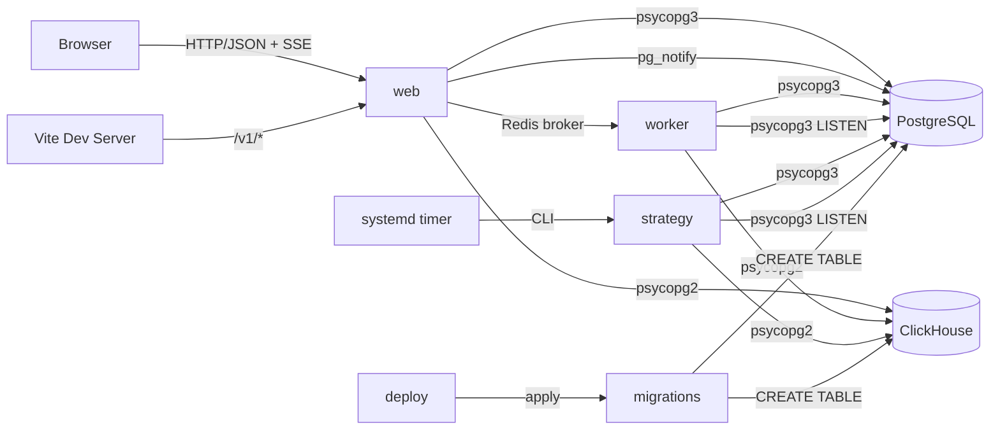
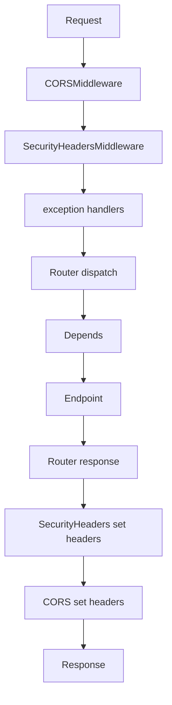
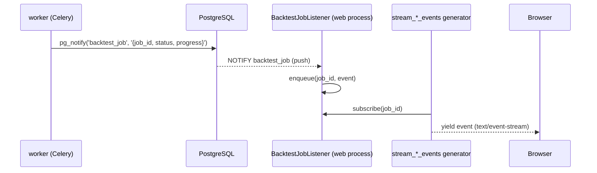
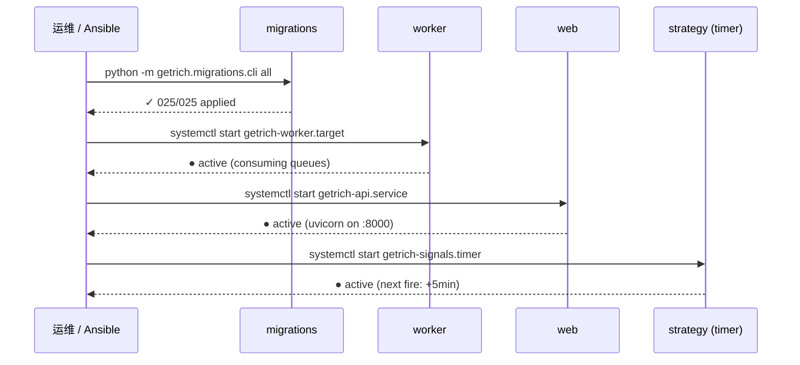

# 平台架构

> **本节讲解 GetRich 平台层（`apps/`）的整体形态**。整个项目由 **4 个 app 角色** 组成：`web`（FastAPI HTTP API）、`worker`（Celery 异步任务）、`strategy`（实盘信号 / 调度 CLI）、`migrations`（PG + CH schema 演进）。本节聚焦 web 的内部架构：lifespan、中间件栈、路由分组、依赖注入、IDOR 防御、跨进程事件流。

---

## 1. 4 个 app 角色

| 角色 | 目录 | 启动方式 | 职责 |
|---|---|---|---|
| **`web`** | `src/getrich/apps/web/` | `uvicorn getrich.apps.web.main:app` | FastAPI HTTP API；与浏览器/前端交互；SSE 推送 |
| **`worker`** | `src/getrich/apps/worker/` | `python -m getrich.apps.worker.cli worker` | Celery 异步任务；跑 backtest / sweep / walk-forward |
| **`strategy`** | `src/getrich/apps/strategy/` | `python -m getrich.apps.strategy.cli`（systemd timer 每 5 分钟） | 实盘信号生成、风控拦截、sub-account 路由 |
| **`migrations`** | `src/getrich/migrations/` | `python -m getrich.migrations.cli postgres` | PG/CH schema 演进；幂等文件命名 |



> 4 个 app 共享同一个 `pg_pool`（PostgreSQL 异步池）和 `ch_pool`（ClickHouse 同步池），都在 `libs/` 下。

---

## 2. `web` 应用入口 —— `apps/web/main.py`

```python
# src/getrich/apps/web/main.py
app = create_app()    # 模块级实例，uvicorn 直接加载

def create_app() -> FastAPI:
    app = FastAPI(
        title="GetRich API",
        version="1.1.0",
        default_response_class=ORJSONResponse,
        lifespan=lifespan,
    )
    app.add_middleware(CORSMiddleware, ...)
    app.add_middleware(SecurityHeadersMiddleware, csp_policy=...)
    register_exception_handlers(app)
    app.include_router(auth_router.router, prefix="/v1")
    # ... 共 11 个 router
    @app.get("/health", tags=["meta"])
    async def health() -> dict[str, str]:
        return {"status": "ok"}
    return app
```

### 2.1 `ORJSONResponse` 默认

`default_response_class=ORJSONResponse` —— 全部响应**默认用 orjson 序列化**（`bytes` / `datetime` / `Decimal` / `UUID` 原生支持，比标准 `json` 快 2-4x）。

### 2.2 11 个路由分组（统一 `/v1` 前缀）

| Router | 路径前缀 | 主要端点 |
|---|---|---|
| `auth_router` | `/v1/auth` | `POST /login` / `POST /register` / `POST /refresh` |
| `backtest_jobs_router` | `/v1/backtest-jobs` | `POST /` / `GET /{id}` / `GET /{id}/events` (SSE) |
| `backtest_runs_router` | `/v1/backtest-runs` | `GET /` / `GET /{id}` / `GET /{id}/report` |
| `backtest_sweeps_router` | `/v1/backtest-sweeps` | `POST /` / `GET /{id}` / `GET /{id}/events` |
| `backtest_walk_forwards_router` | `/v1/backtest-walk-forwards` | 同上 |
| `strategies_router` | `/v1/strategies` | CRUD + 性能数据 |
| `signals_router` | `/v1/signals` | 列出 / 详情 / 执行 |
| `subscriptions_router` | `/v1/subscriptions` | 用户订阅 |
| `signal_settings_router` | `/v1/signal-settings` | 通知设置 |
| `user_router` | `/v1/users` | 用户资料 / 资产 |
| `payments_router` | `/v1/payments` | 支付账单 |

外加：

- `GET /health` —— 探活（无 prefix）
- `GET /openapi.json` / `GET /docs` —— FastAPI 自带（无 prefix）

> **版本策略**：所有业务路由统一 `/v1`，未来 `/v2` 通过 `include_router(prefix="/v2")` 加挂。

---

## 3. `lifespan` —— 启动 / 关闭钩子

```python
@asynccontextmanager
async def lifespan(_: FastAPI) -> AsyncIterator[None]:
    await pg_pool.init()
    listener = BacktestJobListener()
    job_svc._LISTENER = listener
    sweep_svc._LISTENER = listener
    wf_svc._LISTENER = listener
    await listener.start()
    try:
        yield
    finally:
        await listener.stop()
        job_svc._LISTENER = None
        sweep_svc._LISTENER = None
        wf_svc._LISTENER = None
        await pg_pool.close()
```

**严格顺序**（Round #1063）：

1. `pg_pool.init()` —— 必须先于 listener（listener 用同一 DSN，但开独立连接，**不借池**）
2. `BacktestJobListener` 启动（开 LISTEN 连接）
3. 把 listener 注入到 3 个 SSE service 模块（`job_svc` / `sweep_svc` / `wf_svc`）
4. 业务流量开始
5. 关闭时反向：先停 listener（让它能访问 conn），再 close pool

---

## 4. 中间件栈



### 4.1 `CORSMiddleware`

```python
app.add_middleware(
    CORSMiddleware,
    allow_origins=list(settings.web.cors_origins) or ["*"],
    allow_credentials=True,
    allow_methods=["*"],
    allow_headers=["*"],
)
```

> 生产从 `settings.web.cors_origins` 读（环境变量 `GETRICH_WEB__CORS_ORIGINS`）；开发默认 `["*"]`。

### 4.2 `SecurityHeadersMiddleware`（Round #1024）

> 源码：`src/getrich/apps/web/middleware.py`

**协议级 XSS 兜底** —— 即使前端 sanitizer + Pydantic + Postgres CHECK 三层全绕过，浏览器也会拒绝执行注入的 inline script。

| Header | 值 | 防什么 |
|---|---|---|
| `Content-Security-Policy` | `settings.web.csp_policy` | inline `<script>` / 第三方 JS / `<iframe>` 加载 |
| `X-Content-Type-Options` | `nosniff` | MIME 嗅探（user-uploaded content 强制按 Content-Type 解析） |
| `Referrer-Policy` | `strict-origin-when-cross-origin` | 跨域只发 origin（防 strategy_code 漏到第三方） |
| `X-Frame-Options` | `DENY` | clickjacking |

**为什么是最外层**：

```python
app.add_middleware(CORSMiddleware, ...)     # 内层
app.add_middleware(SecurityHeadersMiddleware, ...)   # 外层（最后 add 的最先执行）
```

`add_middleware` 是栈结构，**最后 add 的最外层**。`SecurityHeadersMiddleware` 是外层意味着**它最后写 header** —— 任何 4xx/5xx 错误响应和 `/health` 探活都带这 4 个头。

### 4.3 不能移除 `SecurityHeadersMiddleware`

> CLAUDE.md 铁律：**绝对禁止**在 `create_app()` 中移除 `SecurityHeadersMiddleware` —— 这是协议级 XSS 兜底。
>
> 新增路由/中间件时，测试必须用 `TestClient` 验证响应仍带这 4 个头（见 `tests/apps/web/test_middleware.py`）。

---

## 5. 异常处理

```python
# src/getrich/apps/web/response.py
def register_exception_handlers(app: FastAPI) -> None:
    @app.exception_handler(ApiError)
    async def _handle_api_error(request, exc): ...

    @app.exception_handler(RequestValidationError)
    async def _handle_validation_error(request, exc): ...

    @app.exception_handler(Exception)
    async def _handle_unexpected(request, exc): ...
```

**所有响应统一 `ApiResponse` 形状**：

```json
{
    "code": 4010,
    "message": "auth required: please log in",
    "request_id": "9b1c..."
}
```

| Handler | 触发 | status_code | code |
|---|---|---|---|
| `ApiError` | 业务抛 `Unauthorized` / `NotFound` / ... | `exc.http_status` | `exc.code` |
| `RequestValidationError` | Pydantic 422 | 422 | 4220 |
| `Exception` | 未捕获 | 500 | 5000 |

`error_payload` 在响应中带 `x-request-id`（用于 trace 日志）。

---

## 6. 依赖注入 —— `apps/web/deps.py`

```python
async def get_db() -> AsyncIterator[AsyncConnection]:
    """请求级 DB 连接。"""
    async with pg_pool.connection() as conn:
        yield conn

async def get_current_user(request: Request) -> str | None:
    """Bearer JWT → X-User-Id 兜底。返回 user UUID 或 None。"""

async def require_user(request: Request) -> str:
    """必须有 user，否则抛 Unauthorized(4010)。"""

async def request_id(x_request_id: str | None = Header(None)) -> str:
    """读 / 生成 request_id。"""

def page_dep(
    page: int = Query(1, ge=1),
    page_size: int = Query(DEFAULT_PAGE_SIZE, ge=1, le=MAX_PAGE_SIZE),
    limit: int | None = Query(None, alias="limit", ge=1, le=MAX_PAGE_SIZE),
) -> PageParams:
    """分页参数。'limit' 是前端的 alias（orders.ts 等）。"""
```

### 6.1 典型用法

```python
@router.get("/v1/strategies/{code}")
async def get_strategy(
    code: str,
    user_id: str = Depends(require_user),
    conn: AsyncConnection = Depends(get_db),
    page: PageParams = Depends(page_dep),
) -> ApiResponse[StrategyDetail]:
    ...
```

### 6.2 `get_current_user` 双重兜底

```python
async def get_current_user(request: Request) -> str | None:
    # 1) 优先 Bearer JWT
    token = _extract_bearer_token(request)
    if token:
        try:
            return verify_token(token, settings.web.jwt_secret)["sub"]
        except ValueError:
            pass    # silent-fail-ok：失效 token 走 fallback

    # 2) Fallback: X-User-Id header（dev mock auth）
    return request.headers.get("X-User-Id")
```

> 真实部署关掉 fallback。开发保留让 `curl -H "X-User-Id: ..."` 仍能用。

---

## 7. 跨进程事件流 —— `pg_notify` + `BacktestJobListener`

> Round #1063：worker → API 的事件推送原本是 1s 轮询。**改用 PostgreSQL `LISTEN`/`NOTIFY`**，延迟降到 < 10ms。



**3 个 SSE service 模块共享同一个 listener**：

```python
# 在 lifespan 中
listener = BacktestJobListener()
job_svc._LISTENER = listener
sweep_svc._LISTENER = listener
wf_svc._LISTENER = listener
```

`stream_*_events` generator 模式：

```python
async def stream_job_events(job_id: str):
    queue: asyncio.Queue = asyncio.Queue(maxsize=100)
    await job_svc._LISTENER.subscribe(job_id, queue)
    try:
        while True:
            event = await queue.get()
            yield {"event": "status", "data": json.dumps(event)}
    finally:
        await job_svc._LISTENER.unsubscribe(job_id, queue)
```

---

## 8. IDOR 防御

> Round #880-#889 + #1014 + #1062：跨用户访问控制。

**3 道防线**：

1. **服务层 owner-scope**：`list_runs(user_id=current_user.id)` —— 永远带 `user_id` 过滤
2. **路由层 `require_user`**：每个路由都用 `Depends(require_user)`，不依赖前端传 user_id
3. **PG CHECK 约束**：011 migration 给 `backtest_runs` / `backtest_jobs` / `sweeps` / `walk_forwards` 加了 `user_id` 必填

```python
# ❌ 错的（Round #880 之前）：漏 WHERE user_id
runs = await conn.execute("SELECT * FROM backtest_runs ORDER BY created_at DESC")

# ✅ 对的（Round #880 之后）：永远带 user_id
runs = await conn.execute(
    "SELECT * FROM backtest_runs WHERE user_id = %s ORDER BY created_at DESC",
    (current_user.id,),
)
```

> 详见 [Web API 参考 — 权限模型](api-reference.md) 和 [开发指南 — 编码规范](../development/coding-standards.md)。

---

## 9. `worker` 应用 —— Celery 池

```python
# src/getrich/apps/worker/cli.py
def main() -> None:
    """Dispatch to ``celery worker`` / ``celery beat``."""
    load_settings()
    os.execvp("celery", sys.argv[1:])
```

> `os.execvp` 直接替换为 `celery` 二进制 → `ps` 里看到的是 `celery worker ...`，不是 `python -m ...`。

### 9.1 `lifespan.py` —— Worker 子进程级 init

每个 Celery worker 子进程都需要：

1. 异步 `pg_pool`（`asyncio.run` 打开）
2. 取消 LISTEN 连接（Round #1080）
3. 干净 teardown

```python
async def init_pg_pool() -> None:
    if pg_pool._pool is None:    # 幂等
        await pg_pool.init()

async def init_cancel_listener() -> WorkerCancelListener:
    listener = WorkerCancelListener()
    await listener.start()
    return listener
```

> 为什么 `asyncio.run` per-call：runner 本身就是 async，且 `BacktestJobRunner.run_once` 已经在自己的 loop 里跑。pool 和 listener 需要**跨越**那个 loop。

### 9.2 3 个 Celery 任务

| 任务 | 入口 | 状态 |
|---|---|---|
| `backtest.run_job` | `apps/worker/tasks.py::run_backtest_job` | 接受 backtest job id |
| `sweep.run_job` | `apps/worker/tasks.py::run_sweep_job` | 接受 sweep job id |
| `walk_forward.run_job` | `apps/worker/tasks.py::run_walk_forward_job` | 接受 walk-forward job id |

详见 [运维指南 — systemd 部署](../operations/systemd.md)（含 worker 池配置）。

---

## 10. `strategy` 应用 —— 实盘信号 CLI

```python
# src/getrich/apps/strategy/cli.py
# 入口：systemd timer 每 5 分钟触发
# 环境变量：GETRICH_STRATEGY / GETRICH_STRATEGY_ID / GETRICH_SYMBOLS
```

模块清单：

| 文件 | 职责 |
|---|---|
| `live_runner.py` | `LiveSignalRunner.run_once` |
| `live_data_provider.py` | 拉最新 bar / factor / extra_freq |
| `live_risk.py` | `LiveRiskMonitor` + 3 个 `AlertChannel` |
| `signal_writer.py` | `PgSignalWriter` 写 PG `signals` 表 |
| `account_loader.py` | sub-account 状态加载 |
| `registry.py` | `StrategyRegistry` |
| `trade_reconciler.py` | 交易对账 |
| `scheduler.py` | 多策略调度 |
| `ops.py` | `BacktestRunOp` / `SweepRunOp` / `WalkForwardRunOp` |
| `cli.py` | `getrich-signals` 入口 |
| `cli_multi.py` | 多策略批量 |

详见 [引擎 — 实盘信号生成](../engine/live-signals.md) 和 [运维指南 — systemd 部署](../operations/systemd.md)。

---

## 11. `migrations` 应用 —— schema 演进

```bash
python -m getrich.migrations.cli postgres          # 应用 PG migration
python -m getrich.migrations.cli clickhouse        # 应用 CH migration
python -m getrich.migrations.cli all               # 全部
python -m getrich.migrations.cli status            # 状态
python -m getrich.migrations.cli postgres --dry-run  # 试跑
```

模块：

| 文件 | 职责 |
|---|---|
| `cli.py` | argparse 子命令 |
| `runner.py` | 主流程（按文件名前缀排序，断点续跑） |
| `executors.py` | PG / CH / Aurora / DuckDB 不同 dialect |

详见 [运维指南 — 数据库迁移](../operations/migration-runner.md)。

---

## 12. 启动顺序（部署）



> **顺序很重要**：先 migration → 再 worker（worker 依赖 schema）→ 再 API → 最后 strategy timer（每 5min 触发）。

详见 [运维指南 — systemd 部署](../operations/systemd.md)。

---

## 13. 常见错误

| 症状 | 原因 | 修法 |
|---|---|---|
| `RuntimeError: Pool not initialized` | lifespan 未跑完就接流量 | 检查 `pg_pool.init()` 是否 await |
| 响应没有 `X-Content-Type-Options` 头 | `SecurityHeadersMiddleware` 被移除 | **绝对禁止移除**；用 `TestClient` 测试覆盖 |
| 跨用户看到别人 run | service 层漏 `user_id` 过滤 | Round #1014 之后所有 service 都 owner-scope |
| SSE 1+ 秒延迟 | 没用 `BacktestJobListener` | 全部用 `pg_notify` push；fallback 1s 轮询仅作保险 |
| `csp_policy` 是空字符串 | 没设 `GETRICH_WEB__CSP_POLICY` 环境变量 | 生产必须显式设置，开发用默认 strict 策略 |
| `ORJSONResponse` 报 `TypeError: not JSON serializable` | 业务返回了自定义对象 | 业务用 `pydantic.BaseModel`（orjson 原生支持） |
| `worker child process` 启动失败 | `asyncio.run` 复用同一 loop | Round #1080 修复：每个 task 都 open/close 自己的 loop |
| `celery worker` 进程名是 `python -m ...` | `cli.py` 没用 `os.execvp` | 早期版本会看到，修法见 `cli.py::main` |

---

## 14. 进一步阅读

- API：[Web API 参考](api-reference.md)（含 OpenAPI/Redoc 嵌入）
- 前端：[Web 前端](web-ui.md)
- 运维：[systemd 部署](../operations/systemd.md) / [数据库拓扑](../operations/database-topology.md)
- 引擎侧：[实盘信号生成](../engine/live-signals.md) / [持久化](../engine/persistence.md)
- 源码：
    - [`src/getrich/apps/web/main.py`](https://github.com/getrich/getrich/blob/main/src/getrich/apps/web/main.py)
    - [`src/getrich/apps/web/middleware.py`](https://github.com/getrich/getrich/blob/main/src/getrich/apps/web/middleware.py)
    - [`src/getrich/apps/web/deps.py`](https://github.com/getrich/getrich/blob/main/src/getrich/apps/web/deps.py)
    - [`src/getrich/apps/web/response.py`](https://github.com/getrich/getrich/blob/main/src/getrich/apps/web/response.py)
    - [`src/getrich/apps/worker/`](https://github.com/getrich/getrich/blob/main/src/getrich/apps/worker/)
    - [`src/getrich/apps/strategy/`](https://github.com/getrich/getrich/blob/main/src/getrich/apps/strategy/)
    - [`src/getrich/migrations/`](https://github.com/getrich/getrich/blob/main/src/getrich/migrations/)
