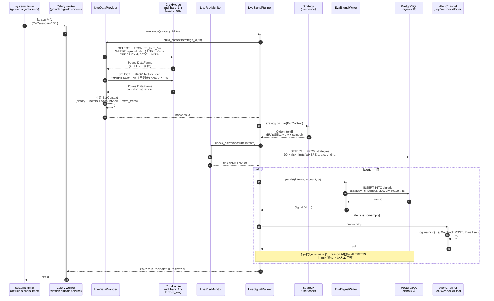

# 实盘信号生成流水线

> **本页讲解 `LiveSignalRunner.run_once()` 一次 tick 内，从 ClickHouse 拉
> 行情 → 调策略 → 写信号 → 风控告警 的完整数据流。**
> 相关源码：`src/getrich/apps/strategy/{live_data_provider,live_runner,
> live_risk,signal_writer}.py` + `src/getrich/apps/worker/` 下的 Celery
> 任务壳。生产部署：`getrich-signals.{service,timer}` systemd unit。

---

## 1. 全景：5 个角色 + 4 个数据源 + 1 个 sink



> **关键设计**：
> - **t-1 估值防 look-ahead bias**：`md_bars_1m` 查询用 `dt <= ts`（不带等号），
>   撮合时再用 `dt > ts` 的下一根 bar。详见 [执行与账户](../engine/execution-accounting.md)
>   与 [多频率与重采样](../engine/multi-frequency.md)
> - **factors 走 long-format 表**：`factors_long` 是 `(symbol, factor, dt, value)`
>   的长表，便于按需加载策略注册过的因子子集（不是全表扫）
> - **告警是旁路，不是阻塞**：`LiveRiskMonitor` 发出 `RiskAlert` 不阻止信号
>   写入；告警走 Webhook/Email/Log，信号表用 `reason='ALERTED: ...'` 标

---

## 2. 一次 tick 的 8 步详解

### Step 1 — Timer 触发

systemd `getrich-signals.timer` 配置 `OnCalendar=*:0/1`（每分钟 0 秒），
触发 `getrich-signals.service`。Service 的 `ExecStart` 是：

```bash
uv run getrich-signals run --strategy-id=<id> --ts=<now-rounding-to-minute>
```

> 命令 `getrich-signals` 在 `pyproject.toml` 的 `[project.scripts]` 段定义，
> 入口指向 `src/getrich/apps/strategy/cli.py::main`。

### Step 2 — Worker 调 `LiveSignalRunner.run_once()`

Celery worker 启动（`getrich-signals.service` 是 `Type=oneshot` 一次性服务，
不是 long-running daemon）→ 调 `live_runner.py::LiveSignalRunner.run_once()`。

`run_once()` 是**幂等**的：用 `(strategy_id, ts)` 做幂等键，重复调
同一分钟不会产生重复信号。

### Step 3 — `LiveDataProvider.build_context()`

详见 [实盘信号](../engine/live-signals.md)。要点：
- 从 `md_bars_1m` 拉策略 universe 内所有 symbol 的最近 N 根分钟线
- 从 `factors_long` 拉策略注册过的因子（注册表在 `strategies.used_factors` 列）
- 如果 `RunConfig.extra_freqs` 设了日线 / 5m，再分别从 `md_bars_1d` / 5m 表拉
- 拼装 `BarContext`（含 `HistoryView`、`AccountView`、`factor()` 方法等）

### Step 4 — 调策略

策略的 `on_bar(ctx)` 是用户代码。`getrich_backtest.SignalStrategy` /
`TargetPositionStrategy` 两种基类范式都支持：
- `SignalStrategy.compute_signal(ctx) -> DataFrame[signal]`
- `TargetPositionStrategy.target_positions(ctx) -> dict[symbol, weight]`

输出转成 `OrderIntent[]`。

### Step 5 — `LiveRiskMonitor.check_alerts()`

风控分 3 类（按报警顺序）：
1. **资金类**：可用现金不足（`InsufficientCash`）、账户净值跌破阈值
2. **持仓类**：单标的持仓超 `risk_limits.max_single_weight`、杠杆超限
3. **行为类**：同一标的一分钟内重复下单（疑似 hot loop）

每类 `RiskAlert` 有 `severity`（`info` / `warning` / `critical`）。
`AlertChannel` 按 severity 路由到不同 sink：
- `info` → `LogAlertChannel`（仅写日志）
- `warning` → `WebhookAlertChannel`（POST 到用户配置的 URL）
- `critical` → 全部 3 个 channel 一起发

### Step 6 — 写信号

`EvalSignalWriter.persist()` 走 PG connection pool，参数化 INSERT
（防 SQL 注入），单条写入 < 1 ms。返回的 `Signal` 对象带 `id`，
runner 写日志但不阻塞。

### Step 7 — Alert 通道（旁路）

告警与写信号是并行的两步。失败一个不影响另一个：
- `LogAlertChannel` 失败 → 只丢一行日志
- `WebhookAlertChannel` 失败 → retry 3 次（指数退避），再失败就 escalate
- `EmailAlertChannel` 失败 → 同上

### Step 8 — Worker 退出

`run_once()` 返回 `{"ok": true, "signals": N, "alerts": M}`，Celery 任务
ack，systemd service 退出。Timer 60s 后再次触发，循环。

---

## 3. 失败模式与可观测性

| 失败点 | 症状 | 检测方式 | 恢复 |
|---|---|---|---|
| `md_bars_1m` 写入延迟 | 数据滞后 t-2，模型用旧值 | CH `system.parts` 监控 last insert time | 等 CH 追上，或策略降级 |
| `factors_long` 缺列 | 策略在生产报 KeyError | `LiveDataProvider` 返回空 DataFrame + warning | 灰度停信号，先回填因子 |
| `signals` 表 PG 写失败 | runner 报错 5xx | Celery task `FAILED` 计数 | PG 连接 / 锁 / 写权限 |
| 告警 Webhook 4xx/5xx | 风险事件无通知 | `AlertChannel.retry_exhausted` 计数 | 修用户 URL / 改用 Email |
| `on_bar` 抛异常 | 整个 strategy 挂 | Celery task `FAILED`，strategy 状态 `error` | 修策略代码 + 重 run |

每个 tick 的 5 个 Prometheus 指标：

| 指标 | 类型 | 含义 |
|---|---|---|
| `getrich_live_run_once_seconds` | histogram | run_once 总耗时 |
| `getrich_live_signals_persisted_total` | counter | 成功写库的信号数 |
| `getrich_live_alerts_emitted_total{severity}` | counter | 按 severity 分桶的告警数 |
| `getrich_live_data_load_seconds{step}` | histogram | `bars` / `factors` / `account` 各步骤耗时 |
| `getrich_live_strategy_errors_total{strategy_id}` | counter | on_bar 异常数（按 strategy 分桶） |

完整 Prometheus 抓取配置见 [监控与告警](../operations/monitoring.md)。

---

## 4. 与回测的对齐保证

实盘信号的可信度建立在"**实盘 == 回测**"上。三层对齐：

1. **同一份策略代码**：`strategy.on_bar()` 来自 `getrich_backtest` 包，
   在回测和实盘上是同一段代码（`Strategy` 基类共用）
2. **同一份 `LiveDataProvider` 抽象**：`build_context()` 在回测和实盘用同
   一个方法，回测时传 `DataFrameBarLoader`，实盘时传 `ClickHouseBarLoader`
3. **同一份 `BacktestMetrics` 计算**：`LiveSignalRunner.run_once()` 跑完后
   可以立刻接一次 `Backtest.run_once()` 模拟盘对比（"shadow backtest"），
   把两者的 `OrderIntent` diff 写入 `signals_vs_backtest` 表供回测-实盘
   健康度监控

回测-实盘对比的具体方法论见 [实盘信号](../engine/live-signals.md)。

---

## 5. 源码导航

| 文件 | 行数 | 入口类 / 函数 |
|---|---|---|
| `src/getrich/apps/strategy/cli.py` | ~120 | `main()` CLI 入口 |
| `src/getrich/apps/strategy/live_runner.py` | ~250 | `LiveSignalRunner.run_once()` |
| `src/getrich/apps/strategy/live_data_provider.py` | ~280 | `LiveDataProvider.build_context()` |
| `src/getrich/apps/strategy/live_risk.py` | ~180 | `LiveRiskMonitor.check_alerts()` |
| `src/getrich/apps/strategy/signal_writer.py` | ~120 | `EvalSignalWriter.persist()` |
| `getrich-signals.service` | systemd unit | `ExecStart=getrich-signals run` |
| `getrich-signals.timer` | systemd timer | `OnCalendar=*:0/1` |
| `migrations/clickhouse/001_ohlcv_bars.sql` | DDL | `md_bars_1m` / `md_bars_1d` 表 |
| `migrations/clickhouse/002_factors_long.sql` | DDL | `factors_long` 表 |
| `migrations/015_signals.sql` | DDL | `signals` 表 + 列定义 |

---

## 6. 相关文档

- [实盘信号生成（引擎层）](../engine/live-signals.md) — 引擎层 live/ 子包
- [持久化与 artifact](../engine/persistence.md) — signal 写 PG 的表结构
- [多频率与重采样](../engine/multi-frequency.md) — `extra_freqs` 在实盘的处理
- [数据加载器](../engine/data-loaders.md) — `LiveDataProvider` 背后的 `BarLoader` 协议
- [监控与告警](../operations/monitoring.md) — Prometheus 抓取 + Alertmanager 路由
- [systemd 部署](../operations/systemd.md) — `getrich-signals.service` 详细配置
