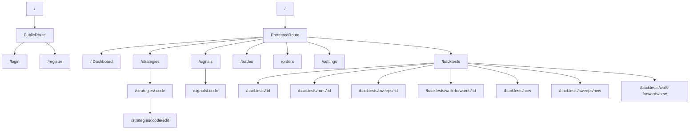

# Web 前端

> **本节讲解 GetRich 平台前端** —— Vite 7 + React 19 + TypeScript 5.9 SPA。涵盖项目结构、路由树、AuthContext + JWT 刷新、react-query 数据层、react-hook-form + zod 表单、shadcn/ui 组件库、ECharts 图表、SSE 实时进度、4 层 XSS 防御。

---

## 1. 技术栈

| 类别 | 选型 | 版本 |
|---|---|---|
| 构建 | Vite | 7.x |
| 框架 | React | 19.x |
| 类型 | TypeScript | 5.9（strict + noUnusedLocals） |
| 路由 | react-router-dom | 7.x |
| 状态 | TanStack Query (react-query) | 5.x |
| 表单 | react-hook-form + zod | 7.x + 3.x |
| 组件 | shadcn/ui + Radix UI | CLI 生成 |
| 图表 | ECharts + Recharts | 5.x + 2.x |
| 样式 | Tailwind CSS + CSS Variables | 3.x |
| 测试 | Vitest + @testing-library/react | 1.x + 16.x |
| Lint | ESLint + 本地插件 `getrich/no-unsanitized-danger` | 9.x |

> **无 any 铁律**（CLAUDE.md §4.2）：所有类型严格推导；对接无类型外部包必须加 `// eslint-disable-next-line @typescript-eslint/no-explicit-any` + 详细注释。

---

## 2. 项目结构

```
frontend/
├── src/
│   ├── api/                     # 所有 HTTP/SSE 接口模块
│   │   ├── auth.ts
│   │   ├── backtestJobEvents.ts # SSE client
│   │   ├── backtestJobs.ts
│   │   ├── backtestRuns.ts
│   │   ├── backtestSweeps.ts
│   │   ├── backtestWalkForwards.ts
│   │   ├── backtests.ts
│   │   ├── client.ts            # fetch wrapper + 401 interceptor
│   │   ├── orders.ts
│   │   ├── signalSettings.ts
│   │   ├── signals.ts
│   │   ├── strategies.ts
│   │   └── subscriptions.ts
│   ├── components/
│   │   ├── EquityCurveChart.tsx
│   │   ├── ProtectedRoute.tsx
│   │   ├── PublicRoute.tsx
│   │   └── ui/                  # shadcn/ui 生成（button/card/dialog/...）
│   ├── contexts/
│   │   └── AuthContext.tsx      # 全局 auth state
│   ├── hooks/
│   ├── lib/
│   │   ├── sanitize.ts          # DOMPurify wrapper（XSS 防御）
│   │   ├── eslint-plugin-no-unsanitized-danger.cjs  # 自定义 ESLint 规则
│   │   └── utils.ts             # cn() / format helpers
│   ├── pages/
│   │   ├── Dashboard.tsx
│   │   ├── Login.tsx / Register.tsx
│   │   ├── Strategies.tsx / StrategyDetail.tsx / StrategyEdit.tsx
│   │   ├── Signals.tsx / SignalDetail.tsx
│   │   ├── Trades.tsx
│   │   ├── Orders.tsx
│   │   ├── SignalSettings.tsx
│   │   └── backtests/           # 7 个 backtest 页面
│   │       ├── BacktestJobs.tsx
│   │       ├── BacktestJobDetail.tsx
│   │       ├── BacktestRunDetail.tsx
│   │       ├── BacktestSweepDetail.tsx
│   │       ├── BacktestWalkForwardDetail.tsx
│   │       ├── NewBacktestJob.tsx
│   │       ├── NewSweepJob.tsx
│   │       └── NewWalkForwardJob.tsx
│   ├── test/
│   │   └── fetch.ts             # vitest fetch mock helper
│   ├── App.tsx                  # 路由树
│   ├── main.tsx                 # React 19 root
│   └── index.css
├── public/                       # 静态资源
├── package.json
├── tsconfig.json
├── vite.config.ts
└── vitest.config.ts
```

> **15 个 page 文件 + 18 个 api 模块**（每个 `*.ts` 对应一个 `*.test.ts`）。

---

## 3. 路由树



### 3.1 守卫组件

```tsx
// ProtectedRoute.tsx —— 已登录才能进
export function ProtectedRoute({ children }: { children: ReactNode }) {
  const { isAuthenticated, isLoading } = useAuth();
  if (isLoading) return <LoadingSpinner />;
  if (!isAuthenticated) return <Navigate to="/login" replace />;
  return <>{children}</>;
}

// PublicRoute.tsx —— 已登录跳走
export function PublicRoute({ children }: { children: ReactNode }) {
  const { isAuthenticated } = useAuth();
  if (isAuthenticated) return <Navigate to="/" replace />;
  return <>{children}</>;
}
```

> Round #920 测试覆盖：登录 / 登出 / 路由跳转 / 401 后 fallback。

### 3.2 Nav 条件渲染

```tsx
{isAuthenticated ? (
  <>
    <Link to="/strategies">Strategies</Link>
    <Link to="/signals">Signals</Link>
    <Link to="/trades">Trades</Link>
    <Link to="/backtests">Backtests</Link>
    <Link to="/orders">Orders</Link>
    <Link to="/settings">Settings</Link>
    <span>{user?.email}</span>
    <button onClick={handleLogout}>Logout</button>
  </>
) : (
  <>
    <Link to="/login">Login</Link>
    <Link to="/register">Register</Link>
  </>
)}
```

---

## 4. AuthContext + JWT 轮换

> 源码：`frontend/src/contexts/AuthContext.tsx`

### 4.1 状态

```typescript
interface AuthState {
  user: UserInfo | null;
  isAuthenticated: boolean;
  isLoading: boolean;
  login: (accessToken: string, user: UserInfo, refreshToken?: string) => void;
  logout: () => void;
}
```

### 4.2 Token 存储

| Token | 存储 | 理由 |
|---|---|---|
| `access_token` | **内存**（`useState`） | 短寿命（默认 15 min），XSS 拿到也来不及用 |
| `refresh_token` | **`sessionStorage`**（`setRefreshToken`） | 7 天寿命；标签页关闭即失 |
| `user`（profile） | **`localStorage`** | 持久；启动时立即 hydrate |

```typescript
// client.ts
export const getAccessToken = () => /* from in-memory map */;
export const setAccessToken = (token: string) => { /* ... */ };
export const getStoredUser = () => JSON.parse(localStorage.getItem("user") ?? "null");
```

### 4.3 401 拦截器

```typescript
// client.ts —— 每次 fetch 后检查
async function fetchWithAuth(url: string, init: RequestInit = {}) {
    const res = await fetch(url, {
        ...init,
        headers: { ...init.headers, Authorization: `Bearer ${getAccessToken()}` },
    });
    if (res.status === 401) {
        const refreshed = await tryRefresh();
        if (!refreshed) {
            logout();
            navigate("/login");
            return;
        }
        // 重试原请求
        return fetchWithAuth(url, init);
    }
    return res;
}
```

### 4.4 Refresh token 轮换

```typescript
async function tryRefresh(): Promise<boolean> {
    const refreshToken = sessionStorage.getItem("refresh_token");
    if (!refreshToken) return false;
    const res = await fetch("/v1/auth/refresh", {
        method: "POST",
        body: JSON.stringify({ refresh_token: refreshToken }),
    });
    if (!res.ok) return false;
    const { access_token, refresh_token } = await res.json();
    setAccessToken(access_token);
    sessionStorage.setItem("refresh_token", refresh_token);  // 新 refresh
    return true;
}
```

> **轮换** = 每次 refresh 都发新 refresh_token，旧 token 立即失效（防 token 重放）。

---

## 5. 数据层 —— `react-query`

> 任何异步数据**必须**用 `useQuery` / `useMutation`，**禁止** `useEffect` + `useState` 手写轮询。

### 5.1 典型用法

```typescript
// pages/Strategies.tsx
import { useQuery } from "@tanstack/react-query";
import { listStrategies } from "../api/strategies";

export function Strategies() {
    const { data, isLoading, error } = useQuery({
        queryKey: ["strategies", { status: "active" }],
        queryFn: () => listStrategies({ status: "active" }),
        staleTime: 30_000,    // 30s 内复用
        refetchOnWindowFocus: true,
    });

    if (isLoading) return <LoadingSpinner />;
    if (error) return <ErrorPanel err={error} />;
    return <StrategyList data={data} />;
}
```

### 5.2 mutation + cache 失效

```typescript
const queryClient = useQueryClient();
const updateMutation = useMutation({
    mutationFn: (input: StrategyUpdate) => updateStrategy(code, input),
    onSuccess: () => {
        queryClient.invalidateQueries({ queryKey: ["strategies"] });
    },
});
```

### 5.3 全局配置

```typescript
// main.tsx
const queryClient = new QueryClient({
    defaultOptions: {
        queries: {
            retry: 1,
            staleTime: 30_000,
            refetchOnWindowFocus: true,
        },
    },
});

<QueryClientProvider client={queryClient}>{children}</QueryClientProvider>
```

---

## 6. 表单 —— `react-hook-form` + `zod`

> 严格前端校验；zod schema 同时给**后端** Pydantic 镜像（CLAUDE.md §4.2 铁律）。

### 6.1 典型 schema

```typescript
// schemas/strategy.ts
export const strategyCreateSchema = z.object({
    code: z.string().min(1).max(64).regex(/^[a-z0-9_-]+$/),
    name: z.string().min(1).max(128),
    category: z.enum(["momentum", "mean_reversion", "arbitrage"]),
    detail_html: z.string().max(100_000).optional(),     // 与 024 migration 对齐
    is_public: z.boolean().default(false),
});
export type StrategyCreate = z.infer<typeof strategyCreateSchema>;
```

### 6.2 表单组件

```typescript
// pages/StrategyEdit.tsx
import { useForm } from "react-hook-form";
import { zodResolver } from "@hookform/resolvers/zod";

export function StrategyEdit() {
    const { register, handleSubmit, formState: { errors } } = useForm<StrategyCreate>({
        resolver: zodResolver(strategyCreateSchema),
        defaultValues: { is_public: false },
    });

    const onSubmit = (data: StrategyCreate) => updateMutation.mutate(data);

    return (
        <form onSubmit={handleSubmit(onSubmit)}>
            <input {...register("code")} />
            {errors.code && <p className="text-danger">{errors.code.message}</p>}
            {/* ... 其他字段 */}
        </form>
    );
}
```

> **错误直接来自 zod 校验** —— 后端 Pydantic 收到的 body 已经过前端过滤（4 层 XSS 防御的 L1）。

---

## 7. UI 组件 —— shadcn/ui + Radix

> 通过 `npx shadcn@latest add <component>` 生成，**CLI 统一管理**，**不手动改 UI 源码**（CLAUDE.md §4.2）。

### 7.1 已用组件

| 组件 | 路径 | 用途 |
|---|---|---|
| `Button` | `components/ui/button.tsx` | 全站 |
| `Card` | `components/ui/card.tsx` | Dashboard 卡片 |
| `Dialog` | `components/ui/dialog.tsx` | 确认弹窗 |
| `Input` / `Textarea` | `components/ui/` | 表单 |
| `Select` | `components/ui/select.tsx` | 下拉 |
| `Table` | `components/ui/table.tsx` | 列表 |
| `Toast` / `Toaster` | `components/ui/toast.tsx` | 通知 |
| `Tabs` | `components/ui/tabs.tsx` | 多页内容 |

### 7.2 主题切换

```typescript
import { useTheme } from "next-themes";
const { theme, setTheme } = useTheme();
setTheme(theme === "dark" ? "light" : "dark");
```

> 跟后端 `palette.toggle` 主题 + 中文 i18n 配套。

---

## 8. 图表 —— ECharts + Recharts

> 时序/权益曲线**必须**用 ECharts；其他常规图用 Recharts。

### 8.1 ECharts 权益曲线

```typescript
// components/EquityCurveChart.tsx
import * as echarts from "echarts/core";
import { LineChart } from "echarts/charts";
import { GridComponent, TooltipComponent, LegendComponent } from "echarts/components";
import { CanvasRenderer } from "echarts/renderers";

echarts.use([LineChart, GridComponent, TooltipComponent, LegendComponent, CanvasRenderer]);

export function EquityCurveChart({ points }: { points: Array<{ dt: string; equity: number }> }) {
    const ref = useRef<HTMLDivElement>(null);
    useEffect(() => {
        const chart = echarts.init(ref.current!);
        chart.setOption({
            xAxis: { type: "time" },
            yAxis: { type: "value" },
            series: [{ data: points.map(p => [p.dt, p.equity]), type: "line" }],
        });
        return () => chart.dispose();
    }, [points]);
    return <div ref={ref} style={{ width: "100%", height: 400 }} />;
}
```

> Round #228 ECharts bundle 优化：用 `echarts/core` 树摇，只 import 需要的组件。

### 8.2 Recharts 备选

```typescript
import { BarChart, Bar, XAxis, YAxis } from "recharts";

<BarChart data={data}>
    <XAxis dataKey="month" />
    <YAxis />
    <Bar dataKey="return" fill="#8884d8" />
</BarChart>
```

> 仅用于**简单静态图**（月度收益柱、统计饼图）。

---

## 9. SSE 实时进度

> 3 个详情页用 SSE：BacktestJobDetail / BacktestSweepDetail / BacktestWalkForwardDetail。

### 9.1 SSE 客户端

```typescript
// api/backtestJobEvents.ts
export function subscribeJobEvents(
    jobId: string,
    onEvent: (e: JobEvent) => void,
    onError?: (err: Error) => void,
): () => void {
    const url = `/v1/backtest-jobs/${jobId}/events`;
    const es = new EventSource(url, { withCredentials: true });

    es.addEventListener("status", (msg) => onEvent(JSON.parse(msg.data)));
    es.addEventListener("progress", (msg) => onEvent(JSON.parse(msg.data)));
    es.addEventListener("done", () => es.close());
    es.onerror = (e) => onError?.(new Error("SSE connection lost"));

    return () => es.close();
}
```

### 9.2 React 组件

```typescript
// pages/backtests/BacktestJobDetail.tsx
export function BacktestJobDetail() {
    const { id } = useParams();
    const [status, setStatus] = useState<JobStatus | null>(null);
    useEffect(() => {
        return subscribeJobEvents(id!, (e) => setStatus(e));
    }, [id]);
    return <JobStatusPanel status={status} />;
}
```

> 详见 [API — SSE 流](../platform/api-reference.md#sse-流) 和 [Round #1058 SSE 重连 + Last-Event-ID](https://github.com/getrich/getrich/blob/main/.agent/brain/NOTES.md)。

---

## 10. 4 层 XSS 防御

> **CLAUDE.md §4.2 铁律 + Round #1006-#1011 + #1024 实现**：

| 层级 | 实现 | 位置 |
|---|---|---|
| **L1 — 前端 schema** | `zod.string().max(100_000)` | `schemas/*.ts` |
| **L2 — 后端 Pydantic** | `Field(..., max_length=100_000)` + `bleach.clean()` 归一化 | `apps/web/schemas/*.py` |
| **L3 — DB CHECK** | `length(detail_html) <= 100000` | 024 migration |
| **L4 — 协议级 CSP** | `SecurityHeadersMiddleware` + `csp_policy` | `apps/web/middleware.py` |

### 10.1 自定义 ESLint 规则

> `frontend/src/lib/eslint-plugin-no-unsanitized-danger.cjs`（Round #1008）

```javascript
// 拦截：任何 dangerouslySetInnerHTML 必须经 sanitizeHtml / DOMPurify.sanitize / bleach.clean 包裹
"no-restricted-syntax": [
    "error",
    {
        selector: "JSXAttribute[name.name='dangerouslySetInnerHTML']",
        message: "Use sanitizeHtml() / DOMPurify.sanitize() / bleach.clean() before dangerouslySetInnerHTML.",
    },
]
```

> 任何新组件必须用 `sanitizeHtml(strategy.detail_html)` 包裹后再 `dangerouslySetInnerHTML`：

```tsx
import { sanitizeHtml } from "../lib/sanitize";

<div dangerouslySetInnerHTML={{ __html: sanitizeHtml(strategy.detail_html) }} />
```

---

## 11. 测试 —— Vitest + Testing Library

> 每个 `*.tsx` 对应一个 `*.test.tsx`，每个 `api/*.ts` 对应一个 `api/*.test.ts`。

### 11.1 工具

```typescript
// test/fetch.ts —— fetch mock helper
export function mockFetch(responses: Array<{ url: string; status: number; body: unknown }>) {
    globalThis.fetch = vi.fn(async (url, init) => {
        const match = responses.find(r => r.url === url);
        if (!match) throw new Error(`unmocked fetch: ${url}`);
        return new Response(JSON.stringify(match.body), { status: match.status });
    });
}

// setup.ts —— vi.unstubAllGlobals in afterEach
afterEach(() => vi.unstubAllGlobals());
```

### 11.2 组件测试

```typescript
// pages/Strategies.test.tsx
import { render, screen, waitFor } from "@testing-library/react";
import { QueryClient, QueryClientProvider } from "@tanstack/react-query";
import { AuthContext } from "../contexts/AuthContext";
import { Strategies } from "./Strategies";

test("renders strategy list", async () => {
    mockFetch([{ url: "/v1/strategies", status: 200, body: { data: [{ code: "MACross" }] } }]);
    render(<Strategies />, { wrapper: makeWrapper() });
    await waitFor(() => screen.getByText("MACross"));
});
```

> Round #1082 完成 10 页测试覆盖；Round #1082.b 修复 Back 按钮测试。

### 11.3 跑测试

```bash
# 本地
cd frontend
npm run test -- --run    # 单次跑（CI 用）

# CI（.github/workflows/ci.yml）
- run: npm run test -- --run
```

---

## 12. Vite 配置

> 关键点：**手动 chunk split** 优化首屏（Round #920-#922）

```typescript
// vite.config.ts
export default defineConfig({
    plugins: [react()],
    build: {
        rollupOptions: {
            output: {
                manualChunks: {
                    react: ["react", "react-dom"],
                    router: ["react-router-dom"],
                    query: ["@tanstack/react-query"],
                    echarts: ["echarts/core", "echarts/charts", "echarts/components"],
                    forms: ["react-hook-form", "zod", "@hookform/resolvers"],
                },
            },
        },
    },
});
```

> 让 dashboard 首屏只加载 react + router + 当前页面用到的 chunk；ECharts 只在 `/dashboard` / `/backtest-runs/{id}` 时加载。

---

## 13. 常见开发操作

### 13.1 新增 API 模块

```bash
# 1. 写实现
touch src/api/myFeature.ts
# 2. 写测试（用 mockFetch）
touch src/api/myFeature.test.ts
# 3. 在 .ts 中 export 函数，.test.ts 中测试 200/4xx/5xx
```

### 13.2 新增页面

```bash
# 1. 写组件
touch src/pages/MyFeature.tsx
# 2. 写测试
touch src/pages/MyFeature.test.tsx
# 3. 在 App.tsx 加 <Route>
# 4. 在 nav 加 <Link>（仅 authenticated）
# 5. 跑 npm run lint + npm run test
```

### 13.3 新增 shadcn 组件

```bash
npx shadcn@latest add <component-name>
# 例: npx shadcn@latest add dialog
# 自动写入 src/components/ui/<name>.tsx + 必要的 cn() 工具
```

> **不**手动改 `components/ui/*` —— 重新 `npx shadcn add` 会覆盖。

### 13.4 调试 SSE

```bash
# 1. 浏览器 DevTools → Network → 找 EventStream
# 2. 看 Last-Event-ID header（Round #1058 重连用）
# 3. 手动 curl 试
curl -N -H "Authorization: Bearer <token>" \
    http://localhost:8000/v1/backtest-jobs/<id>/events
```

---

## 14. 进一步阅读

- API：[Web API 参考](api-reference.md)
- 平台：[平台架构](../platform/architecture.md)
- 编码规范：[开发指南 — 编码规范](../development/coding-standards.md)
- 设计契约：[60 客户端接口](../design-contracts/60-client-api.md)
- 源码：
    - [`frontend/src/App.tsx`](https://github.com/getrich/getrich/blob/main/frontend/src/App.tsx)
    - [`frontend/src/contexts/AuthContext.tsx`](https://github.com/getrich/getrich/blob/main/frontend/src/contexts/AuthContext.tsx)
    - [`frontend/src/api/client.ts`](https://github.com/getrich/getrich/blob/main/frontend/src/api/client.ts)
    - [`frontend/src/lib/sanitize.ts`](https://github.com/getrich/getrich/blob/main/frontend/src/lib/sanitize.ts)
    - [`frontend/src/lib/eslint-plugin-no-unsanitized-danger.cjs`](https://github.com/getrich/getrich/blob/main/frontend/src/lib/eslint-plugin-no-unsanitized-danger.cjs)
- 工具：
    - [React 19 文档](https://react.dev/)
    - [TanStack Query](https://tanstack.com/query/latest)
    - [react-hook-form](https://react-hook-form.com/)
    - [zod](https://zod.dev/)
    - [shadcn/ui](https://ui.shadcn.com/)
    - [ECharts](https://echarts.apache.org/en/index.html)
