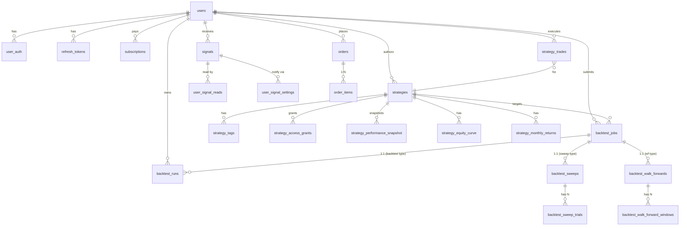

# 数据库 Schema 参考

> **本节汇总 GetRich 平台的 30+ 张业务表 + 8 张 ClickHouse 时序表**。每张表给出：用途、关键字段、索引、写入方。完整 DDL 见 `migrations/00X_*.sql`（PG）和 `migrations/clickhouse/00X_*.sql`（CH）。
>
> ⚠️ 单一真源是 `migrations/` 目录。本文档是镜像，**变更前请同步两边**。

---

## 1. PostgreSQL 速览

**库名**：`getrich` | **Schema**：`frontend.*`（业务）/ `auth.*`（可选）

**25 个 migration（001-025）**：

| Migration | 主要新增表 / 字段 |
|---|---|
| 001 | `strategy_sub_account_mapping` |
| 002 | `strategy_trades` |
| 003 | `users` |
| 004 | `refresh_tokens` |
| 005 | `backtest_runs` / `backtest_metrics` / `backtest_equity_points` / `backtest_final_positions` / `backtest_artifacts` |
| 006 | `backtest_sweeps` / `backtest_sweep_trials` |
| 007 | `backtest_walk_forwards` / `backtest_walk_forward_windows` |
| 008 | `backtest_jobs` |
| 009 | `backtest_jobs` retry 字段 |
| 010 | `backtest_jobs` stuck-running 恢复 SQL |
| 011 | `backtest_jobs` / `backtest_runs` 加 `user_id` |
| 012 | `orders` / `order_items` |
| 013 | `strategies` / `strategy_categories` / `strategy_tags` / `tags` |
| 014 | `user_auth` |
| 015 | `signals` / `signal_batches` |
| 016 | `subscriptions` / `user_strategy_subscriptions` |
| 017 | `signal_settings` / `user_signal_settings` / `user_strategy_signal_settings` |
| 018 | `strategy_performance_snapshot` / `strategy_equity_curve` / `strategy_monthly_returns` |
| 019 | `strategy_categories` 增补 |
| 020 | `user_signal_reads` |
| 021 | `signal_market_snapshot` |
| 022 | `backtest_jobs` retry override 字段 |
| 023 | `backtest_jobs.request_hash` 幂等 |
| 024 | `strategies.detail_html` 长度 CHECK |
| 025 | `signals.reason` 长度 CHECK |

---

## 2. PostgreSQL 表详解

> 按业务域分组。每张表给出：主键、关键字段、关键索引、写入方。

### 2.1 用户与认证

#### `users`（003）

```sql
CREATE TABLE frontend.users (
    id            BIGSERIAL PRIMARY KEY,
    email         TEXT UNIQUE NOT NULL,
    display_name  TEXT,
    created_at    TIMESTAMPTZ NOT NULL DEFAULT now(),
    updated_at    TIMESTAMPTZ NOT NULL DEFAULT now()
);
```

- **写入方**：`POST /v1/auth/register` (auth_router)
- **索引**：`email` UNIQUE

#### `user_auth`（014，替代了早期 `user_password`）

```sql
CREATE TABLE frontend.user_auth (
    user_id        BIGINT PRIMARY KEY REFERENCES users(id),
    password_hash  TEXT NOT NULL,           -- argon2
    last_login_at  TIMESTAMPTZ,
    failed_attempts INT NOT NULL DEFAULT 0,
    locked_until   TIMESTAMPTZ
);
```

- **写入方**：登录、注册、密码重置
- **索引**：`(user_id)` 主键

#### `refresh_tokens`（004）

```sql
CREATE TABLE frontend.refresh_tokens (
    id           BIGSERIAL PRIMARY KEY,
    user_id      BIGINT NOT NULL REFERENCES users(id),
    token_hash   TEXT UNIQUE NOT NULL,       -- SHA-256，**不存原文**
    expires_at   TIMESTAMPTZ NOT NULL,
    revoked_at   TIMESTAMPTZ,
    created_ip   INET,
    created_ua   TEXT
);
CREATE INDEX idx_refresh_tokens_user ON refresh_tokens(user_id);
CREATE INDEX idx_refresh_tokens_expires ON refresh_tokens(expires_at);
```

- **写入方**：`POST /v1/auth/login` / `/refresh`
- **清理**：定期 `DELETE WHERE expires_at < now() - interval '30 days'`

### 2.2 策略与信号

#### `strategies`（013 + 019 + 024）

```sql
CREATE TABLE frontend.strategies (
    id            BIGSERIAL PRIMARY KEY,
    code          TEXT UNIQUE NOT NULL,        -- 用户友好标识
    name          TEXT NOT NULL,
    author_id     BIGINT REFERENCES users(id),
    category_id   BIGINT REFERENCES strategy_categories(id),
    detail_html   TEXT,                         -- Round #1009 加 bleach 归一化 + 024 加 CHECK
    is_public     BOOLEAN NOT NULL DEFAULT false,
    created_at    TIMESTAMPTZ NOT NULL DEFAULT now(),
    updated_at    TIMESTAMPTZ NOT NULL DEFAULT now(),
    CHECK (length(detail_html) <= 100000)       -- 024 migration
);
CREATE INDEX idx_strategies_author ON strategies(author_id);
CREATE INDEX idx_strategies_category ON strategies(category_id);
```

- **写入方**：`POST/PATCH /v1/strategies`
- **CHECK 约束**：`detail_html <= 100000` 字符（防 DoS）
- **IDOR 防护**（Round #1062）：list 永远带 `WHERE author_id = ?`

#### `strategy_categories`（013 + 019）

```sql
CREATE TABLE frontend.strategy_categories (
    id    BIGSERIAL PRIMARY KEY,
    code  TEXT UNIQUE NOT NULL,             -- "momentum" / "mean_reversion" / ...
    name  TEXT NOT NULL,
    sort  INT NOT NULL DEFAULT 0
);
```

#### `strategy_tags` / `tags`（013）

```sql
CREATE TABLE frontend.tags (id BIGSERIAL PRIMARY KEY, name TEXT UNIQUE);
CREATE TABLE frontend.strategy_tags (
    strategy_id BIGINT REFERENCES strategies(id) ON DELETE CASCADE,
    tag_id      BIGINT REFERENCES tags(id) ON DELETE CASCADE,
    PRIMARY KEY (strategy_id, tag_id)
);
```

#### `signals`（015 + 025）

```sql
CREATE TABLE frontend.signals (
    id            BIGSERIAL PRIMARY KEY,
    uuid          UUID UNIQUE NOT NULL DEFAULT gen_random_uuid(),
    strategy_id   BIGINT REFERENCES strategies(id),
    user_id       BIGINT REFERENCES users(id),    -- 015 加
    symbol        TEXT NOT NULL,
    action        TEXT NOT NULL CHECK (action IN ('buy', 'sell', 'hold', 'close')),
    signal_type   TEXT NOT NULL DEFAULT 'entry',
    direction     TEXT,
    trigger_price NUMERIC(20, 4),
    target_price  NUMERIC(20, 4),
    stop_loss     NUMERIC(20, 4),
    quantity      INT,
    confidence    NUMERIC(5, 4),
    urgency       TEXT DEFAULT 'normal',
    reason        TEXT,                              -- 025 加 length CHECK
    trigger_time  TIMESTAMPTZ,
    status        TEXT NOT NULL DEFAULT 'active',
    created_at    TIMESTAMPTZ NOT NULL DEFAULT now(),
    CHECK (length(reason) <= 500),                  -- 025 migration
    CHECK (action IN ('buy', 'sell', 'hold', 'close'))
);
CREATE INDEX idx_signals_strategy_created ON signals(strategy_id, created_at DESC);
CREATE INDEX idx_signals_user_created ON signals(user_id, created_at DESC);
CREATE INDEX idx_signals_status_created ON signals(status, created_at DESC);
```

- **写入方**：`LiveSignalRunner` → `PgSignalWriter.write_batch`（每 5min × strategy）
- **CHECK 约束**：`action ∈ {buy, sell, hold, close}` + `reason ≤ 500 字符`

#### `signal_batches`（015）

```sql
CREATE TABLE frontend.signal_batches (
    id           BIGSERIAL PRIMARY KEY,
    strategy_id  BIGINT,
    batch_id     UUID UNIQUE NOT NULL,           -- 幂等键
    signal_count INT NOT NULL,
    created_at   TIMESTAMPTZ NOT NULL DEFAULT now()
);
```

- **幂等性**：同 `batch_id` 重复提交不创建新 batch（写在 `signal_writer.py`）

#### `user_signal_reads`（020）

```sql
CREATE TABLE frontend.user_signal_reads (
    user_id     BIGINT REFERENCES users(id),
    signal_id   BIGINT REFERENCES signals(id),
    read_at     TIMESTAMPTZ NOT NULL DEFAULT now(),
    PRIMARY KEY (user_id, signal_id)
);
```

- **用途**：标记"已读"，`user_signal_reads_monthly` 视图按月聚合

#### `user_signal_settings` / `user_strategy_signal_settings`（017）

```sql
CREATE TABLE frontend.user_signal_settings (
    user_id    BIGINT REFERENCES users(id) PRIMARY KEY,
    channels   JSONB NOT NULL DEFAULT '{}',  -- {"email": true, "sms": false, ...}
    quiet_hours JSONB,                        -- {"start": "22:00", "end": "08:00"}
    updated_at TIMESTAMPTZ NOT NULL DEFAULT now()
);

CREATE TABLE frontend.user_strategy_signal_settings (
    user_id     BIGINT REFERENCES users(id),
    strategy_id BIGINT REFERENCES strategies(id),
    override    JSONB NOT NULL,
    PRIMARY KEY (user_id, strategy_id)
);
```

### 2.3 订阅

#### `subscriptions`（016）

```sql
CREATE TABLE frontend.subscriptions (
    id            BIGSERIAL PRIMARY KEY,
    user_id       BIGINT REFERENCES users(id),
    plan_code     TEXT NOT NULL,                 -- "free" / "pro" / "enterprise"
    status        TEXT NOT NULL,                 -- "active" / "cancelled" / "expired"
    started_at    TIMESTAMPTZ NOT NULL,
    expires_at    TIMESTAMPTZ,
    auto_renew    BOOLEAN NOT NULL DEFAULT true
);
```

#### `user_strategy_subscriptions`（016）

```sql
CREATE TABLE frontend.user_strategy_subscriptions (
    user_id        BIGINT REFERENCES users(id),
    strategy_id    BIGINT REFERENCES strategies(id),
    sub_account_id TEXT NOT NULL,                -- sub-account 路由
    subscribed_at  TIMESTAMPTZ NOT NULL DEFAULT now(),
    PRIMARY KEY (user_id, strategy_id)
);
```

- **写入方**：`POST /v1/strategies/{code}/subscribe`
- **Round #191-#195**：`sub_account_id` 字段让 live signal 自动路由到对应子账户

### 2.4 订单与交易

#### `orders` / `order_items`（012）

```sql
CREATE TABLE frontend.orders (
    id            BIGSERIAL PRIMARY KEY,
    user_id       BIGINT REFERENCES users(id),
    sub_account_id TEXT NOT NULL,
    status        TEXT NOT NULL,                 -- "pending" / "filled" / "cancelled" / "rejected"
    side          TEXT NOT NULL,                 -- "buy" / "sell"
    total_amount  NUMERIC(20, 4) NOT NULL,
    created_at    TIMESTAMPTZ NOT NULL DEFAULT now()
);
CREATE INDEX idx_orders_user_created ON orders(user_id, created_at DESC);

CREATE TABLE frontend.order_items (
    id         BIGSERIAL PRIMARY KEY,
    order_id   BIGINT REFERENCES orders(id) ON DELETE CASCADE,
    symbol     TEXT NOT NULL,
    quantity   INT NOT NULL,
    price      NUMERIC(20, 4) NOT NULL
);
```

#### `strategy_trades`（002 + 209）

```sql
CREATE TABLE frontend.strategy_trades (
    id           BIGSERIAL PRIMARY KEY,
    strategy_id  BIGINT REFERENCES strategies(id),
    user_id      BIGINT REFERENCES users(id),
    sub_account_id TEXT,
    symbol       TEXT NOT NULL,
    side         TEXT NOT NULL,
    quantity     INT NOT NULL,
    price        NUMERIC(20, 4) NOT NULL,
    fee          NUMERIC(20, 4) NOT NULL DEFAULT 0,
    pnl          NUMERIC(20, 4),
    executed_at  TIMESTAMPTZ NOT NULL,
    created_at   TIMESTAMPTZ NOT NULL DEFAULT now()
);
CREATE INDEX idx_strategy_trades_strategy_executed ON strategy_trades(strategy_id, executed_at DESC);
```

### 2.5 回测与作业

#### `backtest_runs`（005 + 011）

```sql
CREATE TABLE frontend.backtest_runs (
    run_id            TEXT PRIMARY KEY,
    strategy_id       TEXT,
    user_id           INTEGER,                  -- 011 migration
    strategy_name     TEXT NOT NULL,
    config            JSONB NOT NULL,
    config_fingerprint TEXT NOT NULL,           -- SHA-256
    status            TEXT NOT NULL CHECK (status IN ('running', 'completed', 'failed')),
    created_at        TIMESTAMPTZ NOT NULL,
    final_equity      NUMERIC(20, 4),
    benchmark_final_equity NUMERIC(20, 4),
    n_bars            INTEGER,
    n_fills           INTEGER,
    n_orders          INTEGER,
    error_message     TEXT
);
CREATE INDEX idx_backtest_runs_user_created ON backtest_runs(user_id, created_at DESC);
CREATE INDEX idx_backtest_runs_fingerprint ON backtest_runs(config_fingerprint);
CREATE UNIQUE INDEX idx_backtest_runs_fingerprint_user
    ON backtest_runs(user_id, config_fingerprint) WHERE status IN ('running', 'completed');
```

详见 [引擎 — 持久化](../engine/persistence.md)。

#### `backtest_jobs`（008 + 009 + 010 + 011 + 022 + 023）

```sql
CREATE TABLE frontend.backtest_jobs (
    id              TEXT PRIMARY KEY,                  -- UUID
    user_id         INTEGER,                           -- 011
    job_type        TEXT NOT NULL,                     -- "backtest" / "sweep" / "walk_forward"
    status          TEXT NOT NULL,                     -- "queued" / "running" / "completed" / "failed" / "cancelled"
    request_json    JSONB NOT NULL,
    request_hash    TEXT NOT NULL,                     -- 023 migration，幂等键
    result_ref_id   TEXT,                              -- 关联 backtest_runs.run_id / sweeps.id / ...
    progress        JSONB NOT NULL DEFAULT '{}',      -- {"current": 5, "total": 10}
    retry_count     INT NOT NULL DEFAULT 0,            -- 009
    max_retries     INT NOT NULL DEFAULT 3,
    backoff_seconds NUMERIC(5, 2) NOT NULL DEFAULT 5,  -- 009
    last_error      TEXT,
    started_at      TIMESTAMPTZ,
    completed_at    TIMESTAMPTZ,
    created_at      TIMESTAMPTZ NOT NULL DEFAULT now(),
    UNIQUE (user_id, request_hash)                     -- 023
);
CREATE INDEX idx_backtest_jobs_status_created ON backtest_jobs(status, created_at DESC);
```

> 详见 [参数扫描与优化](../engine/parameter-optimization.md#6-错误与重试)。

#### `backtest_sweeps` / `backtest_sweep_trials`（006）

```sql
CREATE TABLE frontend.backtest_sweeps (
    id            TEXT PRIMARY KEY,
    user_id       INTEGER,
    search_json   JSONB NOT NULL,                    -- ParamSpace 序列化
    select_metric TEXT NOT NULL,
    maximize      BOOLEAN NOT NULL,
    status        TEXT NOT NULL,
    best_trial_id TEXT,
    created_at    TIMESTAMPTZ NOT NULL DEFAULT now()
);

CREATE TABLE frontend.backtest_sweep_trials (
    trial_id       TEXT PRIMARY KEY,                -- SHA-256(sweep_id + params)
    sweep_id       TEXT REFERENCES backtest_sweeps(id),
    params         JSONB NOT NULL,
    status         TEXT NOT NULL,
    metrics        JSONB,
    run_id         TEXT REFERENCES backtest_runs(run_id),
    error_message  TEXT
);
```

#### `backtest_walk_forwards` / `backtest_walk_forward_windows`（007）

```sql
CREATE TABLE frontend.backtest_walk_forwards (
    id                TEXT PRIMARY KEY,
    user_id           INTEGER,
    spec_json         JSONB NOT NULL,
    status            TEXT NOT NULL,
    best_trial_id     TEXT,
    created_at        TIMESTAMPTZ NOT NULL DEFAULT now()
);

CREATE TABLE frontend.backtest_walk_forward_windows (
    id            TEXT PRIMARY KEY,
    wf_id         TEXT REFERENCES backtest_walk_forwards(id),
    window_start  TIMESTAMPTZ,
    window_end    TIMESTAMPTZ,
    best_params   JSONB,
    oos_metrics   JSONB,
    oos_run_id    TEXT REFERENCES backtest_runs(run_id)
);
```

### 2.6 性能与归因

#### `strategy_performance_snapshot`（018）

```sql
CREATE TABLE frontend.strategy_performance_snapshot (
    strategy_id    BIGINT PRIMARY KEY REFERENCES strategies(id),
    -- 16 个指标（镜像 BacktestMetrics）
    total_return   NUMERIC(20, 8),
    sharpe_ratio   NUMERIC(20, 8),
    sortino_ratio  NUMERIC(20, 8),
    calmar_ratio   NUMERIC(20, 8),
    max_drawdown   NUMERIC(20, 8),
    annualized_return   NUMERIC(20, 8),
    annualized_volatility NUMERIC(20, 8),
    n_trades       INT,
    total_fees     NUMERIC(20, 4),
    last_updated   TIMESTAMPTZ NOT NULL DEFAULT now()
);
```

#### `strategy_equity_curve` / `strategy_monthly_returns`（018）

```sql
CREATE TABLE frontend.strategy_equity_curve (
    strategy_id BIGINT,
    dt          DATE,
    equity      NUMERIC(20, 4),
    PRIMARY KEY (strategy_id, dt)
);
CREATE INDEX idx_strategy_equity_strategy_dt ON strategy_equity_curve(strategy_id, dt DESC);

CREATE TABLE frontend.strategy_monthly_returns (
    strategy_id BIGINT,
    year        INT,
    month       INT,
    return      NUMERIC(20, 8),
    PRIMARY KEY (strategy_id, year, month)
);
```

#### `signal_market_snapshot`（021）

```sql
CREATE TABLE frontend.signal_market_snapshot (
    symbol      TEXT NOT NULL,
    dt          DATE NOT NULL,
    close       NUMERIC(20, 4),
    pct_change  NUMERIC(10, 6),
    PRIMARY KEY (symbol, dt)
);
```

### 2.7 实盘账户

#### `live_positions`（实盘持仓）— 来自早期 1.0

```sql
CREATE TABLE frontend.live_positions (
    id             BIGSERIAL PRIMARY KEY,
    sub_account_id TEXT NOT NULL,
    symbol         TEXT NOT NULL,
    qty            NUMERIC(20, 4) NOT NULL,
    avg_cost       NUMERIC(20, 4) NOT NULL,
    last_price     NUMERIC(20, 4),
    realized_pnl   NUMERIC(20, 4) NOT NULL DEFAULT 0,
    updated_at     TIMESTAMPTZ NOT NULL DEFAULT now()
);
```

> ⚠️ 注意：009 migration 修复了"live_positions doesn't exist"问题（早期 1.0 代码引用了不存在的表）。

### 2.8 权限与审计

#### `strategy_access_grants`（Round #1062）

```sql
CREATE TABLE frontend.strategy_access_grants (
    strategy_id BIGINT REFERENCES strategies(id),
    user_id     BIGINT REFERENCES users(id),
    access      TEXT NOT NULL,                    -- "view" / "execute"
    granted_at  TIMESTAMPTZ NOT NULL DEFAULT now(),
    PRIMARY KEY (strategy_id, user_id, access)
);
```

> 替代了直接 `author_id = ?` 的硬过滤；允许 view 公开但 execute 需要授权。

#### `import_jobs` / `import_job_errors`（admin_imports）

> 异步批量导入策略 / 净值 / 月度收益 / 信号 / 快照；仅 `admin` 角色可访问。
> 详见 [runbook §14](../operations/runbook.md#14-admin-import策略导入异常) 与 [`platform/api-reference.md`](../platform/api-reference.md#admin-imports) 的 `admin-imports` 标签。

```sql
-- 任务表
CREATE TABLE frontend.import_jobs (
    id               BIGSERIAL PRIMARY KEY,
    job_code         TEXT NOT NULL UNIQUE,        -- e.g. "IMP-2026-06-08-ABCD1234"
    import_type      TEXT NOT NULL,                -- 'strategy' / 'equity_curve' / 'monthly_returns' / 'signals' / 'snapshot'
    strategy_id      BIGINT,                       -- nullable, 关联 strategies
    file_name        TEXT NOT NULL,
    file_sha256      TEXT NOT NULL,                -- 重复上传检测
    mode             TEXT NOT NULL,                -- 'upsert' / 'insert' / 'replace'
    status           TEXT NOT NULL,                -- 'pending' / 'validated' / 'committed' / 'failed'
    summary          JSONB NOT NULL DEFAULT '{}'::jsonb,
    preview_rows     JSONB NOT NULL DEFAULT '[]'::jsonb,
    validated_rows   JSONB NOT NULL DEFAULT '[]'::jsonb,
    error_message    TEXT,                         -- 整体失败消息（NOT 行级）
    created_by       BIGINT NOT NULL REFERENCES user_auth(id),
    created_at       TIMESTAMPTZ NOT NULL DEFAULT now(),
    updated_at       TIMESTAMPTZ NOT NULL DEFAULT now()
);
CREATE INDEX idx_import_jobs_status        ON frontend.import_jobs(status);
CREATE INDEX idx_import_jobs_created_by    ON frontend.import_jobs(created_by);
CREATE INDEX idx_import_jobs_created_at    ON frontend.import_jobs(created_at DESC);

-- 行级错误明细
CREATE TABLE frontend.import_job_errors (
    id           BIGSERIAL PRIMARY KEY,
    job_id       BIGINT NOT NULL REFERENCES import_jobs(id) ON DELETE CASCADE,
    row_number   INT NOT NULL,
    column_name  TEXT,
    error_code   TEXT NOT NULL,                    -- 'CSV_PARSE' / 'SCHEMA_MISMATCH' / 'CHECK_CONSTRAINT' / ...
    message      TEXT NOT NULL,
    raw_row      JSONB NOT NULL DEFAULT '{}'::jsonb
);
CREATE INDEX idx_import_job_errors_job_id ON frontend.import_job_errors(job_id);
```

**约束 / 设计要点：**

- `file_sha256` 重复上传同一文件直接 409（已有专门测试覆盖）
- `status` 枚举值由 service 层校验（`pending` → `validated` → `committed` / `failed`）
- `validated_rows` 与 `preview_rows` 都是 JSONB —— preview 用于前端渲染前 100 行，validated 是 commit 时实际写入的源数据
- 行级错误落 `import_job_errors`，整体失败落 `import_jobs.error_message`
- 删除 job 用 `ON DELETE CASCADE` 级联清理 errors
- 上限：单批 ≤ 10,000 行（service 层 hard check，测试已覆盖）

**鉴权：** 所有路径走 `require_admin`（`apps/web/auth.py::require_admin`），不依赖 `user_id` 字段做权限隔离 —— admin 角色本身是网关。

---

## 3. ClickHouse 表详解

> 引擎：`MergeTree` / `ReplacingMergeTree` / `MergeTree`
> 强制配置：`PARTITION BY toYYYYMM(dt) ORDER BY (symbol, dt) TTL dt + INTERVAL 5 YEAR`

### 3.1 `bar_*m` / `bar_*d`（001）

```sql
CREATE TABLE getrich.bar_1m (
    symbol  LowCardinality(String),
    dt      DateTime64(3, 'Asia/Shanghai'),
    open    Float64,
    high    Float64,
    low     Float64,
    close   Float64,
    volume  Float64,
    vwap    Float64,
    oi      Float64 DEFAULT 0
) ENGINE = MergeTree()
PARTITION BY toYYYYMM(dt)
ORDER BY (symbol, dt)
TTL dt + INTERVAL 5 YEAR;

-- 同结构多频率：bar_5m / bar_15m / bar_30m / bar_60m / bar_1d
```

- **写入方**：ETL 脚本（`scripts/etl/`）
- **查询方**：`LiveDataProvider.load_latest_bars` / `backtest.run()`

### 3.2 `factor_values`（002，长表）

```sql
CREATE TABLE getrich.factor_values (
    symbol  LowCardinality(String),
    dt      DateTime64(3, 'Asia/Shanghai'),
    factor  LowCardinality(String),                -- "momentum_20" / "rsi_14" / ...
    value   Float64
) ENGINE = ReplacingMergeTree()                   -- 同一 (symbol, dt, factor) 多版本自动保留最新
PARTITION BY toYYYYMM(dt)
ORDER BY (symbol, dt, factor)
TTL dt + INTERVAL 5 YEAR;
```

- **写入方**：因子计算 worker
- **查询方**：`LiveDataProvider.load_latest_factors` / `backtest.run()`

### 3.3 `tick`（如果有 — 高频 tick 存储）

> 002 migration 没创建（按需扩展）。如启用：

```sql
CREATE TABLE getrich.tick (
    symbol  LowCardinality(String),
    dt      DateTime64(6, 'Asia/Shanghai'),
    price   Float64,
    volume  Float64,
    side    Enum8('buy'=1, 'sell'=2, 'neutral'=3)
) ENGINE = MergeTree()
PARTITION BY toYYYYMM(dt)
ORDER BY (symbol, dt)
TTL dt + INTERVAL 1 YEAR;                          -- tick 数据量更大，TTL 短
```

### 3.4 `instruments` / `calendar` / `corp_actions`（非 OHLCV 辅助表）

> 这些表的 schema 取决于 ETL 决策，**当前由 getrich-database 项目维护**（CLAUDE.md §2 提过）。查询通过 `BarLoader.load_instruments()` / `load_calendar()` / `load_corp_actions()` 协议。

---

## 4. 跨表关系图



---

## 5. 关键设计决策

### 5.1 `user_id` 强制 owner-scope

> Round #011 + #880-#889 + #1014 + #1062：所有"业务"表都加 `user_id` 列 + IDX，service 层永远带 `WHERE user_id = ?` 过滤。

| 表 | `user_id` 引入 | 备注 |
|---|---|---|
| `backtest_jobs` | 011 | 早期 bug：list 跨用户 |
| `backtest_runs` | 011 | 同上 |
| `backtest_sweeps` | Round #885 | |
| `backtest_walk_forwards` | Round #886 | |
| `signals` | 015 | 早期 `strategy_id` + JOIN `subscriptions` 也能定位，但直接 `user_id` 更快 |
| `strategies` | 013 | `author_id` 字段（`user_id` 别名） |

### 5.2 `request_hash` 幂等

> Round #967 + 023 migration：`backtest_jobs (user_id, request_hash)` UNIQUE。

```sql
-- 同一 user 同 body → 同 hash → 不会创建新 job
INSERT INTO backtest_jobs (..., request_hash)
VALUES (..., 'sha256(...)')
ON CONFLICT (user_id, request_hash) DO NOTHING
RETURNING id;
```

### 5.3 重要 CHECK 约束

| 表 | 约束 | Migration | 防什么 |
|---|---|---|---|
| `strategies` | `length(detail_html) <= 100000` | 024 | DoS / DB 膨胀 |
| `signals` | `action IN ('buy','sell','hold','close')` | 015 | enum 越界 |
| `signals` | `length(reason) <= 500` | 025 | XSS / SQL 注入 |
| `backtest_runs` | `status IN ('running','completed','failed')` | 005 | 状态机污染 |
| `backtest_jobs` | `status` 校验 | 008 | 同上 |

### 5.4 时区铁律

> CLAUDE.md §3.1：所有 timestamp 字段：
> - PG：`TIMESTAMPTZ`（always tz-aware）
> - CH：`DateTime64(3, 'Asia/Shanghai')`（tz 编码在类型里）
> - pool init：PG `SET timezone='Asia/Shanghai'`

---

## 6. 索引设计原则

| 原则 | 说明 |
|---|---|
| **复合索引领先列是过滤性最高的** | `(user_id, created_at DESC)` 而不是 `(created_at, user_id)` |
| **少写 `(symbol, dt)` 索引** | CH `ORDER BY (symbol, dt)` 自带 |
| **唯一索引覆盖幂等** | `(user_id, request_hash) UNIQUE` 防重 |
| **BRIN 用于大时间序列表** | PG 11+ 的 `bigint_brin`/`timestamp_brin` |
| **避免函数索引** | 改用 generated column |

---

## 7. 数据保留 / 清理

| 表 | 保留 | 清理 |
|---|---|---|
| `signals` | 1 年 | 每天 `DELETE WHERE created_at < now() - interval '1 year'` |
| `signal_batches` | 90 天 | 同上 |
| `backtest_runs` | 永久 | 用户主动删 |
| `backtest_equity_points` | 永久 | 同上 |
| `backtest_jobs` (failed) | 30 天 | 每天清理 |
| `refresh_tokens` | 30 天（expired） | 同上 |
| CH `bar_*` | 5 年 | TTL 自动 |
| CH `factor_values` | 5 年 | TTL 自动 |
| CH `tick` | 1 年 | TTL 自动 |

---

## 8. 容量预估

> 单用户活跃 5 个策略、每天 1 个 backtest + 1 sweep + 1 WF + 5 实时信号。

| 表 | 1 年/用户 | 1 万用户 | 5 年 |
|---|---|---|---|
| `users` | 1 | 1 万 | 1 万 |
| `strategies` | 5 | 5 万 | 5 万 |
| `signals` | 1825 (5×365) | 1825 万 | 9000 万 |
| `backtest_runs` | 365 | 365 万 | 1800 万 |
| `backtest_equity_points` | 365×252×5 = 46万 | 4.6 亿 | 23 亿 |
| `backtest_jobs` | 1000 | 1000 万 | 5000 万 |

> **瓶颈**：`backtest_equity_points` 增长最快（每行 1 bar）。需要 partition by `run_id` / `year(created_at)` 长期分表。

---

## 9. 进一步阅读

- 设计契约：[10 数据层](../design-contracts/10-data-layer.md)
- 引擎层：[持久化](../engine/persistence.md) / [实盘信号](../engine/live-signals.md)
- 迁移工具：[migration-runner](../operations/migration-runner.md)
- 库职责：[数据库拓扑](../operations/database-topology.md)
- 源码：
    - [`migrations/`](https://github.com/getrich/getrich/blob/main/migrations/) —— 25 个 PG migration
    - [`migrations/clickhouse/`](https://github.com/getrich/getrich/blob/main/migrations/clickhouse/) —— 2 个 CH migration
- 工具：
    - [PostgreSQL 文档](https://www.postgresql.org/docs/16/index.html)
    - [ClickHouse 文档](https://clickhouse.com/docs)
