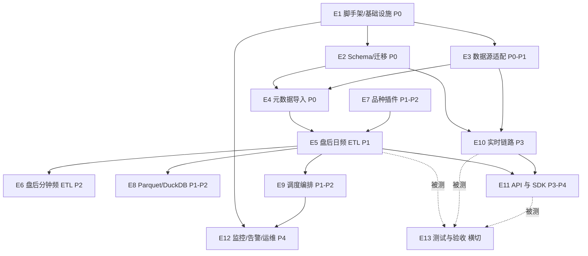

# getrich-database 任务拆分（WBS）

> 版本：v1.0 · 日期：2026-06-03
> 配套设计：`getrich-database 完整设计.md`
> 配套清单：`getrich-database 任务清单.csv`（可导入 Jira / Linear / 飞书项目）
> 结构：两层 —— **Epic（模块/史诗）→ Task（可派工任务）**；共 13 个 Epic、61 个 Task

---

## 1. 如何使用本拆分

- **分发单位是 Task**：每个 Task 边界清晰、可由一名开发独立完成、有明确验收标准（DoD）。

- **排期单位是 Epic + 阶段**：Epic 对应设计文档的模块/章节；阶段（P0–P5）来自设计 §13 路线，决定先后批次。

- **依赖**：`Depends On` 列给出前置 Task ID；据此可排出关键路径与并行批次（见 §6）。

- **字段含义**：
  
  | 字段               | 含义                                                |
  | ---------------- | ------------------------------------------------- |
  | Task ID          | 全局唯一编号，如 `T2.3`                                   |
  | Phase            | 所属阶段 P0–P5                                        |
  | Depends On       | 前置 Task（须先完成）                                     |
  | Acceptance（验收标准） | 完成判定（Definition of Done）                          |
  | Est(d)           | 粗估人天（1 人天 = 1 名熟练工程师 1 天）                         |
  | Role             | 建议技能：BE 后端 / DATA 数据工程 / DBA 数据库 / OPS 运维 / QA 测试 |
  | Ref              | 关联设计文档章节                                          |

- **估时总量**：约 **152 人天**（不含需求/评审/缓冲；建议按 1.3–1.5 倍加缓冲排期）。

---

## 2. Epic 总览

| Epic | 名称                  | 主要阶段   | 目标                               | 关键前置 Epic | Task 数 | 估时(人天)  |
| ---- | ------------------- | ------ | -------------------------------- | --------- | ------ | ------- |
| E1   | 工程脚手架与基础设施          | P0     | uv 工程、配置、日志、连接、本地环境              | —         | 6      | 14      |
| E2   | 数据库 Schema 与迁移      | P0     | `sql/init/backend` 全量 DDL + 迁移框架 | E1        | 7      | 14      |
| E3   | 数据源适配层              | P0–P1  | RQData/insight 适配 + 抽象接口 + 日历/映射 | E1        | 5      | 14      |
| E4   | 元数据导入               | P0     | 合约/标的/交易日历入库与增量更新                | E2,E3     | 3      | 7       |
| E5   | 盘后日频 ETL            | P1     | 抽取/转换/校验/幂等写入 + 日频管线             | E3,E4     | 5      | 14      |
| E6   | 盘后分钟频 ETL           | P2     | 分钟频写入 + 压缩 + 连续聚合                | E5        | 5      | 13      |
| E7   | 品种插件                | P1–P2  | 指数/股指期货/股指期权 特有逻辑                | E1,E5     | 4      | 9       |
| E8   | Parquet 派生层与 DuckDB | P1–P2  | 导出器 + DuckDB 封装 + 重建工具           | E5        | 3      | 7       |
| E9   | 调度与编排               | P1–P2  | 交易日历驱动调度 + 补数重跑                  | E5        | 4      | 9       |
| E10  | 实时数据链路              | P3     | insight 接入→Redis→分发→落地→恢复        | E2,E3     | 4      | 12      |
| E11  | 数据服务 API 与 SDK      | P3–P4  | 查询内核 + REST/WS + 鉴权 + client     | E5,E10    | 6      | 16      |
| E12  | 监控、告警与运维            | P4（横切） | 心跳/推送/指标/备份/部署                   | E1        | 5      | 11      |
| E13  | 测试与验收               | 横切     | 单测/一致性/端到端/性能基准                  | 各 Epic    | 4      | 12      |
| 合计   |                     |        |                                  |           | **61** | **152** |

> 说明：Task 合计 61（含横切测试与运维细分）；如需精简，可将 E13 测试任务并入各 Epic 的 DoD。下文与 CSV 以 61 个 Task 为准。

---

## 3. Epic 级依赖关系图



---

## 4. 阶段路线（P0–P5）与里程碑

| 阶段            | 包含 Epic（主要 Task）                    | 里程碑（验收）                            |
| ------------- | ----------------------------------- | ---------------------------------- |
| **P0 骨架**     | E1 全部、E2 全部、E3.1–E3.3/E3.5、E4 全部    | 元数据与交易日历可查；空库可建、可迁移；数据源可登录拉样本      |
| **P1 盘后日频**   | E5 全部、E7.1–E7.3、E8.1–E8.2、E9.1–E9.3 | 指数/股指期货/股指期权日频可直连/REST 查询，且可幂等重跑补数 |
| **P2 盘后分钟频**  | E6 全部、E7.4、E8.3、E9.4                | 分钟频入库 + 压缩生效 + 连续聚合，与日频聚合一致        |
| **P3 实时**     | E10 全部、E11.1/E11.3                  | <10 长连接稳定订阅；断联可恢复                  |
| **P4 服务化**    | E11.2/E11.4/E11.5/E11.6、E12 全部      | 数百用户历史查询稳定；API Key/限流/监控告警闭环       |
| **P5 扩展（未来）** | 新增品种插件 + tick 下探（占位，见 §8）           | 新增品种仅加插件+配置；评估 ClickHouse 迁移触发条件   |
| **横切**        | E13 测试与验收                           | 贯穿 P1–P4，每阶段出对应测试与基准               |

---

## 5. 详细 Task 分解

### E1 · 工程脚手架与基础设施（P0）

| Task ID | 名称                    | Phase | Depends On | 验收标准（DoD）                                             | Est(d) | Role | Ref   |
| ------- | --------------------- | ----- | ---------- | ----------------------------------------------------- | ------ | ---- | ----- |
| T1.1    | 初始化 uv 工程与目录骨架        | P0    | —          | `uv sync` 可用；目录结构(§14)就位；lint/format/pre-commit/CI 通过 | 2      | BE   | §14   |
| T1.2    | 三层配置系统                | P0    | T1.1       | pydantic-settings 合并 默认/外置/env；敏感项外置不入 git；校验失败报错     | 2      | BE   | §8.1  |
| T1.3    | 配置热加载机制               | P0    | T1.2       | 运行期白名单参数热改生效；校验失败保留旧值并告警                              | 2      | BE   | §8.2  |
| T1.4    | 结构化日志模块（集成 lntools）   | P0    | T1.1       | JSON 行日志含规定字段；按大小/时间轮转；lntools 封装可用                   | 2      | BE   | §11.1 |
| T1.5    | DB/Redis 连接管理         | P0    | T1.2       | PG/Redis 连接工厂+池；健康检查；超时与重连                            | 2      | BE   | §10.3 |
| T1.6    | 本地开发环境 docker-compose | P0    | T1.1       | 一键起 PG+TimescaleDB、Redis、PgBouncer；挂载初始化脚本            | 4      | OPS  | §12.1 |

### E2 · 数据库 Schema 与迁移（P0）

| Task ID | 名称                             | Phase | Depends On               | 验收标准（DoD）                                                                          | Est(d) | Role | Ref   |
| ------- | ------------------------------ | ----- | ------------------------ | ---------------------------------------------------------------------------------- | ------ | ---- | ----- |
| T2.1    | 扩展与 schema 初始化 `00_extensions` | P0    | T1.6                     | timescaledb 等扩展可装；meta/market/realtime/ops 四 schema 建好                             | 1      | DBA  | §6.4  |
| T2.2    | 元数据层 DDL `10_meta`             | P0    | T2.1                     | instruments/symbol_map/trading_calendar/future_contracts/option_contracts 建表+约束+索引 | 2      | DBA  | §6.3  |
| T2.3    | 行情事实层 DDL `20_market`          | P0    | T2.1                     | index/future/option × 1d/1m 建表 + create_hypertable + 主键/BRIN                       | 3      | DBA  | §6.4  |
| T2.4    | 压缩与连续聚合策略 `30_compress_ca`     | P0    | T2.3                     | 压缩策略 + 连续聚合（或交易日对齐物化视图）创建并可刷新                                                      | 2      | DBA  | §6.4  |
| T2.5    | 实时缓冲层 DDL `40_realtime`        | P0    | T2.1                     | tick_buffer hypertable + retention policy                                          | 1      | DBA  | §6.6  |
| T2.6    | 运维/权限层 DDL `50_ops`            | P0    | T2.1                     | users/api_keys/etl_job_run/data_quality_check 建表                                   | 2      | DBA  | §6.7  |
| T2.7    | schema 版本化迁移框架                 | P0    | T2.2;T2.3;T2.4;T2.5;T2.6 | 迁移工具可升级/回滚；CI 校验幂等                                                                 | 3      | DBA  | §12.3 |

### E3 · 数据源适配层（P0–P1）

| Task ID | 名称                 | Phase | Depends On     | 验收标准（DoD）                                                           | Est(d) | Role | Ref  |
| ------- | ------------------ | ----- | -------------- | ------------------------------------------------------------------- | ------ | ---- | ---- |
| T3.1    | 数据源抽象接口            | P0    | T1.1           | HistoryDataSource/RealtimeDataSource Protocol + 标准 DataFrame schema | 2      | BE   | §5.2 |
| T3.2    | RQData 适配器         | P0    | T3.1;T1.2      | license 登录、限频重试；日/分钟/合约/日历归一化输出                                     | 4      | DATA | §5.2 |
| T3.3    | insight 适配器        | P0    | T3.1;T1.2      | 账号/IP 登录、回调接入、回放补数接口、字段归一                                           | 4      | DATA | §5.1 |
| T3.4    | 代码映射服务（symbol_map） | P1    | T3.2;T3.3;T2.2 | 双向映射（rqdata/insight↔instrument_id）；缺失代码告警                           | 2      | DATA | §5.3 |
| T3.5    | 交易日历服务（夜盘归属）       | P0    | T3.2;T2.2      | trading_day 归属（夜盘归下一交易日）；单测覆盖边界                                     | 2      | DATA | §5.3 |

### E4 · 元数据导入（P0）

| Task ID | 名称           | Phase | Depends On | 验收标准（DoD）                     | Est(d) | Role | Ref   |
| ------- | ------------ | ----- | ---------- | ----------------------------- | ------ | ---- | ----- |
| T4.1    | 合约/标的元数据导入   | P0    | T3.2;T2.2  | 指数/期货/期权 instruments+扩展表导入；幂等 | 3      | DATA | §6.3  |
| T4.2    | 交易日历导入与维护    | P0    | T3.5;T2.2  | 交易日历（含夜盘/上下一交易日）入库；可增量更新      | 2      | DATA | §6.3  |
| T4.3    | 元数据增量更新与变更检测 | P0    | T4.1       | 上市/退市/合约变更检测与更新；留痕            | 2      | DATA | §12.3 |

### E5 · 盘后日频 ETL（P1）

| Task ID | 名称             | Phase | Depends On          | 验收标准（DoD）                                                    | Est(d) | Role | Ref  |
| ------- | -------------- | ----- | ------------------- | ------------------------------------------------------------ | ------ | ---- | ---- |
| T5.1    | 抽取层框架          | P1    | T3.2;T4.1           | 按 (asset,freq,day,symbols) 分片拉取；断点续拉、限频退避                    | 3      | DATA | §7.2 |
| T5.2    | 转换层框架          | P1    | T5.1                | 单位/时区/复权因子归一；trading_day 注入；品种插件挂载点                          | 3      | DATA | §7.2 |
| T5.3    | 数据质量校验框架       | P1    | T5.2                | 规则引擎（缺bar/价格跳变/OHLC关系/非负/因子单调）；写 data_quality_check；error 阻断 | 3      | DATA | §7.3 |
| T5.4    | 幂等写入层          | P1    | T5.2;T2.3           | ON CONFLICT UPSERT/COPY 批量写；重跑一致；导出钩子                        | 3      | BE   | §7.3 |
| T5.5    | 日频 pipeline 装配 | P1    | T5.3;T5.4;T7.2;T7.3 | 指数→股指期货→股指期权 日频端到端跑通一交易日                                     | 2      | DATA | §7.3 |

### E6 · 盘后分钟频 ETL（P2）

| Task ID | 名称              | Phase | Depends On     | 验收标准（DoD）                    | Est(d) | Role | Ref  |
| ------- | --------------- | ----- | -------------- | ---------------------------- | ------ | ---- | ---- |
| T6.1    | 分钟频抽取与大批量处理     | P2    | T5.1           | 分钟频分片/内存优化拉取；单日全市场可控内存完成     | 3      | DATA | §7.2 |
| T6.2    | 分钟频幂等写入         | P2    | T5.4;T2.3      | hypertable 批量写；压缩前后查询正确；重跑一致 | 3      | BE   | §6.4 |
| T6.3    | 连续聚合配置与刷新       | P2    | T6.2;T2.4      | 分钟→日频聚合上线（含交易日对齐方案）；刷新可调度    | 3      | DBA  | §6.4 |
| T6.4    | 分钟频质量校验         | P2    | T5.3;T6.1      | 缺 bar 检测对照交易日历应有分钟数；停牌/半日市处理 | 2      | DATA | §7.3 |
| T6.5    | 分钟频 pipeline 装配 | P2    | T6.2;T6.4;T7.4 | 三品种分钟频端到端跑通一交易日              | 2      | DATA | §7.3 |

### E7 · 品种插件（P1–P2）

| Task ID | 名称     | Phase | Depends On | 验收标准（DoD）                   | Est(d) | Role | Ref  |
| ------- | ------ | ----- | ---------- | --------------------------- | ------ | ---- | ---- |
| T7.1    | 品种插件框架 | P1    | T1.1       | 插件注入（字段集/清洗/校验/特有逻辑）接口与注册机制 | 3      | BE   | §7.1 |
| T7.2    | 指数插件   | P1    | T7.1       | 指数字段集与校验规则                  | 1      | DATA | §6.4 |
| T7.3    | 股指期货插件 | P1    | T7.1       | 主力连续拼接、结算价、持仓量逻辑+校验         | 3      | DATA | §5.3 |
| T7.4    | 股指期权插件 | P2    | T7.1       | 希腊字母/IV、行权要素、合约要素校验         | 2      | DATA | §6.4 |

### E8 · Parquet 派生层与 DuckDB（P1–P2）

| Task ID | 名称          | Phase | Depends On | 验收标准（DoD）                                  | Est(d) | Role | Ref   |
| ------- | ----------- | ----- | ---------- | ------------------------------------------ | ------ | ---- | ----- |
| T8.1    | Parquet 导出器 | P1    | T5.4       | Hive 分区布局导出；分区幂等覆盖；schema 稳定               | 3      | DATA | §6.8  |
| T8.2    | DuckDB 读取封装 | P1    | T8.1       | read_parquet + ATTACH postgres 两种读法；复权计算一致 | 2      | BE   | §6.8  |
| T8.3    | 派生层重建工具     | P2    | T8.1       | 从 PG 全量/增量重建 Parquet；可指定 trading_day       | 2      | DATA | §12.3 |

### E9 · 调度与编排（P1–P2）

| Task ID | 名称            | Phase | Depends On | 验收标准（DoD）                          | Est(d) | Role | Ref   |
| ------- | ------------- | ----- | ---------- | ---------------------------------- | ------ | ---- | ----- |
| T9.1    | 调度器（交易日历驱动）   | P1    | T3.5;T1.4  | APScheduler 按交易日触发；非交易日跳过          | 2      | BE   | §7.2  |
| T9.2    | 任务编排与依赖       | P1    | T9.1;T5.5  | 元数据→日频→分钟频→衍生→导出 顺序编排；失败隔离         | 2      | BE   | §7.3  |
| T9.3    | ETL 运行记录与补数重跑 | P1    | T9.2;T2.6  | 写 etl_job_run；按 trading_day 安全重跑补数 | 3      | BE   | §7.3  |
| T9.4    | 失败重试与告警联动     | P2    | T9.3;T12.2 | 重试策略；失败/partial 触发推送               | 2      | BE   | §11.2 |

### E10 · 实时数据链路（P3）

| Task ID | 名称                 | Phase | Depends On  | 验收标准（DoD）                                       | Est(d) | Role | Ref  |
| ------- | ------------------ | ----- | ----------- | ----------------------------------------------- | ------ | ---- | ---- |
| T10.1   | insight 实时接入       | P3    | T3.3        | 回调归一化（symbol_map/时区/trading_day）→写 Redis Stream | 3      | DATA | §9.1 |
| T10.2   | Redis Streams 分发总线 | P3    | T10.1;T1.5  | 按 topic 分流；MAXLEN 控量；消费组与 XACK                  | 3      | BE   | §9.2 |
| T10.3   | 落地 consumer        | P3    | T10.2;T2.5  | 批量写 tick_buffer；背压与队列上限；过载丢可重建批并告警              | 3      | BE   | §9.2 |
| T10.4   | 断点续传与恢复            | P3    | T10.2;T10.3 | last-id 续读 + tick_buffer 补缺 + 盘后修正；演练通过         | 3      | BE   | §9.2 |

### E11 · 数据服务 API 与 SDK（P3–P4）

| Task ID | 名称                 | Phase | Depends On  | 验收标准（DoD）                                             | Est(d) | Role | Ref   |
| ------- | ------------------ | ----- | ----------- | ----------------------------------------------------- | ------ | ---- | ----- |
| T11.1   | 查询内核 query-core    | P3    | T5.4        | SQL 构造/参数校验/复权/分页；三形态共用；单测覆盖                          | 3      | BE   | §10.1 |
| T11.2   | REST 历史接口          | P4    | T11.1       | bars/instruments/calendar/options-greeks；OpenAPI 文档   | 3      | BE   | §10.2 |
| T11.3   | WebSocket/SSE 实时订阅 | P3    | T11.1;T10.2 | sub/unsub；从 Redis 推送；<10 长连接稳定                        | 3      | BE   | §10.2 |
| T11.4   | 鉴权与限流              | P4    | T11.2;T2.6  | API Key 哈希校验、scopes、每键限频；审计可选                         | 2      | BE   | §10.3 |
| T11.5   | Python client SDK  | P4    | T11.2;T11.3 | `import getrich`; bars()/subscribe() 走 API+last-id 续传 | 3      | BE   | §10.2 |
| T11.6   | PgBouncer 接入与并发压测  | P4    | T11.2;T1.6  | transaction pooling 接入；数百用户历史查询压测达标                   | 2      | OPS  | §10.3 |

### E12 · 监控、告警与运维（P4，横切）

| Task ID | 名称        | Phase | Depends On  | 验收标准（DoD）                         | Est(d) | Role | Ref   |
| ------- | --------- | ----- | ----------- | --------------------------------- | ------ | ---- | ----- |
| T12.1   | 心跳监控      | P4    | T1.4        | 实时接入/ETL/API 心跳；超时判定              | 2      | BE   | §11.2 |
| T12.2   | 企微/飞书推送通道 | P4    | T1.4        | 统一 notify 接口；分级、限频合并；企微/飞书可切换     | 2      | BE   | §11.3 |
| T12.3   | 监控指标与阈值   | P4    | T12.1       | 磁盘水位/Stream 积压/连接数/数据质量 指标与告警阈值   | 2      | OPS  | §11.2 |
| T12.4   | 备份与恢复     | P4    | T2.7        | PG 物理/逻辑备份+WAL 归档+Parquet 冷备；恢复演练 | 2      | OPS  | §12.2 |
| T12.5   | 生产部署与容量规划 | P4    | T11.6;T12.4 | 生产 compose/只读副本上线；容量规划文档与水位告警     | 3      | OPS  | §12.1 |

### E13 · 测试与验收（横切）

| Task ID | 名称       | Phase | Depends On | 验收标准（DoD）                                | Est(d) | Role | Ref   |
| ------- | -------- | ----- | ---------- | ---------------------------------------- | ------ | ---- | ----- |
| T13.1   | 单元测试     | 横切    | T5.4       | 幂等/校验规则/聚合/日历归属 单测覆盖率达标                  | 3      | QA   | §14   |
| T13.2   | 数据一致性测试  | 横切    | T6.3;T8.2  | 分钟聚合=日频；复权一致；RQData↔insight 对账           | 3      | QA   | §13   |
| T13.3   | 集成与端到端测试 | 横切    | T9.2;T10.4 | 盘后全链路 + 实时断联恢复演练通过                       | 3      | QA   | §9    |
| T13.4   | 性能基准     | 横切    | T6.2;T11.6 | 分钟频查询 P95、压缩比、并发 基准报告（作 ClickHouse 迁移判据） | 3      | QA   | §13.2 |

---

## 6. 关键路径与并行批次

**关键路径（最长依赖链，决定最短交付周期）**：

```
T1.1 → T1.6 → T2.1 → T2.3 → T5.4 → T6.2 → T6.3 → T13.2
（脚手架 → 本地环境 → 扩展 → 行情表 → 幂等写入 → 分钟频写入 → 连续聚合 → 一致性验收）
```

**按依赖就绪的并行批次**（假设 4–5 人团队）：

| 批次   | 可并行启动的 Task（前置已就绪）                                 | 说明                       |
| ---- | -------------------------------------------------- | ------------------------ |
| 批次 1 | T1.1 → 随后 T1.2/T1.4/T1.6/T3.1/T7.1                 | 脚手架先行，解锁配置、日志、环境、接口、插件框架 |
| 批次 2 | T2.1→T2.x（DBA 线）、T3.2/T3.3（DATA 线）、T1.3/T1.5（BE 线） | Schema 与数据源适配并行推进        |
| 批次 3 | T4.1/T4.2/T3.5（元数据）、T7.2/T7.3（插件）                  | P0 收尾，元数据可查              |
| 批次 4 | T5.1→T5.5（日频）、T8.1/T8.2、T9.1→T9.3                  | P1：日频链路 + 导出 + 调度        |
| 批次 5 | T6.1→T6.5（分钟频）、T7.4、T8.3、T9.4                      | P2：分钟频链路                 |
| 批次 6 | T10.1→T10.4（实时）、T11.1/T11.3                        | P3：实时链路 + 订阅；可与 P2 部分重叠  |
| 批次 7 | T11.2/T11.4/T11.5/T11.6、T12.x                      | P4：服务化与运维闭环              |
| 横切   | T13.1–T13.4                                        | 跟随对应 Epic 出测试与基准         |

> 注：E10（实时）只依赖 E2+E3，可在 P1/P2 进行时由独立成员并行启动，缩短总周期。

---

## 7. 角色与人力建议

按角色汇总估时（合计 152 人天）：

| 角色   | 说明                       | 人天  |
| ---- | ------------------------ | --- |
| BE   | 后端/服务/调度/实时分发/SDK        | 59  |
| DATA | 数据源适配/ETL/插件/导出          | 51  |
| DBA  | Schema/TimescaleDB/迁移/聚合 | 17  |
| OPS  | 环境/部署/连接池/备份/容量          | 13  |
| QA   | 测试/一致性/基准                | 12  |

**建议配置**：1 名后端为主负责人 + 1–2 名数据工程 + 半个 DBA（可由后端兼）+ 半个运维 + 1 名测试。以 4–5 人计，结合依赖与并行，日历周期约 **8–10 周**（含缓冲）。

---

## 8. P5 扩展（未来，暂不估时）

满足 P0–P4 验收后再启动，作为后续 Epic 占位：

- **EF1 更多品种插件**：个股、ETF、商品期货/期权 —— 复用 E7 插件框架，原则上“仅加插件+配置，不改主流程”。
- **EF2 tick/逐笔下探**：新增 `*_tick` hypertable 与抽取（insight 实时 + RQData 历史补全）。
- **EF3 ClickHouse 迁移评估**：依据 T13.4 性能基准与设计 §13.2 触发阈值决策；Parquet 作为迁移中转载体，查询内核切换底层方言，对上层透明。
- **EF4 商业化能力**：多租户配额、计费用量统计、对外文档与 SLA。

---

## 9. CSV 字段说明

`getrich-database 任务清单.csv` 列（UTF-8 BOM，逗号分隔，含逗号的字段已加引号）：

`Epic, TaskID, TaskName, Phase, DependsOn, Acceptance, EstDays, Role, Ref`

- `DependsOn` 多个前置用分号 `;` 分隔，空表示无前置。
- 可直接导入 Jira / Linear / 飞书项目：将 `TaskName→标题`、`Acceptance→描述`、`DependsOn→依赖`、`EstDays→估点`、`Phase/Epic/Role→标签或自定义字段` 映射即可。
